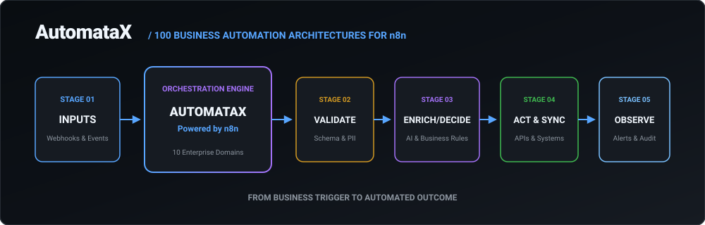
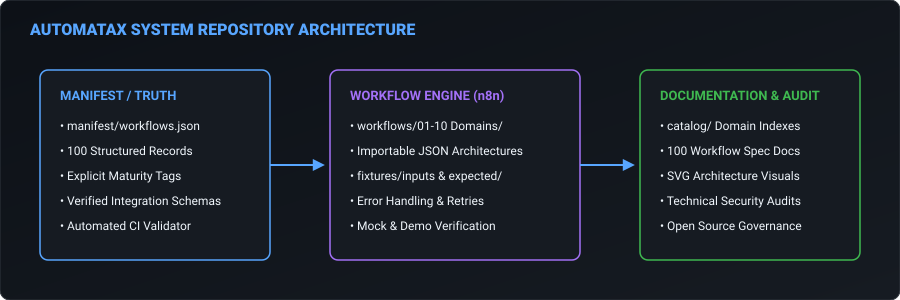

# AutomataX — 100 Business Automation Architectures for n8n

**From business trigger to automated outcome.** AutomataX is an open-source library of 100 enterprise-grade business automation architectures engineered for n8n. Designed for automation agencies, freelancers, recruiters, n8n developers, and technical leaders evaluating automation systems quality.

---

## 📊 Project Statistics

- **100 Workflows** distributed across **10 Enterprise Domains**.
- **100% Schema-Validated** via \`manifest/workflows.json\` source-of-truth.
- **100 Visual Architecture SVGs** auto-derived from node graph structures.
- **15 Demo-Verified Featured Workflows** equipped with safe test inputs and expected outcome fixtures.
- **0 Plaintext Secrets** or hardcoded production credentials.

---

## 🏗 Repository System Architecture

---

## ⭐️ Featured Automations

<table width="100%">
<tr>
<td width="50%" valign="top">

### 🎯 Intelligent Lead Routing & Scoring
**Category:** Sales & CRM | **Trigger:** Webhook  
**Outcome:** Ingests inbound leads, enriches via firmographic API, scores propensity to buy, routes high-value leads to enterprise AEs, and alerts Slack.  
\`Webhook → Validate → Enrich → Score → Route → CRM → Notify\`  
- **Complexity:** Advanced | **Maturity:** 🟢 Demo Verified  
- **Integrations:** \`Salesforce\` · \`Clearbit\` · \`Slack\`  
- [📄 Documentation](./docs/workflows/05-01-intelligent-lead-routing-scoring.md) | [📥 Workflow JSON](./workflows/05-sales-crm/05_01_intelligent_lead_routing_scoring.json) | [🖼 Visual](./assets/workflows/05-01/architecture.svg)

</td>
<td width="50%" valign="top">

### 🤖 AI-Driven Support Ticket Triage
**Category:** Customer Success | **Trigger:** Webhook  
**Outcome:** Uses AI models to classify incoming Zendesk/Jira tickets, analyze sentiment, set priority SLAs, and trigger PagerDuty for critical outages.  
\`Ticket Ingestion → AI Sentiment → SLA Calculation → Priority Route → Escalation\`  
- **Complexity:** Advanced | **Maturity:** 🟢 Demo Verified  
- **Integrations:** \`Zendesk\` · \`OpenAI\` · \`Jira\` · \`PagerDuty\`  
- [📄 Documentation](./docs/workflows/04-02-ai-driven-support-ticket-triage.md) | [📥 Workflow JSON](./workflows/04-customer-success/04_02_ai_driven_support_ticket_triage.json) | [🖼 Visual](./assets/workflows/04-02/architecture.svg)

</td>
</tr>
<tr>
<td width="50%" valign="top">

### 💳 Intelligent Accounts Payable Automation
**Category:** FinOps & Revenue | **Trigger:** Webhook  
**Outcome:** Ingests email invoices, extracts line items via OCR, matches POs in Oracle, and routes for multi-tier signature approval in DocuSign.  
\`Email Ingest → AWS Textract OCR → Oracle PO Match → DocuSign Approval\`  
- **Complexity:** Advanced | **Maturity:** 🟢 Demo Verified  
- **Integrations:** \`AWS Textract\` · \`Oracle ERP\` · \`DocuSign\`  
- [📄 Documentation](./docs/workflows/01-03-intelligent-accounts-payable-automation.md) | [📥 Workflow JSON](./workflows/01-finops/01_03_intelligent_accounts_payable_automation.json) | [🖼 Visual](./assets/workflows/01-03/architecture.svg)

</td>
<td width="50%" valign="top">

### 👔 CEO Morning Briefing Engine
**Category:** Executive Operations | **Trigger:** Schedule  
**Outcome:** Aggregates daily ARR, churn, open incidents, and executive OKRs into a single PDF summary delivered to executive inboxes at 07:00 AM.  
\`Schedule → Query Stripe/Jira → Render PDF → Email Digest\`  
- **Complexity:** Advanced | **Maturity:** 🟢 Demo Verified  
- **Integrations:** \`Stripe\` · \`Jira\` · \`Documint\` · \`Email\`  
- [📄 Documentation](./docs/workflows/10-03-the-ceo-morning-briefing-engine.md) | [📥 Workflow JSON](./workflows/10-executive/10_03_the_ceo_morning_briefing_engine.json) | [🖼 Visual](./assets/workflows/10-03/architecture.svg)

</td>
</tr>
</table>

👉 **[Explore all 100 Workflows in the Master Catalog](./catalog/README.md)**

---

## 🗂 Directory of Automations by Domain

AutomataX divides 100 business automations into 10 enterprise domains.

| Domain | Description | Workflows | Category Catalog |
| :--- | :--- | :---: | :---: |
| **01. FinOps & Revenue** | Revenue recognition, AP automation, budget monitoring, dunning. | 10 | [View FinOps](./catalog/finops.md) |
| **02. HR & Talent** | Employee onboarding, offboarding, performance reviews, sentiment. | 10 | [View HR](./catalog/hr.md) |
| **03. Supply Chain** | Predictive inventory POs, freight tracking, 3PL reconciliation. | 10 | [View Supply Chain](./catalog/supply-chain.md) |
| **04. Customer Success** | Feature drop-off alerts, ticket triage, QBR prep, SLA escalations. | 10 | [View CS](./catalog/customer-success.md) |
| **05. Sales & CRM** | Lead routing, CPQ, deal desk approvals, competitor price scraping. | 10 | [View Sales](./catalog/sales-crm.md) |
| **06. ITSM & DevOps** | Incident war rooms, RBAC access, AI CI/CD failure triage. | 10 | [View DevOps](./catalog/itsm-devops.md) |
| **07. Marketing Ops** | Webinar operations, ad spend pacing, content syndication. | 10 | [View Marketing](./catalog/marketing.md) |
| **08. Legal & Compliance** | Mutual NDA generation, DSAR compliance, SOC 2 evidence collection. | 10 | [View Legal](./catalog/legal-compliance.md) |
| **09. Data Engineering** | ETL pipeline monitoring, data circuit breakers, schema evolution. | 10 | [View Data Eng](./catalog/data-engineering.md) |
| **10. Executive Ops** | Board deck assembly, M&A data rooms, CEO morning briefing. | 10 | [View Executive](./catalog/executive-operations.md) |

---

## 🏷 Workflow Maturity Model

AutomataX strictly enforces a truthful 4-tier maturity system:

- **Architecture Blueprint**: The workflow sequence is defined as an importable n8n graph structure. External integration parameters require configuration and API credential binding.
- **Importable Template**: The workflow contains structured parameter expressions and credential placeholders, ready for environment binding.
- **Demo Verified**: The workflow includes mock payload triggers, input fixtures (\`fixtures/inputs/\`), and expected output fixtures (\`fixtures/expected/\`) for offline testing without production API credentials.
- **Production Reference**: The workflow contains full error handling workflows, exponential retries, rate limiting, PII masking, and real-world execution logs.

---

## 🚀 How to Import Workflows

Importing an AutomataX workflow into your n8n workspace takes under 60 seconds:

1. **Locate your Workflow**: Browse the [Catalog](./catalog/README.md) or domain subdirectories in \`workflows/\`.
2. **Download JSON**: Click the **Download n8n JSON** link in the workflow's documentation page.
3. **Import to n8n Canvas**:
   - Open n8n workspace.
   - Click **Workflows** → **Add Workflow**.
   - Click **...** (Top-right menu) → **Import from File**.
   - Select the downloaded \`.json\` file.
4. **Bind Credentials**: Double-click integration nodes to select your stored n8n API Credentials.

---

## 🔒 Security & Credential Philosophy

- **Zero Plaintext Secrets**: AutomataX workflows never contain raw API keys, passwords, or tokens.
- **Credential Manager**: All integration nodes consume n8n's native Credential Manager (\`{{\$credentials...}}\`).
- **Least Privilege**: Production deployments must scope API keys to the minimum necessary read/write capabilities.
- **Sanitized Fixtures**: All demo test payloads utilize 100% fictional data.

---

## 🛠 Developer & Contribution Tools

\`\`\`bash
# Validate repository integrity (JSON, manifest sync, links, secret scanning)
npm test

# Regenerate master manifest (manifest/workflows.json)
npm run build:manifest

# Regenerate all SVG architecture diagrams
npm run generate:diagrams

# Regenerate documentation pages & stats
npm run generate:docs && npm run generate:stats
\`\`\`

---

## 📁 Repository Structure

\`\`\`text
AutomataX/
├── assets/                  # Brand & visual architecture SVGs
│   ├── brand/              # Hero & system architecture SVGs
│   ├── catalog/            # Category architecture SVGs
│   └── workflows/          # Individual per-workflow SVGs
├── catalog/                 # Categorized catalog index pages
├── docs/                    # Individual workflow spec docs & audit
│   ├── workflows/          # 100 workflow specification pages
│   └── AUDIT.md            # Technical repository audit report
├── fixtures/                # Demo mode test payloads
│   ├── inputs/             # Sample trigger input payloads
│   └── expected/           # Expected output payloads
├── manifest/                # Authoritative source of truth
│   ├── workflows.json      # Master manifest index
│   └── stats.json          # Repository statistics
├── scripts/                 # Validation & generator scripts
├── workflows/               # 10 Domain subdirectories containing 100 n8n JSONs
│   ├── 01-finops/
│   ├── 02-hr/
│   └── ...
├── .github/workflows/ci.yml # Automated CI/CD pipeline
├── CONTRIBUTING.md          # Workflow contribution guide
└── LICENSE                  # MIT License
\`\`\`

---

## 🤝 Contributing

We welcome contributions! Please review our [Contributing Guidelines](CONTRIBUTING.md) and [Code of Conduct](CODE_OF_CONDUCT.md) before submitting pull requests.

---

## 📄 License

This repository is licensed under the [MIT License](LICENSE).
