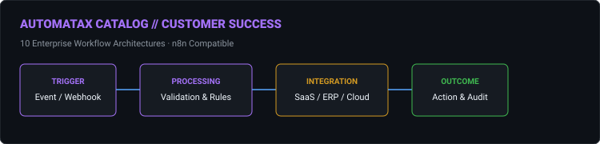
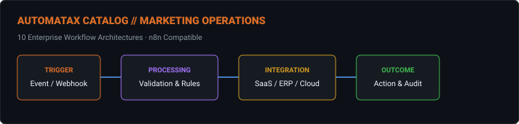
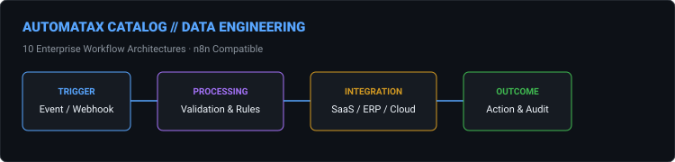
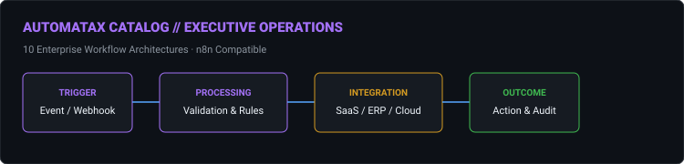

# 📚 AutomataX Automation Catalog

Welcome to the **AutomataX Master Automation Catalog**. This catalog indexes **100 enterprise business automation architectures** built for n8n.

---

## 🗂 Domains Overview

| Domain | Focus Area | Workflows | Category Page |
| :--- | :--- | :---: | :--- |
| **01. FinOps & Revenue** | Multi-currency revenue recognition, AP automation, budget vs actuals, cloud cost monitoring, and subscription dunning. | 10 | [View Category](./finops.md) |
| **02. HR & Talent** | Zero-touch onboarding, offboarding data loss prevention, performance review aggregation, sentiment risk alerting. | 10 | [View Category](./hr.md) |
| **03. Supply Chain & Logistics** | Predictive inventory PO generation, freight delay rerouting, supplier scorecards, 3PL inventory reconciliation. | 10 | [View Category](./supply-chain.md) |
| **04. Customer Success** | Product feature drop-off alerts, AI ticket triage, QBR deck generation, churn deflection, SLA escalation. | 10 | [View Category](./customer-success.md) |
| **05. Sales & CRM** | Intelligent lead routing & scoring, stale deal detection, CPQ provisioning, competitor price scraping. | 10 | [View Category](./sales-crm.md) |
| **06. ITSM & DevOps** | Incident war room creation, RBAC provisioning, AI CI/CD failure triage, self-healing database backup verification. | 10 | [View Category](./itsm-devops.md) |
| **07. Marketing Operations** | End-to-end webinar ops, AI content syndication, ad spend pacing pause, technical SEO monitoring. | 10 | [View Category](./marketing.md) |
| **08. Legal & Compliance** | Zero-friction mutual NDA generation, DSAR data extraction, continuous SOC 2 evidence collection, IP takedowns. | 10 | [View Category](./legal-compliance.md) |
| **09. Data Engineering** | Self-healing ETL pipeline monitoring, data quality circuit breakers, schema evolution, PII masking. | 10 | [View Category](./data-engineering.md) |
| **10. Executive Operations** | Board deck assembly, CEO morning briefing engine, M&A data room setup, executive OKR tracking. | 10 | [View Category](./executive-operations.md) |

---

## ⚡ Master Index (100 Workflows)

### 01. FinOps & Revenue

| ID | Name | Outcome | Maturity | Complexity | Trigger | AI | Links |
| :---: | :--- | :--- | :---: | :---: | :---: | :---: | :--- |
| **01-01** | [Multi-Currency Revenue Recognition & Reporting](../docs/workflows/01-01-multi-currency-revenue-recognition-reporting.md) | Build an n8n workflow connecting SAP ERP, Stripe, and Salesforce to au... | 🟢 Demo Verified | `advanced` | `webhook` | 🤖 Yes | [JSON](../workflows/01-finops/01_01_multi_currency_revenue_recognition_reporting.json) · [Doc](../docs/workflows/01-01-multi-currency-revenue-recognition-reporting.md) |
| **01-02** | [Automated Budget vs. Actuals Cloud Cost Monitoring](../docs/workflows/01-02-automated-budget-vs-actuals-cloud-cost-monitoring.md) | Design a workflow that monitors AWS Cost Explorer API, compares actual... | 🔵 Blueprint | `intermediate` | `webhook` | No | [JSON](../workflows/01-finops/01_02_automated_budget_vs_actuals_cloud_cost_monitoring.json) · [Doc](../docs/workflows/01-02-automated-budget-vs-actuals-cloud-cost-monitoring.md) |
| **01-03** | [Intelligent Accounts Payable Automation](../docs/workflows/01-03-intelligent-accounts-payable-automation.md) | Create an automated accounts payable workflow that ingests invoices fr... | 🟢 Demo Verified | `advanced` | `webhook` | 🤖 Yes | [JSON](../workflows/01-finops/01_03_intelligent_accounts_payable_automation.json) · [Doc](../docs/workflows/01-03-intelligent-accounts-payable-automation.md) |
| **01-04** | [Dynamic Subscription Dunning & Retention](../docs/workflows/01-04-dynamic-subscription-dunning-retention.md) | Build a subscription dunning workflow integrating Stripe, Intercom, an... | 🔵 Blueprint | `intermediate` | `webhook` | 🤖 Yes | [JSON](../workflows/01-finops/01_04_dynamic_subscription_dunning_retention.json) · [Doc](../docs/workflows/01-04-dynamic-subscription-dunning-retention.md) |
| **01-05** | [Omnichannel Sales Aggregation & Data Warehousing](../docs/workflows/01-05-omnichannel-sales-aggregation-data-warehousing.md) | Design a workflow that aggregates daily sales data from Shopify, Amazo... | 🔵 Blueprint | `intermediate` | `webhook` | 🤖 Yes | [JSON](../workflows/01-finops/01_05_omnichannel_sales_aggregation_data_warehousing.json) · [Doc](../docs/workflows/01-05-omnichannel-sales-aggregation-data-warehousing.md) |
| **01-06** | [Corporate Card Expense Reconciliation](../docs/workflows/01-06-corporate-card-expense-reconciliation.md) | Create an automated expense reconciliation workflow that pulls corpora... | 🔵 Blueprint | `intermediate` | `webhook` | 🤖 Yes | [JSON](../workflows/01-finops/01_06_corporate_card_expense_reconciliation.json) · [Doc](../docs/workflows/01-06-corporate-card-expense-reconciliation.md) |
| **01-07** | [Crypto Treasury Real-Time P&L Tracking](../docs/workflows/01-07-crypto-treasury-real-time-p-l-tracking.md) | Build a workflow that monitors crypto treasury wallets via Etherscan A... | 🔵 Blueprint | `standard` | `webhook` | No | [JSON](../workflows/01-finops/01_07_crypto_treasury_real_time_p_l_tracking.json) · [Doc](../docs/workflows/01-07-crypto-treasury-real-time-p-l-tracking.md) |
| **01-08** | [Fraud-Resistant Vendor Payment Gateway](../docs/workflows/01-08-fraud-resistant-vendor-payment-gateway.md) | Design a vendor payment automation workflow that pulls approved invoic... | 🔵 Blueprint | `standard` | `webhook` | 🤖 Yes | [JSON](../workflows/01-finops/01_08_fraud_resistant_vendor_payment_gateway.json) · [Doc](../docs/workflows/01-08-fraud-resistant-vendor-payment-gateway.md) |
| **01-09** | [Automated Month-End Close & Board Reporting](../docs/workflows/01-09-automated-month-end-close-board-reporting.md) | Create a workflow that automates month-end close tasks: pulling trial ... | 🔵 Blueprint | `intermediate` | `webhook` | No | [JSON](../workflows/01-finops/01_09_automated_month_end_close_board_reporting.json) · [Doc](../docs/workflows/01-09-automated-month-end-close-board-reporting.md) |
| **01-10** | [Headless Checkout Tax Liability Sync](../docs/workflows/01-10-headless-checkout-tax-liability-sync.md) | Build an automated tax calculation workflow that integrates Avalara wi... | 🔵 Blueprint | `standard` | `webhook` | No | [JSON](../workflows/01-finops/01_10_headless_checkout_tax_liability_sync.json) · [Doc](../docs/workflows/01-10-headless-checkout-tax-liability-sync.md) |

---

### 02. HR & Talent

| ID | Name | Outcome | Maturity | Complexity | Trigger | AI | Links |
| :---: | :--- | :--- | :---: | :---: | :---: | :---: | :--- |
| **02-01** | [Seamless Zero-Touch Employee Onboarding](../docs/workflows/02-01-seamless-zero-touch-employee-onboarding.md) | Design an automated onboarding workflow triggered by a DocuSign comple... | 🟢 Demo Verified | `advanced` | `webhook` | 🤖 Yes | [JSON](../workflows/02-hr/02_01_seamless_zero_touch_employee_onboarding.json) · [Doc](../docs/workflows/02-01-seamless-zero-touch-employee-onboarding.md) |
| **02-02** | [Secure Offboarding & Data Leakage Prevention](../docs/workflows/02-02-secure-offboarding-data-leakage-prevention.md) | Build an offboarding automation that revokes Okta access, triggers a s... | 🔵 Blueprint | `intermediate` | `webhook` | 🤖 Yes | [JSON](../workflows/02-hr/02_02_secure_offboarding_data_leakage_prevention.json) · [Doc](../docs/workflows/02-02-secure-offboarding-data-leakage-prevention.md) |
| **02-03** | [Automated LinkedIn Talent Sourcing & Screening](../docs/workflows/02-03-automated-linkedin-talent-sourcing-screening.md) | Create a workflow that scrapes LinkedIn for specific skill sets, enric... | 🔵 Blueprint | `intermediate` | `webhook` | No | [JSON](../workflows/02-hr/02_03_automated_linkedin_talent_sourcing_screening.json) · [Doc](../docs/workflows/02-03-automated-linkedin-talent-sourcing-screening.md) |
| **02-04** | [360-Degree Performance Review Aggregation](../docs/workflows/02-04-360-degree-performance-review-aggregation.md) | Design a performance review automation that pulls OKR completion data ... | 🔵 Blueprint | `intermediate` | `webhook` | No | [JSON](../workflows/02-hr/02_04_360_degree_performance_review_aggregation.json) · [Doc](../docs/workflows/02-04-360-degree-performance-review-aggregation.md) |
| **02-05** | [Proactive Employee Sentiment & Churn Risk Alerting](../docs/workflows/02-05-proactive-employee-sentiment-churn-risk-alerting.md) | Build a workflow that monitors employee sentiment via weekly Culture A... | 🔵 Blueprint | `standard` | `webhook` | 🤖 Yes | [JSON](../workflows/02-hr/02_05_proactive_employee_sentiment_churn_risk_alerting.json) · [Doc](../docs/workflows/02-05-proactive-employee-sentiment-churn-risk-alerting.md) |
| **02-06** | [Automated Visa & Relocation Compliance](../docs/workflows/02-06-automated-visa-relocation-compliance.md) | Create an automated visa/relocation workflow that tracks passport expi... | 🔵 Blueprint | `standard` | `webhook` | No | [JSON](../workflows/02-hr/02_06_automated_visa_relocation_compliance.json) · [Doc](../docs/workflows/02-06-automated-visa-relocation-compliance.md) |
| **02-07** | [Frictionless Internal Mobility & Transfers](../docs/workflows/02-07-frictionless-internal-mobility-transfers.md) | Design a workflow that automates internal mobility: when an employee a... | 🔵 Blueprint | `standard` | `webhook` | No | [JSON](../workflows/02-hr/02_07_frictionless_internal_mobility_transfers.json) · [Doc](../docs/workflows/02-07-frictionless-internal-mobility-transfers.md) |
| **02-08** | [Mandatory Compliance Training Enforcement](../docs/workflows/02-08-mandatory-compliance-training-enforcement.md) | Build an automated learning & development workflow that assigns mandat... | 🔵 Blueprint | `standard` | `webhook` | 🤖 Yes | [JSON](../workflows/02-hr/02_08_mandatory_compliance_training_enforcement.json) · [Doc](../docs/workflows/02-08-mandatory-compliance-training-enforcement.md) |
| **02-09** | [Intelligent Interview Scheduling & Prep](../docs/workflows/02-09-intelligent-interview-scheduling-prep.md) | Create a workflow that integrates Greenhouse with Slack to automate in... | 🔵 Blueprint | `standard` | `webhook` | No | [JSON](../workflows/02-hr/02_09_intelligent_interview_scheduling_prep.json) · [Doc](../docs/workflows/02-09-intelligent-interview-scheduling-prep.md) |
| **02-10** | [Pre-Processing Payroll Anomaly Detection](../docs/workflows/02-10-pre-processing-payroll-anomaly-detection.md) | Design a payroll anomaly detection workflow that compares current mont... | 🔵 Blueprint | `standard` | `webhook` | 🤖 Yes | [JSON](../workflows/02-hr/02_10_pre_processing_payroll_anomaly_detection.json) · [Doc](../docs/workflows/02-10-pre-processing-payroll-anomaly-detection.md) |

---

### 03. Supply Chain & Logistics

| ID | Name | Outcome | Maturity | Complexity | Trigger | AI | Links |
| :---: | :--- | :--- | :---: | :---: | :---: | :---: | :--- |
| **03-01** | [Predictive Inventory PO Generation](../docs/workflows/03-01-predictive-inventory-po-generation.md) | Build an n8n workflow that monitors inventory levels in Shopify, check... | 🟢 Demo Verified | `advanced` | `webhook` | 🤖 Yes | [JSON](../workflows/03-supply-chain/03_01_predictive_inventory_po_generation.json) · [Doc](../docs/workflows/03-01-predictive-inventory-po-generation.md) |
| **03-02** | [Ocean Freight Delay & Rerouting Automation](../docs/workflows/03-02-ocean-freight-delay-rerouting-automation.md) | Design a workflow that integrates with Flexport API to track ocean fre... | 🔵 Blueprint | `intermediate` | `webhook` | 🤖 Yes | [JSON](../workflows/03-supply-chain/03_02_ocean_freight_delay_rerouting_automation.json) · [Doc](../docs/workflows/03-02-ocean-freight-delay-rerouting-automation.md) |
| **03-03** | [Automated Supplier Quality Scorecarding](../docs/workflows/03-03-automated-supplier-quality-scorecarding.md) | Create an automated supplier scorecard workflow that pulls delivery on... | 🔵 Blueprint | `standard` | `webhook` | No | [JSON](../workflows/03-supply-chain/03_03_automated_supplier_quality_scorecarding.json) · [Doc](../docs/workflows/03-03-automated-supplier-quality-scorecarding.md) |
| **03-04** | [Zero-Touch Customs Documentation](../docs/workflows/03-04-zero-touch-customs-documentation.md) | Build a workflow that automates customs documentation: when a commerci... | 🔵 Blueprint | `standard` | `webhook` | No | [JSON](../workflows/03-supply-chain/03_04_zero_touch_customs_documentation.json) · [Doc](../docs/workflows/03-04-zero-touch-customs-documentation.md) |
| **03-05** | [Weather Risk Supply Chain Mitigation](../docs/workflows/03-05-weather-risk-supply-chain-mitigation.md) | Design a workflow that monitors weather APIs for severe conditions alo... | 🔵 Blueprint | `standard` | `webhook` | 🤖 Yes | [JSON](../workflows/03-supply-chain/03_05_weather_risk_supply_chain_mitigation.json) · [Doc](../docs/workflows/03-05-weather-risk-supply-chain-mitigation.md) |
| **03-06** | [AI-Powered RMA & Liquidation Routing](../docs/workflows/03-06-ai-powered-rma-liquidation-routing.md) | Create an automated returns processing workflow that ingests RMA reque... | 🔵 Blueprint | `intermediate` | `webhook` | 🤖 Yes | [JSON](../workflows/03-supply-chain/03_06_ai_powered_rma_liquidation_routing.json) · [Doc](../docs/workflows/03-06-ai-powered-rma-liquidation-routing.md) |
| **03-07** | [Daily 3PL to ERP Inventory Reconciliation](../docs/workflows/03-07-daily-3pl-to-erp-inventory-reconciliation.md) | Build a workflow that syncs 3PL warehouse data (ShipHero) with the ERP... | 🔵 Blueprint | `standard` | `webhook` | 🤖 Yes | [JSON](../workflows/03-supply-chain/03_07_daily_3pl_to_erp_inventory_reconciliation.json) · [Doc](../docs/workflows/03-07-daily-3pl-to-erp-inventory-reconciliation.md) |
| **03-08** | [Automated Freight Audit & Payment](../docs/workflows/03-08-automated-freight-audit-payment.md) | Design a workflow that automates freight audit and pay: ingest carrier... | 🔵 Blueprint | `standard` | `webhook` | No | [JSON](../workflows/03-supply-chain/03_08_automated_freight_audit_payment.json) · [Doc](../docs/workflows/03-08-automated-freight-audit-payment.md) |
| **03-09** | [Tier-1 Supplier Risk Trigger](../docs/workflows/03-09-tier-1-supplier-risk-trigger.md) | Create a workflow that monitors supplier risk via API (e.g., Resilinc)... | 🔵 Blueprint | `standard` | `webhook` | No | [JSON](../workflows/03-supply-chain/03_09_tier_1_supplier_risk_trigger.json) · [Doc](../docs/workflows/03-09-tier-1-supplier-risk-trigger.md) |
| **03-10** | [AI-Driven Demand Planning](../docs/workflows/03-10-ai-driven-demand-planning.md) | Build an automated demand planning workflow that pulls historical sale... | 🔵 Blueprint | `standard` | `webhook` | 🤖 Yes | [JSON](../workflows/03-supply-chain/03_10_ai_driven_demand_planning.json) · [Doc](../docs/workflows/03-10-ai-driven-demand-planning.md) |

---

### 04. Customer Success

| ID | Name | Outcome | Maturity | Complexity | Trigger | AI | Links |
| :---: | :--- | :--- | :---: | :---: | :---: | :---: | :--- |
| **04-01** | [Proactive Feature Drop-Off Alerting](../docs/workflows/04-01-proactive-feature-drop-off-alerting.md) | Design a workflow that monitors product usage via Segment webhooks; if... | 🔵 Blueprint | `standard` | `webhook` | No | [JSON](../workflows/04-customer-success/04_01_proactive_feature_drop_off_alerting.json) · [Doc](../docs/workflows/04-01-proactive-feature-drop-off-alerting.md) |
| **04-02** | [AI-Driven Support Ticket Triage](../docs/workflows/04-02-ai-driven-support-ticket-triage.md) | Build an automated ticket triage workflow: ingest Zendesk tickets, use... | 🟢 Demo Verified | `advanced` | `webhook` | 🤖 Yes | [JSON](../workflows/04-customer-success/04_02_ai_driven_support_ticket_triage.json) · [Doc](../docs/workflows/04-02-ai-driven-support-ticket-triage.md) |
| **04-03** | [Automated QBR Deck Generation](../docs/workflows/04-03-automated-qbr-deck-generation.md) | Create a workflow that automates QBR prep: pull usage metrics from Mix... | 🔵 Blueprint | `intermediate` | `webhook` | No | [JSON](../workflows/04-customer-success/04_03_automated_qbr_deck_generation.json) · [Doc](../docs/workflows/04-03-automated-qbr-deck-generation.md) |
| **04-04** | [Dynamic Churn Deflection](../docs/workflows/04-04-dynamic-churn-deflection.md) | Design a workflow that handles automated churn intervention: when a ca... | 🔵 Blueprint | `standard` | `webhook` | No | [JSON](../workflows/04-customer-success/04_04_dynamic_churn_deflection.json) · [Doc](../docs/workflows/04-04-dynamic-churn-deflection.md) |
| **04-05** | [Community Forum to Bug Tracker Sync](../docs/workflows/04-05-community-forum-to-bug-tracker-sync.md) | Build a workflow that monitors community forums (Discourse); if a user... | 🔵 Blueprint | `standard` | `webhook` | No | [JSON](../workflows/04-customer-success/04_05_community_forum_to_bug_tracker_sync.json) · [Doc](../docs/workflows/04-05-community-forum-to-bug-tracker-sync.md) |
| **04-06** | [Intent-Based Onboarding Sequences](../docs/workflows/04-06-intent-based-onboarding-sequences.md) | Create an automated onboarding email sequence workflow triggered by a ... | 🔵 Blueprint | `standard` | `webhook` | 🤖 Yes | [JSON](../workflows/04-customer-success/04_06_intent_based_onboarding_sequences.json) · [Doc](../docs/workflows/04-06-intent-based-onboarding-sequences.md) |
| **04-07** | [Executive CSAT/NPS Correlation](../docs/workflows/04-07-executive-csat-nps-correlation.md) | Design a workflow that aggregates NPS/CSAT scores from Delighted, cros... | 🔵 Blueprint | `standard` | `webhook` | No | [JSON](../workflows/04-customer-success/04_07_executive_csat_nps_correlation.json) · [Doc](../docs/workflows/04-07-executive-csat-nps-correlation.md) |
| **04-08** | [Pre-Breach SLA Escalation](../docs/workflows/04-08-pre-breach-sla-escalation.md) | Build a workflow that automates SLA breach prevention: monitor ticket ... | 🔵 Blueprint | `standard` | `webhook` | No | [JSON](../workflows/04-customer-success/04_08_pre_breach_sla_escalation.json) · [Doc](../docs/workflows/04-08-pre-breach-sla-escalation.md) |
| **04-09** | [Account Health Slack Digest](../docs/workflows/04-09-account-health-slack-digest.md) | Create a workflow that syncs customer health scores from Totango to Sl... | 🔵 Blueprint | `standard` | `webhook` | No | [JSON](../workflows/04-customer-success/04_09_account_health_slack_digest.json) · [Doc](../docs/workflows/04-09-account-health-slack-digest.md) |
| **04-10** | [Macro-Update Propagation](../docs/workflows/04-10-macro-update-propagation.md) | Design a workflow that automates macro-update propagation: when a prod... | 🔵 Blueprint | `standard` | `webhook` | No | [JSON](../workflows/04-customer-success/04_10_macro_update_propagation.json) · [Doc](../docs/workflows/04-10-macro-update-propagation.md) |

---

### 05. Sales & CRM

| ID | Name | Outcome | Maturity | Complexity | Trigger | AI | Links |
| :---: | :--- | :--- | :---: | :---: | :---: | :---: | :--- |
| **05-01** | [Intelligent Lead Routing & Scoring](../docs/workflows/05-01-intelligent-lead-routing-scoring.md) | Build an n8n workflow that automates lead routing: ingest form fills f... | 🟢 Demo Verified | `advanced` | `webhook` | No | [JSON](../workflows/05-sales-crm/05_01_intelligent_lead_routing_scoring.json) · [Doc](../docs/workflows/05-01-intelligent-lead-routing-scoring.md) |
| **05-02** | [Stale Deal Detection](../docs/workflows/05-02-stale-deal-detection.md) | Design a workflow that syncs email engagement data from Outreach/Sales... | 🔵 Blueprint | `standard` | `webhook` | No | [JSON](../workflows/05-sales-crm/05_02_stale_deal_detection.json) · [Doc](../docs/workflows/05-02-stale-deal-detection.md) |
| **05-03** | [Zero-Touch CPQ & Provisioning](../docs/workflows/05-03-zero-touch-cpq-provisioning.md) | Create an automated CPQ workflow: when an Opportunity reaches "Negotia... | 🔵 Blueprint | `standard` | `webhook` | No | [JSON](../workflows/05-sales-crm/05_03_zero_touch_cpq_provisioning.json) · [Doc](../docs/workflows/05-03-zero-touch-cpq-provisioning.md) |
| **05-04** | [Competitor Pricing Web Scraper](../docs/workflows/05-04-competitor-pricing-web-scraper.md) | Build a workflow that monitors competitor pricing via web scraping; if... | 🟢 Demo Verified | `advanced` | `webhook` | No | [JSON](../workflows/05-sales-crm/05_04_competitor_pricing_web_scraper.json) · [Doc](../docs/workflows/05-04-competitor-pricing-web-scraper.md) |
| **05-05** | [Intent-Based Lead Recycling](../docs/workflows/05-05-intent-based-lead-recycling.md) | Design a workflow that automates lead recycling: if an SDR marks a lea... | 🔵 Blueprint | `standard` | `webhook` | No | [JSON](../workflows/05-sales-crm/05_05_intent_based_lead_recycling.json) · [Doc](../docs/workflows/05-05-intent-based-lead-recycling.md) |
| **05-06** | [Call Intelligence Sync](../docs/workflows/05-06-call-intelligence-sync.md) | Create a workflow that integrates Gong call recordings with Salesforce... | 🔵 Blueprint | `standard` | `webhook` | 🤖 Yes | [JSON](../workflows/05-sales-crm/05_06_call_intelligence_sync.json) · [Doc](../docs/workflows/05-06-call-intelligence-sync.md) |
| **05-07** | [Automated Territory Realignment](../docs/workflows/05-07-automated-territory-realignment.md) | Build an automated territory alignment workflow: when a new AE is hire... | 🔵 Blueprint | `standard` | `webhook` | No | [JSON](../workflows/05-sales-crm/05_07_automated_territory_realignment.json) · [Doc](../docs/workflows/05-07-automated-territory-realignment.md) |
| **05-08** | [Contextual Deal Desk Approvals](../docs/workflows/05-08-contextual-deal-desk-approvals.md) | Design a workflow that automates deal desk approvals: when a discount ... | 🔵 Blueprint | `standard` | `webhook` | No | [JSON](../workflows/05-sales-crm/05_08_contextual_deal_desk_approvals.json) · [Doc](../docs/workflows/05-08-contextual-deal-desk-approvals.md) |
| **05-09** | [Bulletproof Activity Logging](../docs/workflows/05-09-bulletproof-activity-logging.md) | Create a workflow that syncs calendar data from Outlook to Salesforce,... | 🔵 Blueprint | `standard` | `webhook` | No | [JSON](../workflows/05-sales-crm/05_09_bulletproof_activity_logging.json) · [Doc](../docs/workflows/05-09-bulletproof-activity-logging.md) |
| **05-10** | [AI-Driven Win/Loss Analysis](../docs/workflows/05-10-ai-driven-win-loss-analysis.md) | Build a workflow that automates win/loss analysis: when an Opp is Clos... | 🔵 Blueprint | `standard` | `webhook` | 🤖 Yes | [JSON](../workflows/05-sales-crm/05_10_ai_driven_win_loss_analysis.json) · [Doc](../docs/workflows/05-10-ai-driven-win-loss-analysis.md) |

---

### 06. ITSM & DevOps

| ID | Name | Outcome | Maturity | Complexity | Trigger | AI | Links |
| :---: | :--- | :--- | :---: | :---: | :---: | :---: | :--- |
| **06-01** | [Zero-Touch Incident War Room Creation](../docs/workflows/06-01-zero-touch-incident-war-room-creation.md) | Design an n8n workflow that automates incident response: when a PagerD... | 🟢 Demo Verified | `advanced` | `webhook` | No | [JSON](../workflows/06-itsm-devops/06_01_zero_touch_incident_war_room_creation.json) · [Doc](../docs/workflows/06-01-zero-touch-incident-war-room-creation.md) |
| **06-02** | [Automated Role-Based Access Provisioning](../docs/workflows/06-02-automated-role-based-access-provisioning.md) | Build a workflow that automates employee access requests: ingest reque... | 🔵 Blueprint | `standard` | `webhook` | No | [JSON](../workflows/06-itsm-devops/06_02_automated_role_based_access_provisioning.json) · [Doc](../docs/workflows/06-02-automated-role-based-access-provisioning.md) |
| **06-03** | [AI-Assisted CI/CD Failure Triage](../docs/workflows/06-03-ai-assisted-ci-cd-failure-triage.md) | Create an automated CI/CD notification workflow: when a GitHub Actions... | 🟢 Demo Verified | `advanced` | `webhook` | 🤖 Yes | [JSON](../workflows/06-itsm-devops/06_03_ai_assisted_ci_cd_failure_triage.json) · [Doc](../docs/workflows/06-03-ai-assisted-ci-cd-failure-triage.md) |
| **06-04** | [Proactive SSL Expiration Prevention](../docs/workflows/06-04-proactive-ssl-expiration-prevention.md) | Design a workflow that monitors SSL certificates via API; if a certifi... | 🔵 Blueprint | `intermediate` | `webhook` | No | [JSON](../workflows/06-itsm-devops/06_04_proactive_ssl_expiration_prevention.json) · [Doc](../docs/workflows/06-04-proactive-ssl-expiration-prevention.md) |
| **06-05** | [Self-Healing Database Backup Verification](../docs/workflows/06-05-self-healing-database-backup-verification.md) | Build a workflow that automates database backup verification: trigger ... | 🔵 Blueprint | `standard` | `webhook` | No | [JSON](../workflows/06-itsm-devops/06_05_self_healing_database_backup_verification.json) · [Doc](../docs/workflows/06-05-self-healing-database-backup-verification.md) |
| **06-06** | [CMDB-Aware Vulnerability Routing](../docs/workflows/06-06-cmdb-aware-vulnerability-routing.md) | Create an automated vulnerability management workflow: ingest scan res... | 🔵 Blueprint | `standard` | `webhook` | No | [JSON](../workflows/06-itsm-devops/06_06_cmdb_aware_vulnerability_routing.json) · [Doc](../docs/workflows/06-06-cmdb-aware-vulnerability-routing.md) |
| **06-07** | [Automated Non-Prod Cloud Cost Optimization](../docs/workflows/06-07-automated-non-prod-cloud-cost-optimization.md) | Design a workflow that automates cloud cost optimization: pull AWS Com... | 🔵 Blueprint | `standard` | `webhook` | No | [JSON](../workflows/06-itsm-devops/06_07_automated_non_prod_cloud_cost_optimization.json) · [Doc](../docs/workflows/06-07-automated-non-prod-cloud-cost-optimization.md) |
| **06-08** | [Secure Slackbot Password Resets](../docs/workflows/06-08-secure-slackbot-password-resets.md) | Build a workflow that handles automated password resets: ingest reques... | 🔵 Blueprint | `intermediate` | `webhook` | No | [JSON](../workflows/06-itsm-devops/06_08_secure_slackbot_password_resets.json) · [Doc](../docs/workflows/06-08-secure-slackbot-password-resets.md) |
| **06-09** | [Digital Signature Release Approvals](../docs/workflows/06-09-digital-signature-release-approvals.md) | Create a workflow that automates software deployment approvals: when a... | 🔵 Blueprint | `standard` | `webhook` | 🤖 Yes | [JSON](../workflows/06-itsm-devops/06_09_digital_signature_release_approvals.json) · [Doc](../docs/workflows/06-09-digital-signature-release-approvals.md) |
| **06-10** | [Zero-Touch MDM Hardware Provisioning](../docs/workflows/06-10-zero-touch-mdm-hardware-provisioning.md) | Design a workflow that syncs hardware inventory: when a new laptop is ... | 🔵 Blueprint | `standard` | `webhook` | No | [JSON](../workflows/06-itsm-devops/06_10_zero_touch_mdm_hardware_provisioning.json) · [Doc](../docs/workflows/06-10-zero-touch-mdm-hardware-provisioning.md) |

---

### 07. Marketing Operations

| ID | Name | Outcome | Maturity | Complexity | Trigger | AI | Links |
| :---: | :--- | :--- | :---: | :---: | :---: | :---: | :--- |
| **07-01** | [End-to-End Webinar Operations](../docs/workflows/07-01-end-to-end-webinar-operations.md) | Build an n8n workflow that automates webinar operations: when a user r... | 🔵 Blueprint | `standard` | `webhook` | No | [JSON](../workflows/07-marketing/07_01_end_to_end_webinar_operations.json) · [Doc](../docs/workflows/07-01-end-to-end-webinar-operations.md) |
| **07-02** | [AI-Powered Content Syndication](../docs/workflows/07-02-ai-powered-content-syndication.md) | Design a workflow that automates content syndication: when a new blog ... | 🟢 Demo Verified | `advanced` | `webhook` | 🤖 Yes | [JSON](../workflows/07-marketing/07_02_ai_powered_content_syndication.json) · [Doc](../docs/workflows/07-02-ai-powered-content-syndication.md) |
| **07-03** | [Automated Ad Spend Pacing & Pause](../docs/workflows/07-03-automated-ad-spend-pacing-pause.md) | Create an automated ad spend reconciliation workflow: pull daily spend... | 🔵 Blueprint | `intermediate` | `webhook` | 🤖 Yes | [JSON](../workflows/07-marketing/07_03_automated_ad_spend_pacing_pause.json) · [Doc](../docs/workflows/07-03-automated-ad-spend-pacing-pause.md) |
| **07-04** | [Frictionless Influencer & Affiliate Payouts](../docs/workflows/07-04-frictionless-influencer-affiliate-payouts.md) | Build a workflow that automates influencer payouts: track affiliate li... | 🔵 Blueprint | `standard` | `webhook` | No | [JSON](../workflows/07-marketing/07_04_frictionless_influencer_affiliate_payouts.json) · [Doc](../docs/workflows/07-04-frictionless-influencer-affiliate-payouts.md) |
| **07-05** | [Instant VIP Brand Mention Triage](../docs/workflows/07-05-instant-vip-brand-mention-triage.md) | Design a workflow that monitors brand mentions via Mention API; if a h... | 🔵 Blueprint | `standard` | `webhook` | 🤖 Yes | [JSON](../workflows/07-marketing/07_05_instant_vip_brand_mention_triage.json) · [Doc](../docs/workflows/07-05-instant-vip-brand-mention-triage.md) |
| **07-06** | [Automated Technical SEO Monitoring](../docs/workflows/07-06-automated-technical-seo-monitoring.md) | Create an automated SEO audit workflow: trigger a weekly crawl via Scr... | 🔵 Blueprint | `standard` | `webhook` | No | [JSON](../workflows/07-marketing/07_06_automated_technical_seo_monitoring.json) · [Doc](../docs/workflows/07-06-automated-technical-seo-monitoring.md) |
| **07-07** | [Speed-to-Lead Ad Handoff](../docs/workflows/07-07-speed-to-lead-ad-handoff.md) | Build a workflow that automates lead handoff from ads: ingest form fil... | 🔵 Blueprint | `standard` | `webhook` | 🤖 Yes | [JSON](../workflows/07-marketing/07_07_speed_to_lead_ad_handoff.json) · [Doc](../docs/workflows/07-07-speed-to-lead-ad-handoff.md) |
| **07-08** | [Event Badge Scanner to CRM Sync](../docs/workflows/07-08-event-badge-scanner-to-crm-sync.md) | Design a workflow that automates event follow-ups: scan business cards... | 🔵 Blueprint | `standard` | `webhook` | No | [JSON](../workflows/07-marketing/07_08_event_badge_scanner_to_crm_sync.json) · [Doc](../docs/workflows/07-08-event-badge-scanner-to-crm-sync.md) |
| **07-09** | [Statistical A/B Test Decision Engine](../docs/workflows/07-09-statistical-a-b-test-decision-engine.md) | Create a workflow that automates A/B test analysis: pull conversion da... | 🔵 Blueprint | `standard` | `webhook` | No | [JSON](../workflows/07-marketing/07_09_statistical_a_b_test_decision_engine.json) · [Doc](../docs/workflows/07-09-statistical-a-b-test-decision-engine.md) |
| **07-10** | [Voice of Customer Feedback Loop](../docs/workflows/07-10-voice-of-customer-feedback-loop.md) | Build a workflow that syncs product feedback from Intercom to Productb... | 🔵 Blueprint | `standard` | `webhook` | No | [JSON](../workflows/07-marketing/07_10_voice_of_customer_feedback_loop.json) · [Doc](../docs/workflows/07-10-voice-of-customer-feedback-loop.md) |

---

### 08. Legal & Compliance

| ID | Name | Outcome | Maturity | Complexity | Trigger | AI | Links |
| :---: | :--- | :--- | :---: | :---: | :---: | :---: | :--- |
| **08-01** | [Zero-Friction Mutual NDA Generation](../docs/workflows/08-01-zero-friction-mutual-nda-generation.md) | Design an n8n workflow that automates NDA processing: when a request i... | 🟢 Demo Verified | `advanced` | `webhook` | 🤖 Yes | [JSON](../workflows/08-legal-compliance/08_01_zero_friction_mutual_nda_generation.json) · [Doc](../docs/workflows/08-01-zero-friction-mutual-nda-generation.md) |
| **08-02** | [Automated Regulatory Tracking & Alerting](../docs/workflows/08-02-automated-regulatory-tracking-alerting.md) | Build a workflow that monitors regulatory changes via an API (e.g., As... | 🔵 Blueprint | `standard` | `webhook` | No | [JSON](../workflows/08-legal-compliance/08_02_automated_regulatory_tracking_alerting.json) · [Doc](../docs/workflows/08-02-automated-regulatory-tracking-alerting.md) |
| **08-03** | [Omni-System DSAR Data Extraction](../docs/workflows/08-03-omni-system-dsar-data-extraction.md) | Create an automated data subject access request (DSAR) workflow: inges... | 🔵 Blueprint | `intermediate` | `webhook` | No | [JSON](../workflows/08-legal-compliance/08_03_omni_system_dsar_data_extraction.json) · [Doc](../docs/workflows/08-03-omni-system-dsar-data-extraction.md) |
| **08-04** | [Third-Party Vendor Risk Assessment](../docs/workflows/08-04-third-party-vendor-risk-assessment.md) | Design a workflow that automates vendor risk assessments: when a new v... | 🔵 Blueprint | `standard` | `webhook` | 🤖 Yes | [JSON](../workflows/08-legal-compliance/08_04_third_party_vendor_risk_assessment.json) · [Doc](../docs/workflows/08-04-third-party-vendor-risk-assessment.md) |
| **08-05** | [Insider Threat Detection & Lockout](../docs/workflows/08-05-insider-threat-detection-lockout.md) | Build a workflow that monitors insider threat indicators: aggregate lo... | 🔵 Blueprint | `standard` | `webhook` | No | [JSON](../workflows/08-legal-compliance/08_05_insider_threat_detection_lockout.json) · [Doc](../docs/workflows/08-05-insider-threat-detection-lockout.md) |
| **08-06** | [Proactive Contract Renewal Management](../docs/workflows/08-06-proactive-contract-renewal-management.md) | Create an automated contract renewal workflow: monitor contract end da... | 🔵 Blueprint | `standard` | `webhook` | No | [JSON](../workflows/08-legal-compliance/08_06_proactive_contract_renewal_management.json) · [Doc](../docs/workflows/08-06-proactive-contract-renewal-management.md) |
| **08-07** | [Continuous SOC2 Evidence Collection](../docs/workflows/08-07-continuous-soc2-evidence-collection.md) | Design a workflow that automates SOC2 evidence collection: weekly, pul... | 🟢 Demo Verified | `advanced` | `webhook` | No | [JSON](../workflows/08-legal-compliance/08_07_continuous_soc2_evidence_collection.json) · [Doc](../docs/workflows/08-07-continuous-soc2-evidence-collection.md) |
| **08-08** | [Automated IP Infringement Takedowns](../docs/workflows/08-08-automated-ip-infringement-takedowns.md) | Build a workflow that handles automated IP infringement takedowns: mon... | 🔵 Blueprint | `standard` | `webhook` | No | [JSON](../workflows/08-legal-compliance/08_08_automated_ip_infringement_takedowns.json) · [Doc](../docs/workflows/08-08-automated-ip-infringement-takedowns.md) |
| **08-09** | [Background Conflict of Interest Checks](../docs/workflows/08-09-background-conflict-of-interest-checks.md) | Create a workflow that automates conflict of interest checks: when a n... | 🔵 Blueprint | `standard` | `webhook` | No | [JSON](../workflows/08-legal-compliance/08_09_background_conflict_of_interest_checks.json) · [Doc](../docs/workflows/08-09-background-conflict-of-interest-checks.md) |
| **08-10** | [Mandatory Policy Acknowledgment Tracking](../docs/workflows/08-10-mandatory-policy-acknowledgment-tracking.md) | Design a workflow that automates policy acknowledgment: when an HR pol... | 🔵 Blueprint | `standard` | `webhook` | No | [JSON](../workflows/08-legal-compliance/08_10_mandatory_policy_acknowledgment_tracking.json) · [Doc](../docs/workflows/08-10-mandatory-policy-acknowledgment-tracking.md) |

---

### 09. Data Engineering

| ID | Name | Outcome | Maturity | Complexity | Trigger | AI | Links |
| :---: | :--- | :--- | :---: | :---: | :---: | :---: | :--- |
| **09-01** | [Self-Healing ETL Pipeline Monitor](../docs/workflows/09-01-self-healing-etl-pipeline-monitor.md) | Build an n8n workflow that automates ETL pipeline monitoring: listen f... | 🟢 Demo Verified | `advanced` | `webhook` | 🤖 Yes | [JSON](../workflows/09-data-engineering/09_01_self_healing_etl_pipeline_monitor.json) · [Doc](../docs/workflows/09-01-self-healing-etl-pipeline-monitor.md) |
| **09-02** | [Automated Data Quality Circuit Breaker](../docs/workflows/09-02-automated-data-quality-circuit-breaker.md) | Design a workflow that automates data quality checks: run a Great Expe... | 🟢 Demo Verified | `advanced` | `webhook` | No | [JSON](../workflows/09-data-engineering/09_02_automated_data_quality_circuit_breaker.json) · [Doc](../docs/workflows/09-02-automated-data-quality-circuit-breaker.md) |
| **09-03** | [Auto-Updating Data Dictionary](../docs/workflows/09-03-auto-updating-data-dictionary.md) | Create an automated data dictionary update workflow: when a new column... | 🔵 Blueprint | `standard` | `webhook` | No | [JSON](../workflows/09-data-engineering/09_03_auto_updating_data_dictionary.json) · [Doc](../docs/workflows/09-03-auto-updating-data-dictionary.md) |
| **09-04** | [Statistical Dashboard Anomaly Detection](../docs/workflows/09-04-statistical-dashboard-anomaly-detection.md) | Build a workflow that automates anomaly detection in dashboards: pull ... | 🔵 Blueprint | `standard` | `webhook` | No | [JSON](../workflows/09-data-engineering/09_04_statistical_dashboard_anomaly_detection.json) · [Doc](../docs/workflows/09-04-statistical-dashboard-anomaly-detection.md) |
| **09-05** | [Dynamic PII Masking for Dev Environments](../docs/workflows/09-05-dynamic-pii-masking-for-dev-environments.md) | Design a workflow that handles automated data masking: when a producti... | 🔵 Blueprint | `standard` | `webhook` | No | [JSON](../workflows/09-data-engineering/09_05_dynamic_pii_masking_for_dev_environments.json) · [Doc](../docs/workflows/09-05-dynamic-pii-masking-for-dev-environments.md) |
| **09-06** | [Automated Schema Evolution Handling](../docs/workflows/09-06-automated-schema-evolution-handling.md) | Create a workflow that automates schema evolution: when a new JSON fie... | 🔵 Blueprint | `standard` | `webhook` | No | [JSON](../workflows/09-data-engineering/09_06_automated_schema_evolution_handling.json) · [Doc](../docs/workflows/09-06-automated-schema-evolution-handling.md) |
| **09-07** | [BI Tool "Data Health" Digest](../docs/workflows/09-07-bi-tool-data-health-digest.md) | Build a workflow that syncs BI tool metadata to Slack: every Monday, p... | 🔵 Blueprint | `standard` | `webhook` | No | [JSON](../workflows/09-data-engineering/09_07_bi_tool_data_health_digest.json) · [Doc](../docs/workflows/09-07-bi-tool-data-health-digest.md) |
| **09-08** | [Automated Data Retention & Archival](../docs/workflows/09-08-automated-data-retention-archival.md) | Design a workflow that automates data retention policies: monthly, que... | 🔵 Blueprint | `standard` | `webhook` | No | [JSON](../workflows/09-data-engineering/09_08_automated_data_retention_archival.json) · [Doc](../docs/workflows/09-08-automated-data-retention-archival.md) |
| **09-09** | [Intelligent API Rate Limit Handler](../docs/workflows/09-09-intelligent-api-rate-limit-handler.md) | Create a workflow that automates API rate limit handling: when an exte... | 🔵 Blueprint | `standard` | `webhook` | No | [JSON](../workflows/09-data-engineering/09_09_intelligent_api_rate_limit_handler.json) · [Doc](../docs/workflows/09-09-intelligent-api-rate-limit-handler.md) |
| **09-10** | [Automated Data Lineage Mapping](../docs/workflows/09-10-automated-data-lineage-mapping.md) | Build a workflow that automates data lineage mapping: parse SQL querie... | 🔵 Blueprint | `standard` | `webhook` | No | [JSON](../workflows/09-data-engineering/09_10_automated_data_lineage_mapping.json) · [Doc](../docs/workflows/09-10-automated-data-lineage-mapping.md) |

---

### 10. Executive Operations

| ID | Name | Outcome | Maturity | Complexity | Trigger | AI | Links |
| :---: | :--- | :--- | :---: | :---: | :---: | :---: | :--- |
| **10-01** | [Zero-Touch Board Deck Assembly](../docs/workflows/10-01-zero-touch-board-deck-assembly.md) | Design an n8n workflow that automates the Board of Directors deck crea... | 🔵 Blueprint | `intermediate` | `webhook` | No | [JSON](../workflows/10-executive/10_01_zero_touch_board_deck_assembly.json) · [Doc](../docs/workflows/10-01-zero-touch-board-deck-assembly.md) |
| **10-02** | [Automated Executive OKR Tracking](../docs/workflows/10-02-automated-executive-okr-tracking.md) | Build a workflow that automates OKR tracking: bi-weekly, pull progress... | 🔵 Blueprint | `standard` | `webhook` | No | [JSON](../workflows/10-executive/10_02_automated_executive_okr_tracking.json) · [Doc](../docs/workflows/10-02-automated-executive-okr-tracking.md) |
| **10-03** | [The "CEO Morning Briefing" Engine](../docs/workflows/10-03-the-ceo-morning-briefing-engine.md) | Create an automated executive briefing workflow: every morning at 6 AM... | 🟢 Demo Verified | `advanced` | `webhook` | No | [JSON](../workflows/10-executive/10_03_the_ceo_morning_briefing_engine.json) · [Doc](../docs/workflows/10-03-the-ceo-morning-briefing-engine.md) |
| **10-04** | [Automated M&A Virtual Data Room Setup](../docs/workflows/10-04-automated-m-a-virtual-data-room-setup.md) | Design a workflow that automates M&A data room setup: when a new M&A p... | 🔵 Blueprint | `standard` | `webhook` | No | [JSON](../workflows/10-executive/10_04_automated_m_a_virtual_data_room_setup.json) · [Doc](../docs/workflows/10-04-automated-m-a-virtual-data-room-setup.md) |
| **10-05** | [Cross-Departmental SLA Enforcer](../docs/workflows/10-05-cross-departmental-sla-enforcer.md) | Build a workflow that automates cross-departmental SLA tracking: monit... | 🔵 Blueprint | `standard` | `webhook` | No | [JSON](../workflows/10-executive/10_05_cross_departmental_sla_enforcer.json) · [Doc](../docs/workflows/10-05-cross-departmental-sla-enforcer.md) |
| **10-06** | [Intelligent Executive Travel Concierge](../docs/workflows/10-06-intelligent-executive-travel-concierge.md) | Create a workflow that automates executive travel booking: when an exe... | 🔵 Blueprint | `intermediate` | `webhook` | No | [JSON](../workflows/10-executive/10_06_intelligent_executive_travel_concierge.json) · [Doc](../docs/workflows/10-06-intelligent-executive-travel-concierge.md) |
| **10-07** | [Frictionless QBR Preparation](../docs/workflows/10-07-frictionless-qbr-preparation.md) | Design a workflow that automates quarterly business review (QBR) prep ... | 🔵 Blueprint | `standard` | `webhook` | No | [JSON](../workflows/10-executive/10_07_frictionless_qbr_preparation.json) · [Doc](../docs/workflows/10-07-frictionless-qbr-preparation.md) |
| **10-08** | [Crisis Communication Broadcaster](../docs/workflows/10-08-crisis-communication-broadcaster.md) | Build a workflow that handles automated executive communication: when ... | 🔵 Blueprint | `intermediate` | `webhook` | 🤖 Yes | [JSON](../workflows/10-executive/10_08_crisis_communication_broadcaster.json) · [Doc](../docs/workflows/10-08-crisis-communication-broadcaster.md) |
| **10-09** | [Zero-Touch Cap Table Sync](../docs/workflows/10-09-zero-touch-cap-table-sync.md) | Create a workflow that automates cap table management: when a new SAFE... | 🔵 Blueprint | `standard` | `webhook` | 🤖 Yes | [JSON](../workflows/10-executive/10_09_zero_touch_cap_table_sync.json) · [Doc](../docs/workflows/10-09-zero-touch-cap-table-sync.md) |
| **10-10** | [Automated All-Hands Meeting Production](../docs/workflows/10-10-automated-all-hands-meeting-production.md) | Design a workflow that automates the "State of the Company" all-hands ... | 🔵 Blueprint | `standard` | `webhook` | No | [JSON](../workflows/10-executive/10_10_automated_all_hands_meeting_production.json) · [Doc](../docs/workflows/10-10-automated-all-hands-meeting-production.md) |

---

