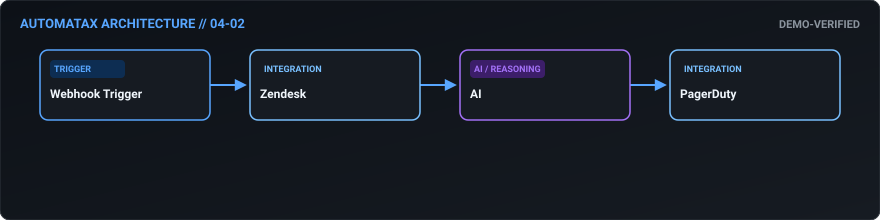
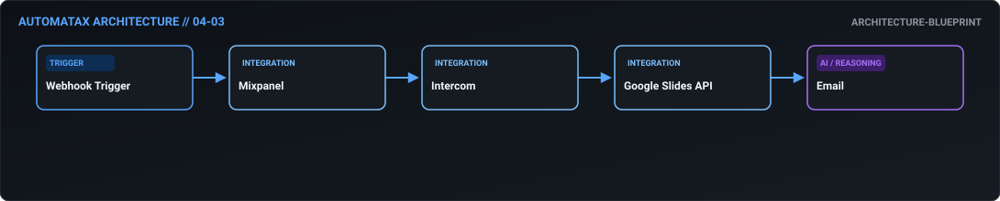
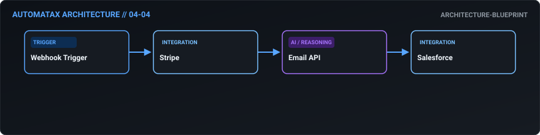
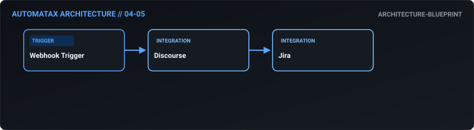
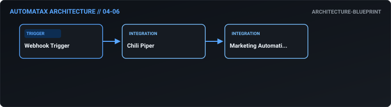
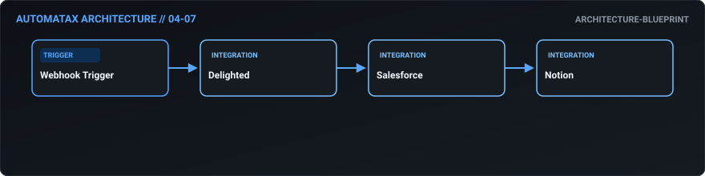
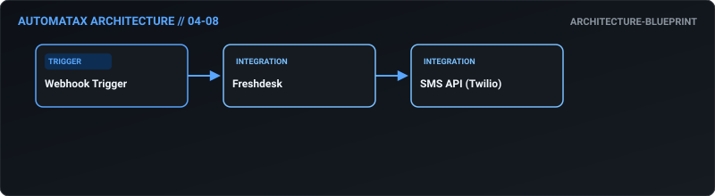
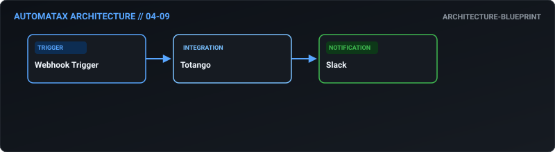
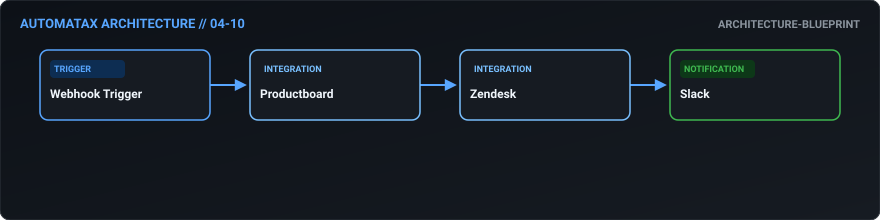

# 04. Customer Success — AutomataX Catalog

> **Category Focus:** Product feature drop-off alerts, AI ticket triage, QBR deck generation, churn deflection, SLA escalation.

---

## 📋 Available Workflows

| ID | Name | Business Problem | Trigger | Integrations | Maturity | Links |
| :---: | :--- | :--- | :---: | :--- | :---: | :--- |
| **04-01** | **[Proactive Feature Drop-Off Alerting](../docs/workflows/04-01-proactive-feature-drop-off-alerting.md)** | CSMs are often blindsided by churn because they lack visibility into when a cust... | `webhook` | `Segment, Gainsight, Slack` | 🔵 Blueprint | [JSON](../workflows/04-customer-success/04_01_proactive_feature_drop_off_alerting.json) · [Doc](../docs/workflows/04-01-proactive-feature-drop-off-alerting.md) |
| **04-02** | **[AI-Driven Support Ticket Triage](../docs/workflows/04-02-ai-driven-support-ticket-triage.md)** | Support queues get clogged with low-priority or repetitive questions, delaying r... | `webhook` | `Zendesk, AI, PagerDuty` | 🟢 Demo Verified | [JSON](../workflows/04-customer-success/04_02_ai_driven_support_ticket_triage.json) · [Doc](../docs/workflows/04-02-ai-driven-support-ticket-triage.md) |
| **04-03** | **[Automated QBR Deck Generation](../docs/workflows/04-03-automated-qbr-deck-generation.md)** | CSMs spend hours every quarter manually compiling usage graphs and support metri... | `webhook` | `Mixpanel, Intercom, Google Slides API` | 🔵 Blueprint | [JSON](../workflows/04-customer-success/04_03_automated_qbr_deck_generation.json) · [Doc](../docs/workflows/04-03-automated-qbr-deck-generation.md) |
| **04-04** | **[Dynamic Churn Deflection](../docs/workflows/04-04-dynamic-churn-deflection.md)** | When a customer hits 'cancel', relying on them to reach out to support is a lost... | `webhook` | `Stripe, Email API, Salesforce` | 🔵 Blueprint | [JSON](../workflows/04-customer-success/04_04_dynamic_churn_deflection.json) · [Doc](../docs/workflows/04-04-dynamic-churn-deflection.md) |
| **04-05** | **[Community Forum to Bug Tracker Sync](../docs/workflows/04-05-community-forum-to-bug-tracker-sync.md)** | Bugs reported by users in public community forums get lost or ignored, leading t... | `webhook` | `Discourse, Jira` | 🔵 Blueprint | [JSON](../workflows/04-customer-success/04_05_community_forum_to_bug_tracker_sync.json) · [Doc](../docs/workflows/04-05-community-forum-to-bug-tracker-sync.md) |
| **04-06** | **[Intent-Based Onboarding Sequences](../docs/workflows/04-06-intent-based-onboarding-sequences.md)** | Sending generic, one-size-fits-all onboarding emails results in low engagement. ... | `webhook` | `Chili Piper, Marketing Automation (e.g., Marketo/HubSpot)` | 🔵 Blueprint | [JSON](../workflows/04-customer-success/04_06_intent_based_onboarding_sequences.json) · [Doc](../docs/workflows/04-06-intent-based-onboarding-sequences.md) |
| **04-07** | **[Executive CSAT/NPS Correlation](../docs/workflows/04-07-executive-csat-nps-correlation.md)** | NPS scores exist in a silo. Executives need to know if the unhappy customers are... | `webhook` | `Delighted, Salesforce, Notion` | 🔵 Blueprint | [JSON](../workflows/04-customer-success/04_07_executive_csat_nps_correlation.json) · [Doc](../docs/workflows/04-07-executive-csat-nps-correlation.md) |
| **04-08** | **[Pre-Breach SLA Escalation](../docs/workflows/04-08-pre-breach-sla-escalation.md)** | By the time a support ticket breaches its SLA, the customer is already angry and... | `webhook` | `Freshdesk, SMS API (Twilio)` | 🔵 Blueprint | [JSON](../workflows/04-customer-success/04_08_pre_breach_sla_escalation.json) · [Doc](../docs/workflows/04-08-pre-breach-sla-escalation.md) |
| **04-09** | **[Account Health Slack Digest](../docs/workflows/04-09-account-health-slack-digest.md)** | The wider company (sales, product, leadership) rarely logs into Customer Success... | `webhook` | `Totango, Slack` | 🔵 Blueprint | [JSON](../workflows/04-customer-success/04_09_account_health_slack_digest.json) · [Doc](../docs/workflows/04-09-account-health-slack-digest.md) |
| **04-10** | **[Macro-Update Propagation](../docs/workflows/04-10-macro-update-propagation.md)** | When the product team releases a new feature, support agents are often left usin... | `webhook` | `Productboard, Zendesk, Slack` | 🔵 Blueprint | [JSON](../workflows/04-customer-success/04_10_macro_update_propagation.json) · [Doc](../docs/workflows/04-10-macro-update-propagation.md) |

---

## 🛠 Workflow Details

### 04-01 — Proactive Feature Drop-Off Alerting

- **Business Outcome:** Design a workflow that monitors product usage via Segment webhooks; if a key feature adoption drops by 20% week-over-week, automatically create a "Health Score Drop" task in Gainsight and alert the CSM via Slack.
- **Maturity:** `architecture-blueprint` | **Complexity:** `standard` | **Trigger:** `webhook`
- **Core Integrations:** `Segment` • `Gainsight` • `Slack`
- **Documentation:** [Read Specs](../docs/workflows/04-01-proactive-feature-drop-off-alerting.md)
- **Workflow File:** [Download n8n JSON](../workflows/04-customer-success/04_01_proactive_feature_drop_off_alerting.json)

---

### 04-02 — AI-Driven Support Ticket Triage

- **Business Outcome:** Build an automated ticket triage workflow: ingest Zendesk tickets, use AI to classify intent and sentiment, route P1 issues to PagerDuty, and auto-respond to P3 issues with relevant knowledge base articles.
- **Maturity:** `demo-verified` | **Complexity:** `advanced` | **Trigger:** `webhook`
- **Core Integrations:** `Zendesk` • `AI` • `PagerDuty`
- **Documentation:** [Read Specs](../docs/workflows/04-02-ai-driven-support-ticket-triage.md)
- **Workflow File:** [Download n8n JSON](../workflows/04-customer-success/04_02_ai_driven_support_ticket_triage.json)

---

### 04-03 — Automated QBR Deck Generation

- **Business Outcome:** Create a workflow that automates QBR prep: pull usage metrics from Mixpanel, pull support ticket volume from Intercom, generate a slide deck via Google Slides API, and email it to the CSM.
- **Maturity:** `architecture-blueprint` | **Complexity:** `intermediate` | **Trigger:** `webhook`
- **Core Integrations:** `Mixpanel` • `Intercom` • `Google Slides API` • `Email`
- **Documentation:** [Read Specs](../docs/workflows/04-03-automated-qbr-deck-generation.md)
- **Workflow File:** [Download n8n JSON](../workflows/04-customer-success/04_03_automated_qbr_deck_generation.json)

---

### 04-04 — Dynamic Churn Deflection

- **Business Outcome:** Design a workflow that handles automated churn intervention: when a cancellation request is submitted in Stripe, trigger a workflow that offers a dynamic discount via email, and if accepted, updates the subscription and creates a retention win task in Salesforce.
- **Maturity:** `architecture-blueprint` | **Complexity:** `standard` | **Trigger:** `webhook`
- **Core Integrations:** `Stripe` • `Email API` • `Salesforce`
- **Documentation:** [Read Specs](../docs/workflows/04-04-dynamic-churn-deflection.md)
- **Workflow File:** [Download n8n JSON](../workflows/04-customer-success/04_04_dynamic_churn_deflection.json)

---

### 04-05 — Community Forum to Bug Tracker Sync

- **Business Outcome:** Build a workflow that monitors community forums (Discourse); if a user posts a bug, automatically create a Jira ticket, link it to the forum post, and notify the user when the Jira status changes to "Resolved".
- **Maturity:** `architecture-blueprint` | **Complexity:** `standard` | **Trigger:** `webhook`
- **Core Integrations:** `Discourse` • `Jira`
- **Documentation:** [Read Specs](../docs/workflows/04-05-community-forum-to-bug-tracker-sync.md)
- **Workflow File:** [Download n8n JSON](../workflows/04-customer-success/04_05_community_forum_to_bug_tracker_sync.json)

---

### 04-06 — Intent-Based Onboarding Sequences

- **Business Outcome:** Create an automated onboarding email sequence workflow triggered by a welcome call completion in Chili Piper, dynamically adjusting the email content based on the user's selected use-case during the call.
- **Maturity:** `architecture-blueprint` | **Complexity:** `standard` | **Trigger:** `webhook`
- **Core Integrations:** `Chili Piper` • `Marketing Automation (e.g., Marketo/HubSpot)`
- **Documentation:** [Read Specs](../docs/workflows/04-06-intent-based-onboarding-sequences.md)
- **Workflow File:** [Download n8n JSON](../workflows/04-customer-success/04_06_intent_based_onboarding_sequences.json)

---

### 04-07 — Executive CSAT/NPS Correlation

- **Business Outcome:** Design a workflow that aggregates NPS/CSAT scores from Delighted, cross-references them with the customer's ARR in Salesforce, and automatically generates a monthly executive summary report in Notion.
- **Maturity:** `architecture-blueprint` | **Complexity:** `standard` | **Trigger:** `webhook`
- **Core Integrations:** `Delighted` • `Salesforce` • `Notion`
- **Documentation:** [Read Specs](../docs/workflows/04-07-executive-csat-nps-correlation.md)
- **Workflow File:** [Download n8n JSON](../workflows/04-customer-success/04_07_executive_csat_nps_correlation.json)

---

### 04-08 — Pre-Breach SLA Escalation

- **Business Outcome:** Build a workflow that automates SLA breach prevention: monitor ticket age in Freshdesk, and at 80% of SLA time, automatically escalate the ticket to a Tier 2 agent and notify the Support Manager via SMS.
- **Maturity:** `architecture-blueprint` | **Complexity:** `standard` | **Trigger:** `webhook`
- **Core Integrations:** `Freshdesk` • `SMS API (Twilio)`
- **Documentation:** [Read Specs](../docs/workflows/04-08-pre-breach-sla-escalation.md)
- **Workflow File:** [Download n8n JSON](../workflows/04-customer-success/04_08_pre_breach_sla_escalation.json)

---

### 04-09 — Account Health Slack Digest

- **Business Outcome:** Create a workflow that syncs customer health scores from Totango to Slack, posting a weekly "Wins and Risks" digest in the #customer-success channel, highlighting top expansions and at-risk accounts.
- **Maturity:** `architecture-blueprint` | **Complexity:** `standard` | **Trigger:** `webhook`
- **Core Integrations:** `Totango` • `Slack`
- **Documentation:** [Read Specs](../docs/workflows/04-09-account-health-slack-digest.md)
- **Workflow File:** [Download n8n JSON](../workflows/04-customer-success/04_09_account_health_slack_digest.json)

---

### 04-10 — Macro-Update Propagation

- **Business Outcome:** Design a workflow that automates macro-update propagation: when a product update is published in Productboard, automatically update the relevant macros in Zendesk and notify agents via a Slack digest.
- **Maturity:** `architecture-blueprint` | **Complexity:** `standard` | **Trigger:** `webhook`
- **Core Integrations:** `Productboard` • `Zendesk` • `Slack`
- **Documentation:** [Read Specs](../docs/workflows/04-10-macro-update-propagation.md)
- **Workflow File:** [Download n8n JSON](../workflows/04-customer-success/04_10_macro_update_propagation.json)

---

