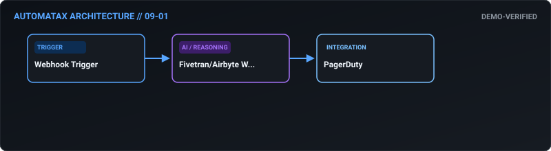
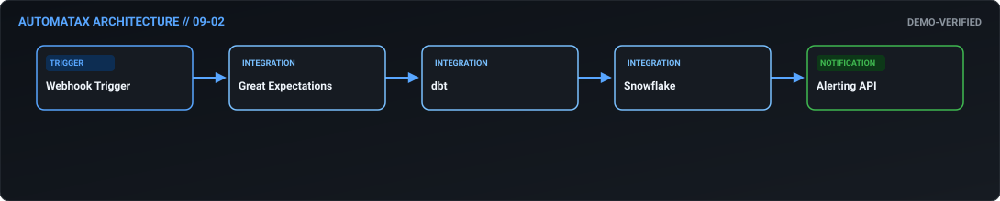
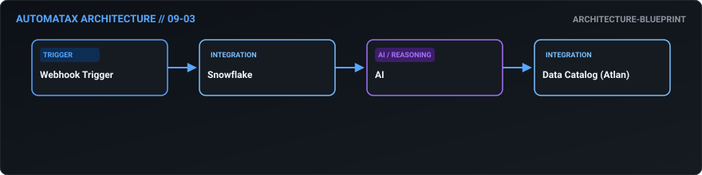
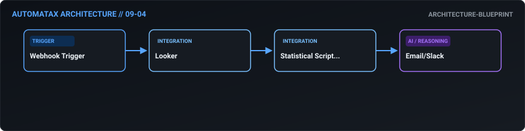
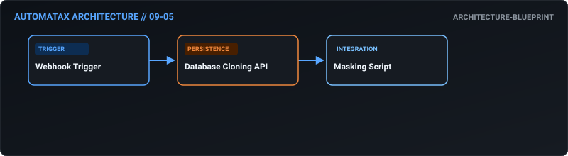
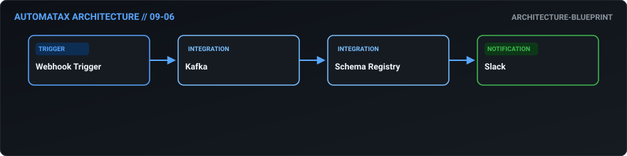
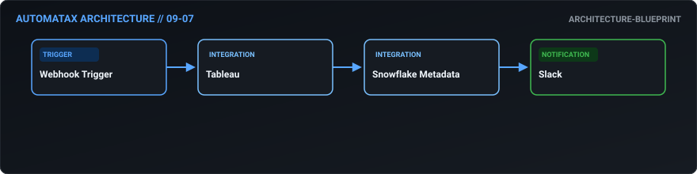
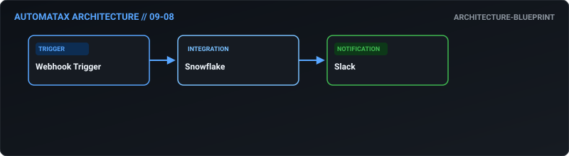
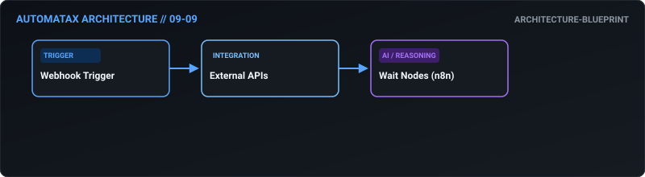
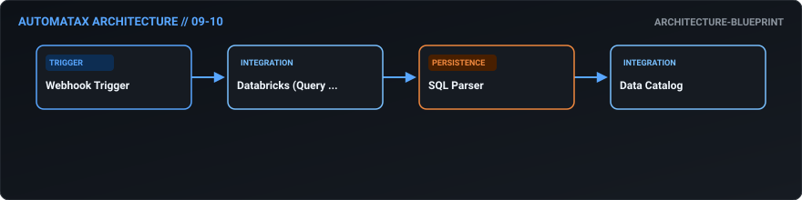

# 09. Data Engineering — AutomataX Catalog

> **Category Focus:** Self-healing ETL pipeline monitoring, data quality circuit breakers, schema evolution, PII masking.

---

## 📋 Available Workflows

| ID | Name | Business Problem | Trigger | Integrations | Maturity | Links |
| :---: | :--- | :--- | :---: | :--- | :---: | :--- |
| **09-01** | **[Self-Healing ETL Pipeline Monitor](../docs/workflows/09-01-self-healing-etl-pipeline-monitor.md)** | When an Airbyte or Fivetran sync fails silently, data engineers only find out da... | `webhook` | `Fivetran/Airbyte Webhooks, PagerDuty` | 🟢 Demo Verified | [JSON](../workflows/09-data-engineering/09_01_self_healing_etl_pipeline_monitor.json) · [Doc](../docs/workflows/09-01-self-healing-etl-pipeline-monitor.md) |
| **09-02** | **[Automated Data Quality Circuit Breaker](../docs/workflows/09-02-automated-data-quality-circuit-breaker.md)** | Bad data ingested from upstream systems pollutes downstream BI reports. By the t... | `webhook` | `Great Expectations, dbt, Snowflake` | 🟢 Demo Verified | [JSON](../workflows/09-data-engineering/09_02_automated_data_quality_circuit_breaker.json) · [Doc](../docs/workflows/09-02-automated-data-quality-circuit-breaker.md) |
| **09-03** | **[Auto-Updating Data Dictionary](../docs/workflows/09-03-auto-updating-data-dictionary.md)** | Data catalogs (like Atlan or Alation) go out of date instantly because engineers... | `webhook` | `Snowflake, AI, Data Catalog (Atlan)` | 🔵 Blueprint | [JSON](../workflows/09-data-engineering/09_03_auto_updating_data_dictionary.json) · [Doc](../docs/workflows/09-03-auto-updating-data-dictionary.md) |
| **09-04** | **[Statistical Dashboard Anomaly Detection](../docs/workflows/09-04-statistical-dashboard-anomaly-detection.md)** | Business owners don't look at dashboards every day. When a key metric crashes, i... | `webhook` | `Looker, Statistical Scripting, Email/Slack` | 🔵 Blueprint | [JSON](../workflows/09-data-engineering/09_04_statistical_dashboard_anomaly_detection.json) · [Doc](../docs/workflows/09-04-statistical-dashboard-anomaly-detection.md) |
| **09-05** | **[Dynamic PII Masking for Dev Environments](../docs/workflows/09-05-dynamic-pii-masking-for-dev-environments.md)** | Copying production databases to dev environments for testing often accidentally ... | `webhook` | `Database Cloning API, Masking Script` | 🔵 Blueprint | [JSON](../workflows/09-data-engineering/09_05_dynamic_pii_masking_for_dev_environments.json) · [Doc](../docs/workflows/09-05-dynamic-pii-masking-for-dev-environments.md) |
| **09-06** | **[Automated Schema Evolution Handling](../docs/workflows/09-06-automated-schema-evolution-handling.md)** | When an upstream engineering team adds a field to a JSON payload, it breaks down... | `webhook` | `Kafka, Schema Registry, Slack` | 🔵 Blueprint | [JSON](../workflows/09-data-engineering/09_06_automated_schema_evolution_handling.json) · [Doc](../docs/workflows/09-06-automated-schema-evolution-handling.md) |
| **09-07** | **[BI Tool "Data Health" Digest](../docs/workflows/09-07-bi-tool-data-health-digest.md)** | The data team has no idea which dashboards are actually being used by the busine... | `webhook` | `Tableau, Snowflake Metadata, Slack` | 🔵 Blueprint | [JSON](../workflows/09-data-engineering/09_07_bi_tool_data_health_digest.json) · [Doc](../docs/workflows/09-07-bi-tool-data-health-digest.md) |
| **09-08** | **[Automated Data Retention & Archival](../docs/workflows/09-08-automated-data-retention-archival.md)** | Keeping years of raw log data in a high-performance Snowflake warehouse costs a ... | `webhook` | `Snowflake, Slack` | 🔵 Blueprint | [JSON](../workflows/09-data-engineering/09_08_automated_data_retention_archival.json) · [Doc](../docs/workflows/09-08-automated-data-retention-archival.md) |
| **09-09** | **[Intelligent API Rate Limit Handler](../docs/workflows/09-09-intelligent-api-rate-limit-handler.md)** | Simple ETL scripts often crash because they hit rate limits on external APIs (li... | `webhook` | `External APIs, Wait Nodes (n8n)` | 🔵 Blueprint | [JSON](../workflows/09-data-engineering/09_09_intelligent_api_rate_limit_handler.json) · [Doc](../docs/workflows/09-09-intelligent-api-rate-limit-handler.md) |
| **09-10** | **[Automated Data Lineage Mapping](../docs/workflows/09-10-automated-data-lineage-mapping.md)** | When a base table changes, data engineers have no way to know which downstream r... | `webhook` | `Databricks (Query History), SQL Parser, Data Catalog` | 🔵 Blueprint | [JSON](../workflows/09-data-engineering/09_10_automated_data_lineage_mapping.json) · [Doc](../docs/workflows/09-10-automated-data-lineage-mapping.md) |

---

## 🛠 Workflow Details

### 09-01 — Self-Healing ETL Pipeline Monitor

- **Business Outcome:** Build an n8n workflow that automates ETL pipeline monitoring: listen for webhooks from Fivetran/Airbyte; if a sync fails, parse the error, restart the sync, and if it fails twice, page the data engineer via PagerDuty.
- **Maturity:** `demo-verified` | **Complexity:** `advanced` | **Trigger:** `webhook`
- **Core Integrations:** `Fivetran/Airbyte Webhooks` • `PagerDuty`
- **Documentation:** [Read Specs](../docs/workflows/09-01-self-healing-etl-pipeline-monitor.md)
- **Workflow File:** [Download n8n JSON](../workflows/09-data-engineering/09_01_self_healing_etl_pipeline_monitor.json)

---

### 09-02 — Automated Data Quality Circuit Breaker

- **Business Outcome:** Design a workflow that automates data quality checks: run a Great Expectations script via a webhook; if data quality drops below 99%, automatically halt downstream dbt models in Snowflake and alert the data team.
- **Maturity:** `demo-verified` | **Complexity:** `advanced` | **Trigger:** `webhook`
- **Core Integrations:** `Great Expectations` • `dbt` • `Snowflake` • `Alerting API`
- **Documentation:** [Read Specs](../docs/workflows/09-02-automated-data-quality-circuit-breaker.md)
- **Workflow File:** [Download n8n JSON](../workflows/09-data-engineering/09_02_automated_data_quality_circuit_breaker.json)

---

### 09-03 — Auto-Updating Data Dictionary

- **Business Outcome:** Create an automated data dictionary update workflow: when a new column is added to a Snowflake table, automatically extract the metadata, use AI to generate a description, and push it to the data catalog (Atlan).
- **Maturity:** `architecture-blueprint` | **Complexity:** `standard` | **Trigger:** `webhook`
- **Core Integrations:** `Snowflake` • `AI` • `Data Catalog (Atlan)`
- **Documentation:** [Read Specs](../docs/workflows/09-03-auto-updating-data-dictionary.md)
- **Workflow File:** [Download n8n JSON](../workflows/09-data-engineering/09_03_auto_updating_data_dictionary.json)

---

### 09-04 — Statistical Dashboard Anomaly Detection

- **Business Outcome:** Build a workflow that automates anomaly detection in dashboards: pull daily metrics from Looker; if a metric deviates >3 standard deviations from the 30-day mean, automatically generate a root-cause analysis prompt and email the data owner.
- **Maturity:** `architecture-blueprint` | **Complexity:** `standard` | **Trigger:** `webhook`
- **Core Integrations:** `Looker` • `Statistical Scripting` • `Email/Slack`
- **Documentation:** [Read Specs](../docs/workflows/09-04-statistical-dashboard-anomaly-detection.md)
- **Workflow File:** [Download n8n JSON](../workflows/09-data-engineering/09_04_statistical_dashboard_anomaly_detection.json)

---

### 09-05 — Dynamic PII Masking for Dev Environments

- **Business Outcome:** Design a workflow that handles automated data masking: when a production database clone is requested for dev, automatically trigger a script to mask PII (names, emails, SSNs) before provisioning the database to the developer.
- **Maturity:** `architecture-blueprint` | **Complexity:** `standard` | **Trigger:** `webhook`
- **Core Integrations:** `Database Cloning API` • `Masking Script`
- **Documentation:** [Read Specs](../docs/workflows/09-05-dynamic-pii-masking-for-dev-environments.md)
- **Workflow File:** [Download n8n JSON](../workflows/09-data-engineering/09_05_dynamic_pii_masking_for_dev_environments.json)

---

### 09-06 — Automated Schema Evolution Handling

- **Business Outcome:** Create a workflow that automates schema evolution: when a new JSON field is detected in an incoming Kafka topic, automatically update the Avro schema in the Schema Registry and notify the data engineers via Slack.
- **Maturity:** `architecture-blueprint` | **Complexity:** `standard` | **Trigger:** `webhook`
- **Core Integrations:** `Kafka` • `Schema Registry` • `Slack`
- **Documentation:** [Read Specs](../docs/workflows/09-06-automated-schema-evolution-handling.md)
- **Workflow File:** [Download n8n JSON](../workflows/09-data-engineering/09_06_automated_schema_evolution_handling.json)

---

### 09-07 — BI Tool "Data Health" Digest

- **Business Outcome:** Build a workflow that syncs BI tool metadata to Slack: every Monday, pull the most viewed dashboards from Tableau, the slowest running queries from Snowflake, and post a "Data Health & Usage" digest to the #data-team channel.
- **Maturity:** `architecture-blueprint` | **Complexity:** `standard` | **Trigger:** `webhook`
- **Core Integrations:** `Tableau` • `Snowflake Metadata` • `Slack`
- **Documentation:** [Read Specs](../docs/workflows/09-07-bi-tool-data-health-digest.md)
- **Workflow File:** [Download n8n JSON](../workflows/09-data-engineering/09_07_bi_tool_data_health_digest.json)

---

### 09-08 — Automated Data Retention & Archival

- **Business Outcome:** Design a workflow that automates data retention policies: monthly, query Snowflake for tables older than X days, generate a drop/alter script, route it for DBA approval via Slack, and execute upon approval.
- **Maturity:** `architecture-blueprint` | **Complexity:** `standard` | **Trigger:** `webhook`
- **Core Integrations:** `Snowflake` • `Slack`
- **Documentation:** [Read Specs](../docs/workflows/09-08-automated-data-retention-archival.md)
- **Workflow File:** [Download n8n JSON](../workflows/09-data-engineering/09_08_automated_data_retention_archival.json)

---

### 09-09 — Intelligent API Rate Limit Handler

- **Business Outcome:** Create a workflow that automates API rate limit handling: when an external API returns a 429 Too Many Requests, automatically parse the Retry-After header, pause the n8n workflow using a Wait node, and resume seamlessly.
- **Maturity:** `architecture-blueprint` | **Complexity:** `standard` | **Trigger:** `webhook`
- **Core Integrations:** `External APIs` • `Wait Nodes (n8n)`
- **Documentation:** [Read Specs](../docs/workflows/09-09-intelligent-api-rate-limit-handler.md)
- **Workflow File:** [Download n8n JSON](../workflows/09-data-engineering/09_09_intelligent_api_rate_limit_handler.json)

---

### 09-10 — Automated Data Lineage Mapping

- **Business Outcome:** Build a workflow that automates data lineage mapping: parse SQL queries from the query warehouse (e.g., Databricks), extract table dependencies, and automatically update the lineage graph in the data catalog.
- **Maturity:** `architecture-blueprint` | **Complexity:** `standard` | **Trigger:** `webhook`
- **Core Integrations:** `Databricks (Query History)` • `SQL Parser` • `Data Catalog`
- **Documentation:** [Read Specs](../docs/workflows/09-10-automated-data-lineage-mapping.md)
- **Workflow File:** [Download n8n JSON](../workflows/09-data-engineering/09_10_automated_data_lineage_mapping.json)

---

