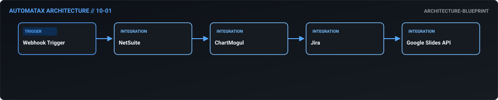
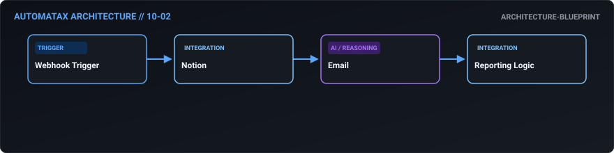
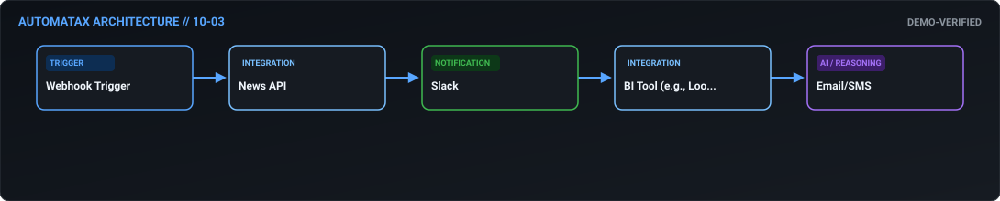
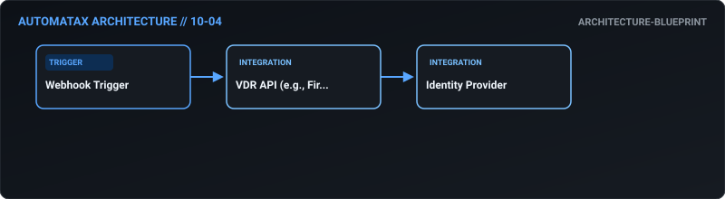
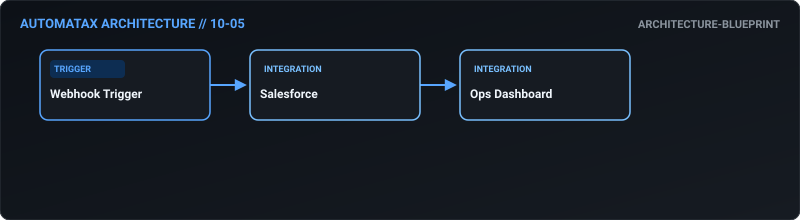
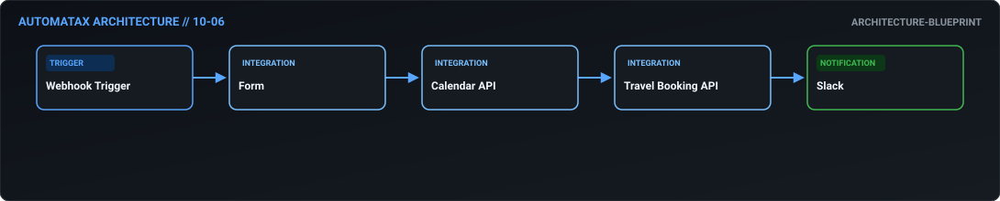
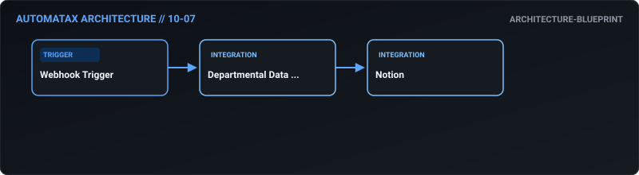
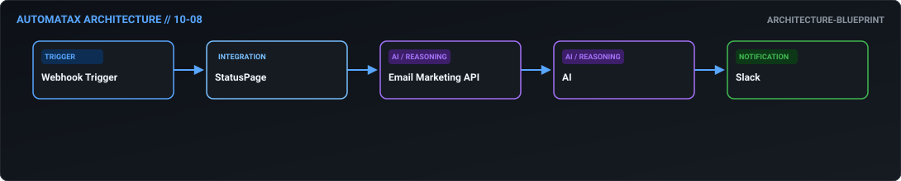
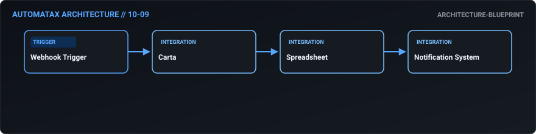
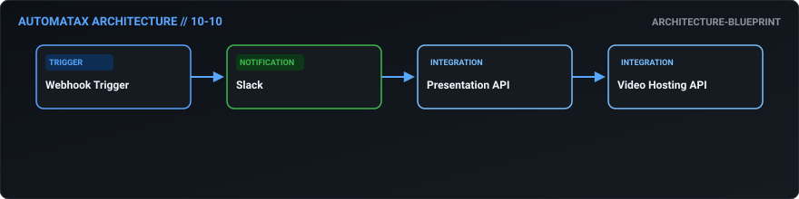

# 10. Executive Operations — AutomataX Catalog

> **Category Focus:** Board deck assembly, CEO morning briefing engine, M&A data room setup, executive OKR tracking.

---

## 📋 Available Workflows

| ID | Name | Business Problem | Trigger | Integrations | Maturity | Links |
| :---: | :--- | :--- | :---: | :--- | :---: | :--- |
| **10-01** | **[Zero-Touch Board Deck Assembly](../docs/workflows/10-01-zero-touch-board-deck-assembly.md)** | The CEO and Chief of Staff spend a full week every quarter hunting down metrics ... | `webhook` | `NetSuite, ChartMogul, Jira` | 🔵 Blueprint | [JSON](../workflows/10-executive/10_01_zero_touch_board_deck_assembly.json) · [Doc](../docs/workflows/10-01-zero-touch-board-deck-assembly.md) |
| **10-02** | **[Automated Executive OKR Tracking](../docs/workflows/10-02-automated-executive-okr-tracking.md)** | Department heads forget to update their OKRs. When leadership meets, half the da... | `webhook` | `Notion, Email, Reporting Logic` | 🔵 Blueprint | [JSON](../workflows/10-executive/10_02_automated_executive_okr_tracking.json) · [Doc](../docs/workflows/10-02-automated-executive-okr-tracking.md) |
| **10-03** | **[The "CEO Morning Briefing" Engine](../docs/workflows/10-03-the-ceo-morning-briefing-engine.md)** | Executives are overwhelmed by notifications across 10 different apps. They need ... | `webhook` | `News API, Slack, BI Tool (e.g., Looker)` | 🟢 Demo Verified | [JSON](../workflows/10-executive/10_03_the_ceo_morning_briefing_engine.json) · [Doc](../docs/workflows/10-03-the-ceo-morning-briefing-engine.md) |
| **10-04** | **[Automated M&A Virtual Data Room Setup](../docs/workflows/10-04-automated-m-a-virtual-data-room-setup.md)** | During a merger or acquisition, standing up a secure data room and granting gran... | `webhook` | `VDR API (e.g., Firmroom), Identity Provider` | 🔵 Blueprint | [JSON](../workflows/10-executive/10_04_automated_m_a_virtual_data_room_setup.json) · [Doc](../docs/workflows/10-04-automated-m-a-virtual-data-room-setup.md) |
| **10-05** | **[Cross-Departmental SLA Enforcer](../docs/workflows/10-05-cross-departmental-sla-enforcer.md)** | Sales blames CS for slow onboarding; CS blames Sales for poor handoffs. Without ... | `webhook` | `Salesforce, Ops Dashboard` | 🔵 Blueprint | [JSON](../workflows/10-executive/10_05_cross_departmental_sla_enforcer.json) · [Doc](../docs/workflows/10-05-cross-departmental-sla-enforcer.md) |
| **10-06** | **[Intelligent Executive Travel Concierge](../docs/workflows/10-06-intelligent-executive-travel-concierge.md)** | Executive Assistants waste hours cross-referencing calendars and booking portals... | `webhook` | `Form, Calendar API, Travel Booking API` | 🔵 Blueprint | [JSON](../workflows/10-executive/10_06_intelligent_executive_travel_concierge.json) · [Doc](../docs/workflows/10-06-intelligent-executive-travel-concierge.md) |
| **10-07** | **[Frictionless QBR Preparation](../docs/workflows/10-07-frictionless-qbr-preparation.md)** | Quarterly Business Reviews for the executive team become messy because every dep... | `webhook` | `Departmental Data Sources, Notion` | 🔵 Blueprint | [JSON](../workflows/10-executive/10_07_frictionless_qbr_preparation.json) · [Doc](../docs/workflows/10-07-frictionless-qbr-preparation.md) |
| **10-08** | **[Crisis Communication Broadcaster](../docs/workflows/10-08-crisis-communication-broadcaster.md)** | During a PR crisis or severe outage, coordinating the message across the status ... | `webhook` | `StatusPage, Email Marketing API, AI` | 🔵 Blueprint | [JSON](../workflows/10-executive/10_08_crisis_communication_broadcaster.json) · [Doc](../docs/workflows/10-08-crisis-communication-broadcaster.md) |
| **10-09** | **[Zero-Touch Cap Table Sync](../docs/workflows/10-09-zero-touch-cap-table-sync.md)** | Issuing new equity grants or SAFEs on Carta but failing to update the internal f... | `webhook` | `Carta, Spreadsheet, Notification System` | 🔵 Blueprint | [JSON](../workflows/10-executive/10_09_zero_touch_cap_table_sync.json) · [Doc](../docs/workflows/10-09-zero-touch-cap-table-sync.md) |
| **10-10** | **[Automated All-Hands Meeting Production](../docs/workflows/10-10-automated-all-hands-meeting-production.md)** | Producing a high-quality, monthly all-hands meeting requires gathering slides, w... | `webhook` | `Slack, Presentation API, Video Hosting API` | 🔵 Blueprint | [JSON](../workflows/10-executive/10_10_automated_all_hands_meeting_production.json) · [Doc](../docs/workflows/10-10-automated-all-hands-meeting-production.md) |

---

## 🛠 Workflow Details

### 10-01 — Zero-Touch Board Deck Assembly

- **Business Outcome:** Design an n8n workflow that automates the Board of Directors deck creation: pull financial actuals from NetSuite, SaaS metrics from ChartMogul, and product roadmap from Jira, and automatically populate a master Google Slides template.
- **Maturity:** `architecture-blueprint` | **Complexity:** `intermediate` | **Trigger:** `webhook`
- **Core Integrations:** `NetSuite` • `ChartMogul` • `Jira` • `Google Slides API`
- **Documentation:** [Read Specs](../docs/workflows/10-01-zero-touch-board-deck-assembly.md)
- **Workflow File:** [Download n8n JSON](../workflows/10-executive/10_01_zero_touch_board_deck_assembly.json)

---

### 10-02 — Automated Executive OKR Tracking

- **Business Outcome:** Build a workflow that automates OKR tracking: bi-weekly, pull progress updates from Notion, calculate completion percentages, and automatically generate a "Red/Yellow/Green" status report for the executive team via email.
- **Maturity:** `architecture-blueprint` | **Complexity:** `standard` | **Trigger:** `webhook`
- **Core Integrations:** `Notion` • `Email` • `Reporting Logic`
- **Documentation:** [Read Specs](../docs/workflows/10-02-automated-executive-okr-tracking.md)
- **Workflow File:** [Download n8n JSON](../workflows/10-executive/10_02_automated_executive_okr_tracking.json)

---

### 10-03 — The "CEO Morning Briefing" Engine

- **Business Outcome:** Create an automated executive briefing workflow: every morning at 6 AM, aggregate top news via API, pull internal Slack highlights from #wins, summarize key metrics from the BI tool, and send a personalized morning digest to the CEO.
- **Maturity:** `demo-verified` | **Complexity:** `advanced` | **Trigger:** `webhook`
- **Core Integrations:** `News API` • `Slack` • `BI Tool (e.g., Looker)` • `Email/SMS`
- **Documentation:** [Read Specs](../docs/workflows/10-03-the-ceo-morning-briefing-engine.md)
- **Workflow File:** [Download n8n JSON](../workflows/10-executive/10_03_the_ceo_morning_briefing_engine.json)

---

### 10-04 — Automated M&A Virtual Data Room Setup

- **Business Outcome:** Design a workflow that automates M&A data room setup: when a new M&A project is initiated, automatically create a secure VDR (Virtual Data Room) in Firmroom, provision access for legal/finance, and trigger an indexing workflow for uploaded documents.
- **Maturity:** `architecture-blueprint` | **Complexity:** `standard` | **Trigger:** `webhook`
- **Core Integrations:** `VDR API (e.g., Firmroom)` • `Identity Provider`
- **Documentation:** [Read Specs](../docs/workflows/10-04-automated-m-a-virtual-data-room-setup.md)
- **Workflow File:** [Download n8n JSON](../workflows/10-executive/10_04_automated_m_a_virtual_data_room_setup.json)

---

### 10-05 — Cross-Departmental SLA Enforcer

- **Business Outcome:** Build a workflow that automates cross-departmental SLA tracking: monitor handoffs between Sales and CS in Salesforce; if the "Time to Onboarding" SLA is breached, automatically flag it in the weekly Ops review and deduct points from the rep's score.
- **Maturity:** `architecture-blueprint` | **Complexity:** `standard` | **Trigger:** `webhook`
- **Core Integrations:** `Salesforce` • `Ops Dashboard`
- **Documentation:** [Read Specs](../docs/workflows/10-05-cross-departmental-sla-enforcer.md)
- **Workflow File:** [Download n8n JSON](../workflows/10-executive/10_05_cross_departmental_sla_enforcer.json)

---

### 10-06 — Intelligent Executive Travel Concierge

- **Business Outcome:** Create a workflow that automates executive travel booking: when an exec requests travel via a form, check their calendar for conflicts, find the best flights/hotels via API, present options via Slack, and book upon approval.
- **Maturity:** `architecture-blueprint` | **Complexity:** `intermediate` | **Trigger:** `webhook`
- **Core Integrations:** `Form` • `Calendar API` • `Travel Booking API` • `Slack`
- **Documentation:** [Read Specs](../docs/workflows/10-06-intelligent-executive-travel-concierge.md)
- **Workflow File:** [Download n8n JSON](../workflows/10-executive/10_06_intelligent_executive_travel_concierge.json)

---

### 10-07 — Frictionless QBR Preparation

- **Business Outcome:** Design a workflow that automates quarterly business review (QBR) prep for the exec team: aggregate departmental OKR completions, financial variance reports, and strategic initiative updates into a single Notion dashboard.
- **Maturity:** `architecture-blueprint` | **Complexity:** `standard` | **Trigger:** `webhook`
- **Core Integrations:** `Departmental Data Sources` • `Notion`
- **Documentation:** [Read Specs](../docs/workflows/10-07-frictionless-qbr-preparation.md)
- **Workflow File:** [Download n8n JSON](../workflows/10-executive/10_07_frictionless_qbr_preparation.json)

---

### 10-08 — Crisis Communication Broadcaster

- **Business Outcome:** Build a workflow that handles automated executive communication: when a critical incident occurs, automatically draft a status page update and a customer-facing email using AI, route for exec approval via Slack, and publish upon click.
- **Maturity:** `architecture-blueprint` | **Complexity:** `intermediate` | **Trigger:** `webhook`
- **Core Integrations:** `StatusPage` • `Email Marketing API` • `AI` • `Slack`
- **Documentation:** [Read Specs](../docs/workflows/10-08-crisis-communication-broadcaster.md)
- **Workflow File:** [Download n8n JSON](../workflows/10-executive/10_08_crisis_communication_broadcaster.json)

---

### 10-09 — Zero-Touch Cap Table Sync

- **Business Outcome:** Create a workflow that automates cap table management: when a new SAFE or equity grant is signed in Carta, automatically update the internal cap table spreadsheet, notify the CFO, and trigger a legal compliance check.
- **Maturity:** `architecture-blueprint` | **Complexity:** `standard` | **Trigger:** `webhook`
- **Core Integrations:** `Carta` • `Spreadsheet` • `Notification System`
- **Documentation:** [Read Specs](../docs/workflows/10-09-zero-touch-cap-table-sync.md)
- **Workflow File:** [Download n8n JSON](../workflows/10-executive/10_09_zero_touch_cap_table_sync.json)

---

### 10-10 — Automated All-Hands Meeting Production

- **Business Outcome:** Design a workflow that automates the "State of the Company" all-hands meeting: aggregate video shoutouts from Slack, pull key metrics for the presentation, generate a running script for the CEO, and automatically distribute the recording and transcript post-meeting.
- **Maturity:** `architecture-blueprint` | **Complexity:** `standard` | **Trigger:** `webhook`
- **Core Integrations:** `Slack` • `Presentation API` • `Video Hosting API`
- **Documentation:** [Read Specs](../docs/workflows/10-10-automated-all-hands-meeting-production.md)
- **Workflow File:** [Download n8n JSON](../workflows/10-executive/10_10_automated_all_hands_meeting_production.json)

---

