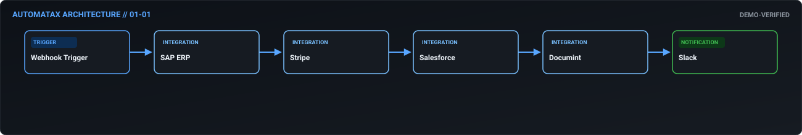
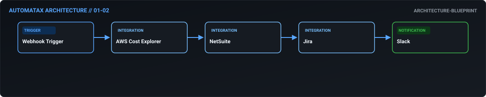
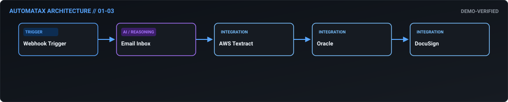
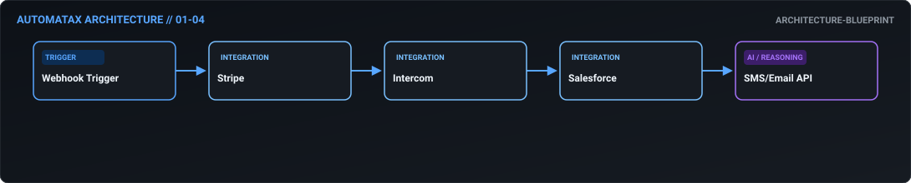
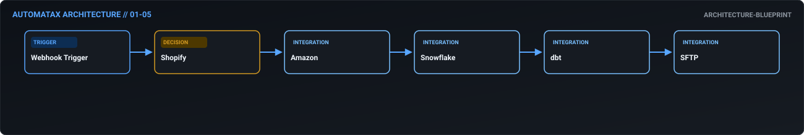
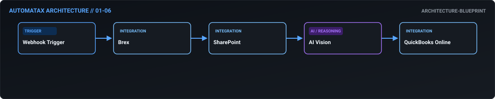
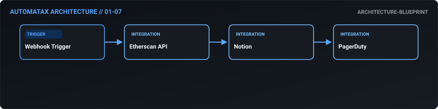
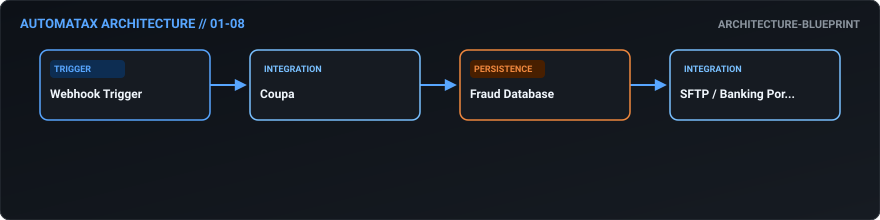
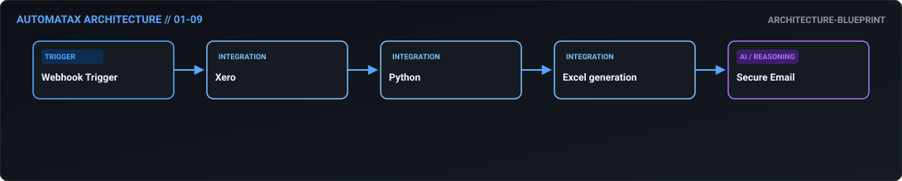
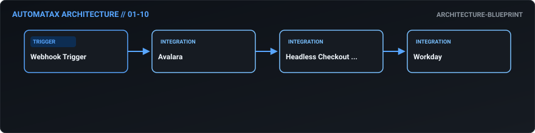

# 01. FinOps & Revenue — AutomataX Catalog

> **Category Focus:** Multi-currency revenue recognition, AP automation, budget vs actuals, cloud cost monitoring, and subscription dunning.

---

## 📋 Available Workflows

| ID | Name | Business Problem | Trigger | Integrations | Maturity | Links |
| :---: | :--- | :--- | :---: | :--- | :---: | :--- |
| **01-01** | **[Multi-Currency Revenue Recognition & Reporting](../docs/workflows/01-01-multi-currency-revenue-recognition-reporting.md)** | Finance teams waste hours manually fetching daily FX rates, reconciling discrepa... | `webhook` | `SAP ERP, Stripe, Salesforce` | 🟢 Demo Verified | [JSON](../workflows/01-finops/01_01_multi_currency_revenue_recognition_reporting.json) · [Doc](../docs/workflows/01-01-multi-currency-revenue-recognition-reporting.md) |
| **01-02** | **[Automated Budget vs. Actuals Cloud Cost Monitoring](../docs/workflows/01-02-automated-budget-vs-actuals-cloud-cost-monitoring.md)** | Cloud spend often spirals out of control before FinOps can catch it. Manual comp... | `webhook` | `AWS Cost Explorer, NetSuite, Jira` | 🔵 Blueprint | [JSON](../workflows/01-finops/01_02_automated_budget_vs_actuals_cloud_cost_monitoring.json) · [Doc](../docs/workflows/01-02-automated-budget-vs-actuals-cloud-cost-monitoring.md) |
| **01-03** | **[Intelligent Accounts Payable Automation](../docs/workflows/01-03-intelligent-accounts-payable-automation.md)** | Processing hundreds of inbound invoices manually is prone to human error, missed... | `webhook` | `Email Inbox, AWS Textract, Oracle` | 🟢 Demo Verified | [JSON](../workflows/01-finops/01_03_intelligent_accounts_payable_automation.json) · [Doc](../docs/workflows/01-03-intelligent-accounts-payable-automation.md) |
| **01-04** | **[Dynamic Subscription Dunning & Retention](../docs/workflows/01-04-dynamic-subscription-dunning-retention.md)** | Failed payments lead to involuntary churn. Handling collections manually is inef... | `webhook` | `Stripe, Intercom, Salesforce` | 🔵 Blueprint | [JSON](../workflows/01-finops/01_04_dynamic_subscription_dunning_retention.json) · [Doc](../docs/workflows/01-04-dynamic-subscription-dunning-retention.md) |
| **01-05** | **[Omnichannel Sales Aggregation & Data Warehousing](../docs/workflows/01-05-omnichannel-sales-aggregation-data-warehousing.md)** | Aggregating daily sales data across multiple platforms (Shopify, Amazon, custom ... | `webhook` | `Shopify, Amazon, Snowflake` | 🔵 Blueprint | [JSON](../workflows/01-finops/01_05_omnichannel_sales_aggregation_data_warehousing.json) · [Doc](../docs/workflows/01-05-omnichannel-sales-aggregation-data-warehousing.md) |
| **01-06** | **[Corporate Card Expense Reconciliation](../docs/workflows/01-06-corporate-card-expense-reconciliation.md)** | Employees delay submitting receipts, and finance struggles to match them against... | `webhook` | `Brex, SharePoint, AI Vision` | 🔵 Blueprint | [JSON](../workflows/01-finops/01_06_corporate_card_expense_reconciliation.json) · [Doc](../docs/workflows/01-06-corporate-card-expense-reconciliation.md) |
| **01-07** | **[Crypto Treasury Real-Time P&L Tracking](../docs/workflows/01-07-crypto-treasury-real-time-p-l-tracking.md)** | Managing corporate crypto treasuries requires constant monitoring. Sudden market... | `webhook` | `Etherscan API, Notion, PagerDuty` | 🔵 Blueprint | [JSON](../workflows/01-finops/01_07_crypto_treasury_real_time_p_l_tracking.json) · [Doc](../docs/workflows/01-07-crypto-treasury-real-time-p-l-tracking.md) |
| **01-08** | **[Fraud-Resistant Vendor Payment Gateway](../docs/workflows/01-08-fraud-resistant-vendor-payment-gateway.md)** | Vendor bank detail spoofing is a common fraud vector. Verifying payment details ... | `webhook` | `Coupa, Fraud Database, SFTP / Banking Portal` | 🔵 Blueprint | [JSON](../workflows/01-finops/01_08_fraud_resistant_vendor_payment_gateway.json) · [Doc](../docs/workflows/01-08-fraud-resistant-vendor-payment-gateway.md) |
| **01-09** | **[Automated Month-End Close & Board Reporting](../docs/workflows/01-09-automated-month-end-close-board-reporting.md)** | The month-end close process requires aggregating data, running complex variance ... | `webhook` | `Xero, Python, Excel generation` | 🔵 Blueprint | [JSON](../workflows/01-finops/01_09_automated_month_end_close_board_reporting.json) · [Doc](../docs/workflows/01-09-automated-month-end-close-board-reporting.md) |
| **01-10** | **[Headless Checkout Tax Liability Sync](../docs/workflows/01-10-headless-checkout-tax-liability-sync.md)** | Global tax compliance (nexus rules, VAT) is notoriously difficult. Syncing e-com... | `webhook` | `Avalara, Headless Checkout API, Workday` | 🔵 Blueprint | [JSON](../workflows/01-finops/01_10_headless_checkout_tax_liability_sync.json) · [Doc](../docs/workflows/01-10-headless-checkout-tax-liability-sync.md) |

---

## 🛠 Workflow Details

### 01-01 — Multi-Currency Revenue Recognition & Reporting

- **Business Outcome:** Build an n8n workflow connecting SAP ERP, Stripe, and Salesforce to automate multi-currency revenue recognition, including automated daily FX rate fetching via API, discrepancy flagging in Slack, and generating a monthly PDF report via Documint.
- **Maturity:** `demo-verified` | **Complexity:** `advanced` | **Trigger:** `webhook`
- **Core Integrations:** `SAP ERP` • `Stripe` • `Salesforce` • `Documint` • `Slack`
- **Documentation:** [Read Specs](../docs/workflows/01-01-multi-currency-revenue-recognition-reporting.md)
- **Workflow File:** [Download n8n JSON](../workflows/01-finops/01_01_multi_currency_revenue_recognition_reporting.json)

---

### 01-02 — Automated Budget vs. Actuals Cloud Cost Monitoring

- **Business Outcome:** Design a workflow that monitors AWS Cost Explorer API, compares actuals vs. budgeted spend in NetSuite, and automatically triggers a Jira ticket for the FinOps team if variance exceeds 5%, including a Slack summary.
- **Maturity:** `architecture-blueprint` | **Complexity:** `intermediate` | **Trigger:** `webhook`
- **Core Integrations:** `AWS Cost Explorer` • `NetSuite` • `Jira` • `Slack`
- **Documentation:** [Read Specs](../docs/workflows/01-02-automated-budget-vs-actuals-cloud-cost-monitoring.md)
- **Workflow File:** [Download n8n JSON](../workflows/01-finops/01_02_automated_budget_vs_actuals_cloud_cost_monitoring.json)

---

### 01-03 — Intelligent Accounts Payable Automation

- **Business Outcome:** Create an automated accounts payable workflow that ingests invoices from a dedicated email inbox, uses OCR (via AWS Textract) to extract line items, matches them against POs in Oracle, and routes for multi-tier approval in DocuSign based on amount thresholds.
- **Maturity:** `demo-verified` | **Complexity:** `advanced` | **Trigger:** `webhook`
- **Core Integrations:** `Email Inbox` • `AWS Textract` • `Oracle` • `DocuSign`
- **Documentation:** [Read Specs](../docs/workflows/01-03-intelligent-accounts-payable-automation.md)
- **Workflow File:** [Download n8n JSON](../workflows/01-finops/01_03_intelligent_accounts_payable_automation.json)

---

### 01-04 — Dynamic Subscription Dunning & Retention

- **Business Outcome:** Build a subscription dunning workflow integrating Stripe, Intercom, and Salesforce: on failed payment, pause service via API, trigger a personalized SMS/Email sequence, update CRM opportunity stage, and create a high-priority support ticket if unresolved in 48 hours.
- **Maturity:** `architecture-blueprint` | **Complexity:** `intermediate` | **Trigger:** `webhook`
- **Core Integrations:** `Stripe` • `Intercom` • `Salesforce` • `SMS/Email API`
- **Documentation:** [Read Specs](../docs/workflows/01-04-dynamic-subscription-dunning-retention.md)
- **Workflow File:** [Download n8n JSON](../workflows/01-finops/01_04_dynamic_subscription_dunning_retention.json)

---

### 01-05 — Omnichannel Sales Aggregation & Data Warehousing

- **Business Outcome:** Design a workflow that aggregates daily sales data from Shopify, Amazon, and custom APIs, transforms it using complex JavaScript nodes, and pushes it to a Snowflake data warehouse via SFTP, triggering a dbt run upon completion.
- **Maturity:** `architecture-blueprint` | **Complexity:** `intermediate` | **Trigger:** `webhook`
- **Core Integrations:** `Shopify` • `Amazon` • `Snowflake` • `dbt` • `SFTP`
- **Documentation:** [Read Specs](../docs/workflows/01-05-omnichannel-sales-aggregation-data-warehousing.md)
- **Workflow File:** [Download n8n JSON](../workflows/01-finops/01_05_omnichannel_sales_aggregation_data_warehousing.json)

---

### 01-06 — Corporate Card Expense Reconciliation

- **Business Outcome:** Create an automated expense reconciliation workflow that pulls corporate card transactions from Brex, matches them against receipts uploaded to a SharePoint folder using AI vision, and posts approved entries to QuickBooks Online.
- **Maturity:** `architecture-blueprint` | **Complexity:** `intermediate` | **Trigger:** `webhook`
- **Core Integrations:** `Brex` • `SharePoint` • `AI Vision` • `QuickBooks Online`
- **Documentation:** [Read Specs](../docs/workflows/01-06-corporate-card-expense-reconciliation.md)
- **Workflow File:** [Download n8n JSON](../workflows/01-finops/01_06_corporate_card_expense_reconciliation.json)

---

### 01-07 — Crypto Treasury Real-Time P&L Tracking

- **Business Outcome:** Build a workflow that monitors crypto treasury wallets via Etherscan API, calculates daily P&L based on real-time oracle prices, and updates a Notion dashboard while alerting the CFO via PagerDuty if daily loss exceeds a set threshold.
- **Maturity:** `architecture-blueprint` | **Complexity:** `standard` | **Trigger:** `webhook`
- **Core Integrations:** `Etherscan API` • `Notion` • `PagerDuty`
- **Documentation:** [Read Specs](../docs/workflows/01-07-crypto-treasury-real-time-p-l-tracking.md)
- **Workflow File:** [Download n8n JSON](../workflows/01-finops/01_07_crypto_treasury_real_time_p_l_tracking.json)

---

### 01-08 — Fraud-Resistant Vendor Payment Gateway

- **Business Outcome:** Design a vendor payment automation workflow that pulls approved invoices from Coupa, checks vendor bank details against a sanitized fraud database, formats BACS/ACH files, and uploads them to the banking portal via SFTP.
- **Maturity:** `architecture-blueprint` | **Complexity:** `standard` | **Trigger:** `webhook`
- **Core Integrations:** `Coupa` • `Fraud Database` • `SFTP / Banking Portal`
- **Documentation:** [Read Specs](../docs/workflows/01-08-fraud-resistant-vendor-payment-gateway.md)
- **Workflow File:** [Download n8n JSON](../workflows/01-finops/01_08_fraud_resistant_vendor_payment_gateway.json)

---

### 01-09 — Automated Month-End Close & Board Reporting

- **Business Outcome:** Create a workflow that automates month-end close tasks: pulling trial balances from Xero, running variance analysis via Python script nodes, and generating a comprehensive Excel report distributed to the board via secure email.
- **Maturity:** `architecture-blueprint` | **Complexity:** `intermediate` | **Trigger:** `webhook`
- **Core Integrations:** `Xero` • `Python` • `Excel generation` • `Secure Email`
- **Documentation:** [Read Specs](../docs/workflows/01-09-automated-month-end-close-board-reporting.md)
- **Workflow File:** [Download n8n JSON](../workflows/01-finops/01_09_automated_month_end_close_board_reporting.json)

---

### 01-10 — Headless Checkout Tax Liability Sync

- **Business Outcome:** Build an automated tax calculation workflow that integrates Avalara with a custom headless checkout, handling complex nexus rules, and automatically syncing tax liability journals to the general ledger in Workday.
- **Maturity:** `architecture-blueprint` | **Complexity:** `standard` | **Trigger:** `webhook`
- **Core Integrations:** `Avalara` • `Headless Checkout API` • `Workday`
- **Documentation:** [Read Specs](../docs/workflows/01-10-headless-checkout-tax-liability-sync.md)
- **Workflow File:** [Download n8n JSON](../workflows/01-finops/01_10_headless_checkout_tax_liability_sync.json)

---

