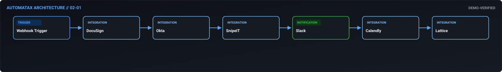
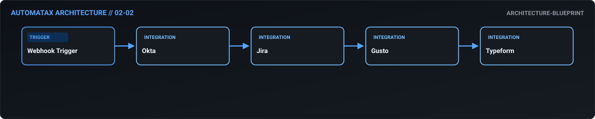
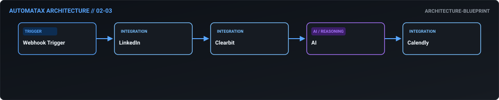
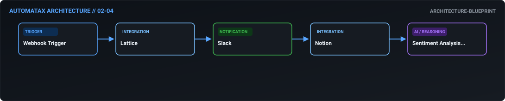
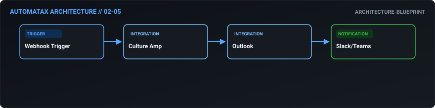
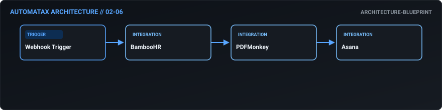
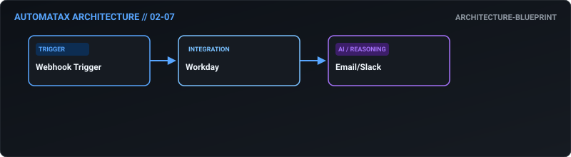
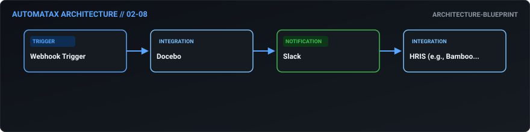
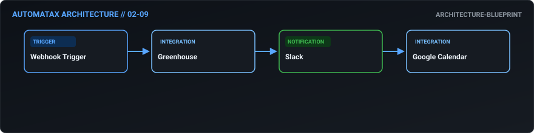
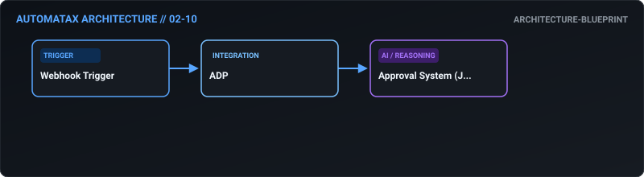

# 02. HR & Talent — AutomataX Catalog

> **Category Focus:** Zero-touch onboarding, offboarding data loss prevention, performance review aggregation, sentiment risk alerting.

---

## 📋 Available Workflows

| ID | Name | Business Problem | Trigger | Integrations | Maturity | Links |
| :---: | :--- | :--- | :---: | :--- | :---: | :--- |
| **02-01** | **[Seamless Zero-Touch Employee Onboarding](../docs/workflows/02-01-seamless-zero-touch-employee-onboarding.md)** | Onboarding requires coordinating accounts, hardware, and meetings across multipl... | `webhook` | `DocuSign, Okta, SnipeIT` | 🟢 Demo Verified | [JSON](../workflows/02-hr/02_01_seamless_zero_touch_employee_onboarding.json) · [Doc](../docs/workflows/02-01-seamless-zero-touch-employee-onboarding.md) |
| **02-02** | **[Secure Offboarding & Data Leakage Prevention](../docs/workflows/02-02-secure-offboarding-data-leakage-prevention.md)** | Missed offboarding steps result in ex-employees retaining access to sensitive co... | `webhook` | `Okta, Jira, Gusto` | 🔵 Blueprint | [JSON](../workflows/02-hr/02_02_secure_offboarding_data_leakage_prevention.json) · [Doc](../docs/workflows/02-02-secure-offboarding-data-leakage-prevention.md) |
| **02-03** | **[Automated LinkedIn Talent Sourcing & Screening](../docs/workflows/02-03-automated-linkedin-talent-sourcing-screening.md)** | Recruiters spend too much time manually sourcing candidates, researching profile... | `webhook` | `LinkedIn, Clearbit, AI` | 🔵 Blueprint | [JSON](../workflows/02-hr/02_03_automated_linkedin_talent_sourcing_screening.json) · [Doc](../docs/workflows/02-03-automated-linkedin-talent-sourcing-screening.md) |
| **02-04** | **[360-Degree Performance Review Aggregation](../docs/workflows/02-04-360-degree-performance-review-aggregation.md)** | Performance reviews require managers to hunt down data across HR systems and cha... | `webhook` | `Lattice, Slack, Notion` | 🔵 Blueprint | [JSON](../workflows/02-hr/02_04_360_degree_performance_review_aggregation.json) · [Doc](../docs/workflows/02-04-360-degree-performance-review-aggregation.md) |
| **02-05** | **[Proactive Employee Sentiment & Churn Risk Alerting](../docs/workflows/02-05-proactive-employee-sentiment-churn-risk-alerting.md)** | HR often finds out about low team morale or cultural issues too late, resulting ... | `webhook` | `Culture Amp, Outlook, Slack/Teams` | 🔵 Blueprint | [JSON](../workflows/02-hr/02_05_proactive_employee_sentiment_churn_risk_alerting.json) · [Doc](../docs/workflows/02-05-proactive-employee-sentiment-churn-risk-alerting.md) |
| **02-06** | **[Automated Visa & Relocation Compliance](../docs/workflows/02-06-automated-visa-relocation-compliance.md)** | Missing a visa or passport expiration date can result in illegal working statuse... | `webhook` | `BambooHR, PDFMonkey, Asana` | 🔵 Blueprint | [JSON](../workflows/02-hr/02_06_automated_visa_relocation_compliance.json) · [Doc](../docs/workflows/02-06-automated-visa-relocation-compliance.md) |
| **02-07** | **[Frictionless Internal Mobility & Transfers](../docs/workflows/02-07-frictionless-internal-mobility-transfers.md)** | Internal job applications often bypass current managers or ignore historical per... | `webhook` | `Workday, Email/Slack` | 🔵 Blueprint | [JSON](../workflows/02-hr/02_07_frictionless_internal_mobility_transfers.json) · [Doc](../docs/workflows/02-07-frictionless-internal-mobility-transfers.md) |
| **02-08** | **[Mandatory Compliance Training Enforcement](../docs/workflows/02-08-mandatory-compliance-training-enforcement.md)** | Ensuring 100% compliance on mandatory training (like security or harassment) is ... | `webhook` | `Docebo, Slack, HRIS (e.g., BambooHR)` | 🔵 Blueprint | [JSON](../workflows/02-hr/02_08_mandatory_compliance_training_enforcement.json) · [Doc](../docs/workflows/02-08-mandatory-compliance-training-enforcement.md) |
| **02-09** | **[Intelligent Interview Scheduling & Prep](../docs/workflows/02-09-intelligent-interview-scheduling-prep.md)** | Interview coordination is the biggest bottleneck in hiring. Candidates drop off ... | `webhook` | `Greenhouse, Slack, Google Calendar` | 🔵 Blueprint | [JSON](../workflows/02-hr/02_09_intelligent_interview_scheduling_prep.json) · [Doc](../docs/workflows/02-09-intelligent-interview-scheduling-prep.md) |
| **02-10** | **[Pre-Processing Payroll Anomaly Detection](../docs/workflows/02-10-pre-processing-payroll-anomaly-detection.md)** | Payroll mistakes (incorrect raises, wrong bank details) are catastrophic for emp... | `webhook` | `ADP, Approval System (Jira/Email)` | 🔵 Blueprint | [JSON](../workflows/02-hr/02_10_pre_processing_payroll_anomaly_detection.json) · [Doc](../docs/workflows/02-10-pre-processing-payroll-anomaly-detection.md) |

---

## 🛠 Workflow Details

### 02-01 — Seamless Zero-Touch Employee Onboarding

- **Business Outcome:** Design an automated onboarding workflow triggered by a DocuSign completion: create accounts in Okta, assign hardware in SnipeIT, provision Slack channels, schedule intro meetings via Calendly, and trigger a 30-60-90 day check-in sequence in Lattice.
- **Maturity:** `demo-verified` | **Complexity:** `advanced` | **Trigger:** `webhook`
- **Core Integrations:** `DocuSign` • `Okta` • `SnipeIT` • `Slack` • `Calendly` • `Lattice`
- **Documentation:** [Read Specs](../docs/workflows/02-01-seamless-zero-touch-employee-onboarding.md)
- **Workflow File:** [Download n8n JSON](../workflows/02-hr/02_01_seamless_zero_touch_employee_onboarding.json)

---

### 02-02 — Secure Offboarding & Data Leakage Prevention

- **Business Outcome:** Build an offboarding automation that revokes Okta access, triggers a secure data wipe request to IT via Jira, calculates final PTO payout in Gusto, and sends a secure offboarding survey via Typeform, ensuring zero data leakage.
- **Maturity:** `architecture-blueprint` | **Complexity:** `intermediate` | **Trigger:** `webhook`
- **Core Integrations:** `Okta` • `Jira` • `Gusto` • `Typeform`
- **Documentation:** [Read Specs](../docs/workflows/02-02-secure-offboarding-data-leakage-prevention.md)
- **Workflow File:** [Download n8n JSON](../workflows/02-hr/02_02_secure_offboarding_data_leakage_prevention.json)

---

### 02-03 — Automated LinkedIn Talent Sourcing & Screening

- **Business Outcome:** Create a workflow that scrapes LinkedIn for specific skill sets, enriches candidate profiles via Clearbit, scores them using a custom AI prompt, and automatically schedules initial screening calls via Calendly for top 10% matches.
- **Maturity:** `architecture-blueprint` | **Complexity:** `intermediate` | **Trigger:** `webhook`
- **Core Integrations:** `LinkedIn` • `Clearbit` • `AI` • `Calendly`
- **Documentation:** [Read Specs](../docs/workflows/02-03-automated-linkedin-talent-sourcing-screening.md)
- **Workflow File:** [Download n8n JSON](../workflows/02-hr/02_03_automated_linkedin_talent_sourcing_screening.json)

---

### 02-04 — 360-Degree Performance Review Aggregation

- **Business Outcome:** Design a performance review automation that pulls OKR completion data from Lattice, aggregates peer feedback from Slack (using sentiment analysis), and generates a draft performance summary for managers in Notion.
- **Maturity:** `architecture-blueprint` | **Complexity:** `intermediate` | **Trigger:** `webhook`
- **Core Integrations:** `Lattice` • `Slack` • `Notion` • `Sentiment Analysis AI`
- **Documentation:** [Read Specs](../docs/workflows/02-04-360-degree-performance-review-aggregation.md)
- **Workflow File:** [Download n8n JSON](../workflows/02-hr/02_04_360_degree_performance_review_aggregation.json)

---

### 02-05 — Proactive Employee Sentiment & Churn Risk Alerting

- **Business Outcome:** Build a workflow that monitors employee sentiment via weekly Culture Amp pulses; if sentiment drops below a threshold in a specific department, automatically alert the HRBP and schedule a focus group via Outlook.
- **Maturity:** `architecture-blueprint` | **Complexity:** `standard` | **Trigger:** `webhook`
- **Core Integrations:** `Culture Amp` • `Outlook` • `Slack/Teams`
- **Documentation:** [Read Specs](../docs/workflows/02-05-proactive-employee-sentiment-churn-risk-alerting.md)
- **Workflow File:** [Download n8n JSON](../workflows/02-hr/02_05_proactive_employee_sentiment_churn_risk_alerting.json)

---

### 02-06 — Automated Visa & Relocation Compliance

- **Business Outcome:** Create an automated visa/relocation workflow that tracks passport expiration dates in BambooHR, triggers alerts 90 days out, generates required legal documents via PDFMonkey, and creates a tracking board in Asana.
- **Maturity:** `architecture-blueprint` | **Complexity:** `standard` | **Trigger:** `webhook`
- **Core Integrations:** `BambooHR` • `PDFMonkey` • `Asana`
- **Documentation:** [Read Specs](../docs/workflows/02-06-automated-visa-relocation-compliance.md)
- **Workflow File:** [Download n8n JSON](../workflows/02-hr/02_06_automated_visa_relocation_compliance.json)

---

### 02-07 — Frictionless Internal Mobility & Transfers

- **Business Outcome:** Design a workflow that automates internal mobility: when an employee applies for an internal role via Workday, check their tenure and performance ratings, and automatically notify the hiring manager and current manager.
- **Maturity:** `architecture-blueprint` | **Complexity:** `standard` | **Trigger:** `webhook`
- **Core Integrations:** `Workday` • `Email/Slack`
- **Documentation:** [Read Specs](../docs/workflows/02-07-frictionless-internal-mobility-transfers.md)
- **Workflow File:** [Download n8n JSON](../workflows/02-hr/02_07_frictionless_internal_mobility_transfers.json)

---

### 02-08 — Mandatory Compliance Training Enforcement

- **Business Outcome:** Build an automated learning & development workflow that assigns mandatory compliance training in Docebo based on the employee's department and role, tracking completion and escalating to HR via Slack if overdue.
- **Maturity:** `architecture-blueprint` | **Complexity:** `standard` | **Trigger:** `webhook`
- **Core Integrations:** `Docebo` • `Slack` • `HRIS (e.g., BambooHR)`
- **Documentation:** [Read Specs](../docs/workflows/02-08-mandatory-compliance-training-enforcement.md)
- **Workflow File:** [Download n8n JSON](../workflows/02-hr/02_08_mandatory_compliance_training_enforcement.json)

---

### 02-09 — Intelligent Interview Scheduling & Prep

- **Business Outcome:** Create a workflow that integrates Greenhouse with Slack to automate interview scheduling: parse interviewer availability from Google Calendar, send custom booking links to candidates, and prep interviewers with candidate resumes.
- **Maturity:** `architecture-blueprint` | **Complexity:** `standard` | **Trigger:** `webhook`
- **Core Integrations:** `Greenhouse` • `Slack` • `Google Calendar`
- **Documentation:** [Read Specs](../docs/workflows/02-09-intelligent-interview-scheduling-prep.md)
- **Workflow File:** [Download n8n JSON](../workflows/02-hr/02_09_intelligent_interview_scheduling_prep.json)

---

### 02-10 — Pre-Processing Payroll Anomaly Detection

- **Business Outcome:** Design a payroll anomaly detection workflow that compares current month payroll draft in ADP against the previous month, flagging any salary changes >5% or new bank accounts for manual HR review before processing.
- **Maturity:** `architecture-blueprint` | **Complexity:** `standard` | **Trigger:** `webhook`
- **Core Integrations:** `ADP` • `Approval System (Jira/Email)`
- **Documentation:** [Read Specs](../docs/workflows/02-10-pre-processing-payroll-anomaly-detection.md)
- **Workflow File:** [Download n8n JSON](../workflows/02-hr/02_10_pre_processing_payroll_anomaly_detection.json)

---

