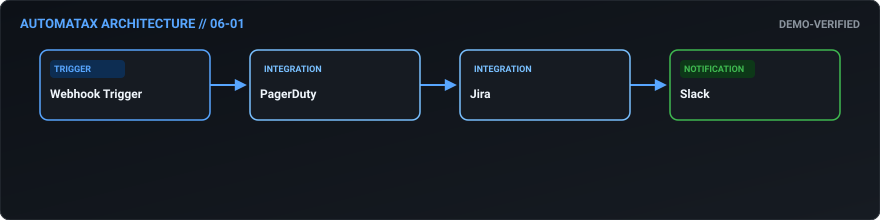
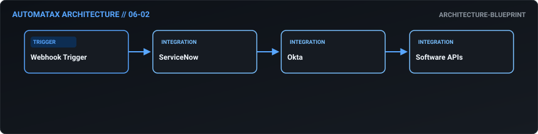
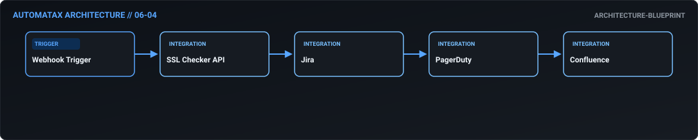
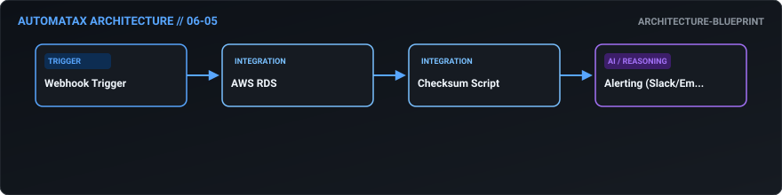
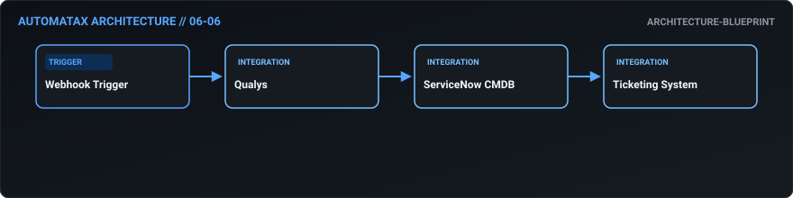
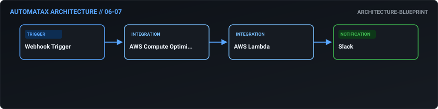
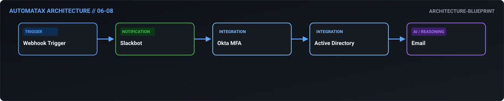
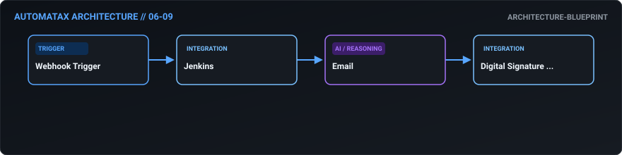
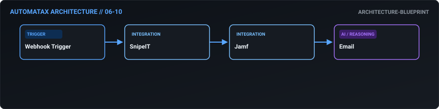

# 06. ITSM & DevOps — AutomataX Catalog

> **Category Focus:** Incident war room creation, RBAC provisioning, AI CI/CD failure triage, self-healing database backup verification.

---

## 📋 Available Workflows

| ID | Name | Business Problem | Trigger | Integrations | Maturity | Links |
| :---: | :--- | :--- | :---: | :--- | :---: | :--- |
| **06-01** | **[Zero-Touch Incident War Room Creation](../docs/workflows/06-01-zero-touch-incident-war-room-creation.md)** | When an outage occurs, engineers waste the first 15 critical minutes manually cr... | `webhook` | `PagerDuty, Jira, Slack` | 🟢 Demo Verified | [JSON](../workflows/06-itsm-devops/06_01_zero_touch_incident_war_room_creation.json) · [Doc](../docs/workflows/06-01-zero-touch-incident-war-room-creation.md) |
| **06-02** | **[Automated Role-Based Access Provisioning](../docs/workflows/06-02-automated-role-based-access-provisioning.md)** | IT helpdesks get bogged down manually granting software licenses based on Servic... | `webhook` | `ServiceNow, Okta, Software APIs` | 🔵 Blueprint | [JSON](../workflows/06-itsm-devops/06_02_automated_role_based_access_provisioning.json) · [Doc](../docs/workflows/06-02-automated-role-based-access-provisioning.md) |
| **06-03** | **[AI-Assisted CI/CD Failure Triage](../docs/workflows/06-03-ai-assisted-ci-cd-failure-triage.md)** | When a build fails in CI/CD, developers spend hours digging through massive erro... | `webhook` | `GitHub Actions, AI, Slack` | 🟢 Demo Verified | [JSON](../workflows/06-itsm-devops/06_03_ai_assisted_ci_cd_failure_triage.json) · [Doc](../docs/workflows/06-03-ai-assisted-ci-cd-failure-triage.md) |
| **06-04** | **[Proactive SSL Expiration Prevention](../docs/workflows/06-04-proactive-ssl-expiration-prevention.md)** | Expired SSL certificates cause immediate customer-facing outages and security wa... | `webhook` | `SSL Checker API, Jira, PagerDuty` | 🔵 Blueprint | [JSON](../workflows/06-itsm-devops/06_04_proactive_ssl_expiration_prevention.json) · [Doc](../docs/workflows/06-04-proactive-ssl-expiration-prevention.md) |
| **06-05** | **[Self-Healing Database Backup Verification](../docs/workflows/06-05-self-healing-database-backup-verification.md)** | Backups are scheduled, but rarely tested. A corrupted backup is useless during a... | `webhook` | `AWS RDS, Checksum Script, Alerting (Slack/Email)` | 🔵 Blueprint | [JSON](../workflows/06-itsm-devops/06_05_self_healing_database_backup_verification.json) · [Doc](../docs/workflows/06-05-self-healing-database-backup-verification.md) |
| **06-06** | **[CMDB-Aware Vulnerability Routing](../docs/workflows/06-06-cmdb-aware-vulnerability-routing.md)** | Security scanners (like Qualys) dump thousands of vulnerabilities, but security ... | `webhook` | `Qualys, ServiceNow CMDB, Ticketing System` | 🔵 Blueprint | [JSON](../workflows/06-itsm-devops/06_06_cmdb_aware_vulnerability_routing.json) · [Doc](../docs/workflows/06-06-cmdb-aware-vulnerability-routing.md) |
| **06-07** | **[Automated Non-Prod Cloud Cost Optimization](../docs/workflows/06-07-automated-non-prod-cloud-cost-optimization.md)** | Developers leave expensive dev/test environments running 24/7 over the weekend, ... | `webhook` | `AWS Compute Optimizer, AWS Lambda, Slack` | 🔵 Blueprint | [JSON](../workflows/06-itsm-devops/06_07_automated_non_prod_cloud_cost_optimization.json) · [Doc](../docs/workflows/06-07-automated-non-prod-cloud-cost-optimization.md) |
| **06-08** | **[Secure Slackbot Password Resets](../docs/workflows/06-08-secure-slackbot-password-resets.md)** | "I forgot my password" is the #1 IT support ticket, consuming massive amounts of... | `webhook` | `Slackbot, Okta MFA, Active Directory` | 🔵 Blueprint | [JSON](../workflows/06-itsm-devops/06_08_secure_slackbot_password_resets.json) · [Doc](../docs/workflows/06-08-secure-slackbot-password-resets.md) |
| **06-09** | **[Digital Signature Release Approvals](../docs/workflows/06-09-digital-signature-release-approvals.md)** | CAB (Change Advisory Board) approvals are often a rubber-stamp process delayed b... | `webhook` | `Jenkins, Email, Digital Signature API` | 🔵 Blueprint | [JSON](../workflows/06-itsm-devops/06_09_digital_signature_release_approvals.json) · [Doc](../docs/workflows/06-09-digital-signature-release-approvals.md) |
| **06-10** | **[Zero-Touch MDM Hardware Provisioning](../docs/workflows/06-10-zero-touch-mdm-hardware-provisioning.md)** | Setting up a new laptop manually with corporate software takes hours of IT time ... | `webhook` | `SnipeIT, Jamf, Email` | 🔵 Blueprint | [JSON](../workflows/06-itsm-devops/06_10_zero_touch_mdm_hardware_provisioning.json) · [Doc](../docs/workflows/06-10-zero-touch-mdm-hardware-provisioning.md) |

---

## 🛠 Workflow Details

### 06-01 — Zero-Touch Incident War Room Creation

- **Business Outcome:** Design an n8n workflow that automates incident response: when a PagerDuty alert fires, automatically create a Jira incident, spin up a dedicated Slack war room, page the on-call engineer, and start a timer for SLA tracking.
- **Maturity:** `demo-verified` | **Complexity:** `advanced` | **Trigger:** `webhook`
- **Core Integrations:** `PagerDuty` • `Jira` • `Slack`
- **Documentation:** [Read Specs](../docs/workflows/06-01-zero-touch-incident-war-room-creation.md)
- **Workflow File:** [Download n8n JSON](../workflows/06-itsm-devops/06_01_zero_touch_incident_war_room_creation.json)

---

### 06-02 — Automated Role-Based Access Provisioning

- **Business Outcome:** Build a workflow that automates employee access requests: ingest requests from ServiceNow, check the user's role in Okta, automatically provision standard access, and route non-standard access to the data owner for approval.
- **Maturity:** `architecture-blueprint` | **Complexity:** `standard` | **Trigger:** `webhook`
- **Core Integrations:** `ServiceNow` • `Okta` • `Software APIs`
- **Documentation:** [Read Specs](../docs/workflows/06-02-automated-role-based-access-provisioning.md)
- **Workflow File:** [Download n8n JSON](../workflows/06-itsm-devops/06_02_automated_role_based_access_provisioning.json)

---

### 06-03 — AI-Assisted CI/CD Failure Triage

- **Business Outcome:** Create an automated CI/CD notification workflow: when a GitHub Actions build fails, parse the error logs, use AI to suggest a fix, post the summary to the #dev-ops Slack channel, and assign a Jira bug to the commit author.
- **Maturity:** `demo-verified` | **Complexity:** `advanced` | **Trigger:** `webhook`
- **Core Integrations:** `GitHub Actions` • `AI` • `Slack` • `Jira`
- **Documentation:** [Read Specs](../docs/workflows/06-03-ai-assisted-ci-cd-failure-triage.md)
- **Workflow File:** [Download n8n JSON](../workflows/06-itsm-devops/06_03_ai_assisted_ci_cd_failure_triage.json)

---

### 06-04 — Proactive SSL Expiration Prevention

- **Business Outcome:** Design a workflow that monitors SSL certificates via API; if a certificate expires in <14 days, automatically create a high-priority Jira ticket, alert the DevOps team via PagerDuty, and update the status in Confluence.
- **Maturity:** `architecture-blueprint` | **Complexity:** `intermediate` | **Trigger:** `webhook`
- **Core Integrations:** `SSL Checker API` • `Jira` • `PagerDuty` • `Confluence`
- **Documentation:** [Read Specs](../docs/workflows/06-04-proactive-ssl-expiration-prevention.md)
- **Workflow File:** [Download n8n JSON](../workflows/06-itsm-devops/06_04_proactive_ssl_expiration_prevention.json)

---

### 06-05 — Self-Healing Database Backup Verification

- **Business Outcome:** Build a workflow that automates database backup verification: trigger a daily backup in AWS RDS, run a checksum validation script, and if it fails, automatically restore from the last known good backup and alert the DBA.
- **Maturity:** `architecture-blueprint` | **Complexity:** `standard` | **Trigger:** `webhook`
- **Core Integrations:** `AWS RDS` • `Checksum Script` • `Alerting (Slack/Email)`
- **Documentation:** [Read Specs](../docs/workflows/06-05-self-healing-database-backup-verification.md)
- **Workflow File:** [Download n8n JSON](../workflows/06-itsm-devops/06_05_self_healing_database_backup_verification.json)

---

### 06-06 — CMDB-Aware Vulnerability Routing

- **Business Outcome:** Create an automated vulnerability management workflow: ingest scan results from Qualys, cross-reference with the CMDB in ServiceNow to identify the asset owner, and automatically create remediation tickets based on CVSS severity.
- **Maturity:** `architecture-blueprint` | **Complexity:** `standard` | **Trigger:** `webhook`
- **Core Integrations:** `Qualys` • `ServiceNow CMDB` • `Ticketing System`
- **Documentation:** [Read Specs](../docs/workflows/06-06-cmdb-aware-vulnerability-routing.md)
- **Workflow File:** [Download n8n JSON](../workflows/06-itsm-devops/06_06_cmdb_aware_vulnerability_routing.json)

---

### 06-07 — Automated Non-Prod Cloud Cost Optimization

- **Business Outcome:** Design a workflow that automates cloud cost optimization: pull AWS Compute Optimizer recommendations, automatically downsize dev/test instances during non-working hours via Lambda, and report savings in a weekly Slack digest.
- **Maturity:** `architecture-blueprint` | **Complexity:** `standard` | **Trigger:** `webhook`
- **Core Integrations:** `AWS Compute Optimizer` • `AWS Lambda` • `Slack`
- **Documentation:** [Read Specs](../docs/workflows/06-07-automated-non-prod-cloud-cost-optimization.md)
- **Workflow File:** [Download n8n JSON](../workflows/06-itsm-devops/06_07_automated_non_prod_cloud_cost_optimization.json)

---

### 06-08 — Secure Slackbot Password Resets

- **Business Outcome:** Build a workflow that handles automated password resets: ingest requests via Slackbot, verify identity via Okta MFA prompt, reset the password in Active Directory, and send the temporary password via secure email.
- **Maturity:** `architecture-blueprint` | **Complexity:** `intermediate` | **Trigger:** `webhook`
- **Core Integrations:** `Slackbot` • `Okta MFA` • `Active Directory` • `Email`
- **Documentation:** [Read Specs](../docs/workflows/06-08-secure-slackbot-password-resets.md)
- **Workflow File:** [Download n8n JSON](../workflows/06-itsm-devops/06_08_secure_slackbot_password_resets.json)

---

### 06-09 — Digital Signature Release Approvals

- **Business Outcome:** Create a workflow that automates software deployment approvals: when a release is staged in Jenkins, automatically notify the change advisory board (CAB) via email with a link to the release notes, and proceed only upon digital signature.
- **Maturity:** `architecture-blueprint` | **Complexity:** `standard` | **Trigger:** `webhook`
- **Core Integrations:** `Jenkins` • `Email` • `Digital Signature API`
- **Documentation:** [Read Specs](../docs/workflows/06-09-digital-signature-release-approvals.md)
- **Workflow File:** [Download n8n JSON](../workflows/06-itsm-devops/06_09_digital_signature_release_approvals.json)

---

### 06-10 — Zero-Touch MDM Hardware Provisioning

- **Business Outcome:** Design a workflow that syncs hardware inventory: when a new laptop is scanned into SnipeIT, automatically create a user profile in Jamf, generate a pre-stage enrollment profile, and email the setup instructions to the employee.
- **Maturity:** `architecture-blueprint` | **Complexity:** `standard` | **Trigger:** `webhook`
- **Core Integrations:** `SnipeIT` • `Jamf` • `Email`
- **Documentation:** [Read Specs](../docs/workflows/06-10-zero-touch-mdm-hardware-provisioning.md)
- **Workflow File:** [Download n8n JSON](../workflows/06-itsm-devops/06_10_zero_touch_mdm_hardware_provisioning.json)

---

