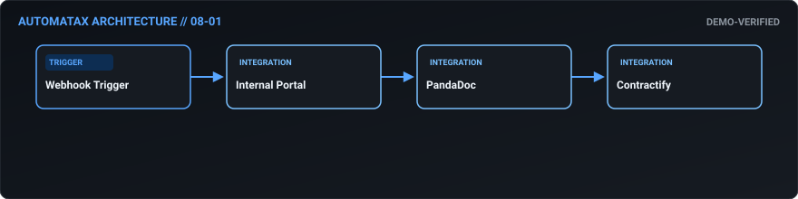
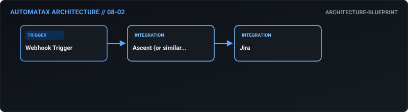
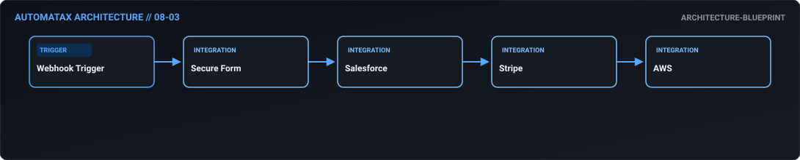
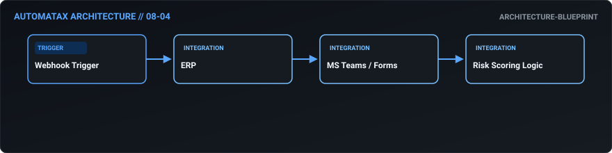
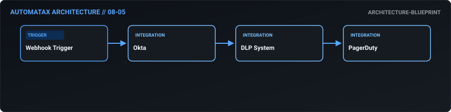
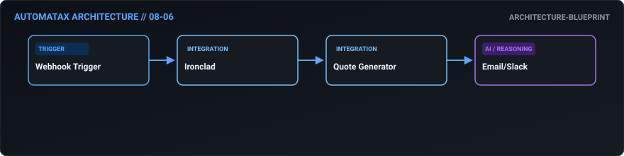
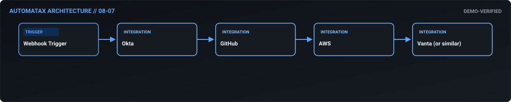
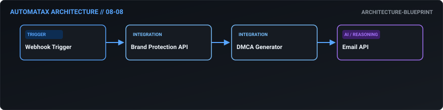
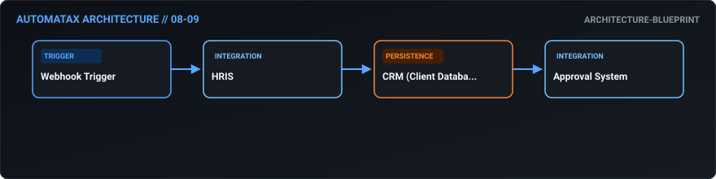
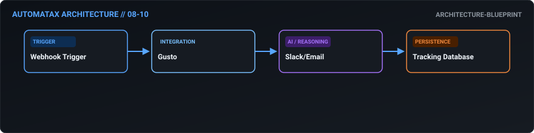

# 08. Legal & Compliance — AutomataX Catalog

> **Category Focus:** Zero-friction mutual NDA generation, DSAR data extraction, continuous SOC 2 evidence collection, IP takedowns.

---

## 📋 Available Workflows

| ID | Name | Business Problem | Trigger | Integrations | Maturity | Links |
| :---: | :--- | :--- | :---: | :--- | :---: | :--- |
| **08-01** | **[Zero-Friction Mutual NDA Generation](../docs/workflows/08-01-zero-friction-mutual-nda-generation.md)** | Sales reps lose momentum when they have to wait days for the legal team to draft... | `webhook` | `Internal Portal, PandaDoc, Contractify` | 🟢 Demo Verified | [JSON](../workflows/08-legal-compliance/08_01_zero_friction_mutual_nda_generation.json) · [Doc](../docs/workflows/08-01-zero-friction-mutual-nda-generation.md) |
| **08-02** | **[Automated Regulatory Tracking & Alerting](../docs/workflows/08-02-automated-regulatory-tracking-alerting.md)** | Compliance officers struggle to keep up with changing global data privacy laws (... | `webhook` | `Ascent (or similar Regulatory API), Jira` | 🔵 Blueprint | [JSON](../workflows/08-legal-compliance/08_02_automated_regulatory_tracking_alerting.json) · [Doc](../docs/workflows/08-02-automated-regulatory-tracking-alerting.md) |
| **08-03** | **[Omni-System DSAR Data Extraction](../docs/workflows/08-03-omni-system-dsar-data-extraction.md)** | Executing a Data Subject Access Request (DSAR) requires IT to manually query dat... | `webhook` | `Secure Form, Salesforce, Stripe` | 🔵 Blueprint | [JSON](../workflows/08-legal-compliance/08_03_omni_system_dsar_data_extraction.json) · [Doc](../docs/workflows/08-03-omni-system-dsar-data-extraction.md) |
| **08-04** | **[Third-Party Vendor Risk Assessment](../docs/workflows/08-04-third-party-vendor-risk-assessment.md)** | Onboarding a new vendor without a proper security review exposes the company to ... | `webhook` | `ERP, MS Teams / Forms, Risk Scoring Logic` | 🔵 Blueprint | [JSON](../workflows/08-legal-compliance/08_04_third_party_vendor_risk_assessment.json) · [Doc](../docs/workflows/08-04-third-party-vendor-risk-assessment.md) |
| **08-05** | **[Insider Threat Detection & Lockout](../docs/workflows/08-05-insider-threat-detection-lockout.md)** | Disgruntled employees downloading gigabytes of proprietary data before leaving t... | `webhook` | `Okta, DLP System, PagerDuty` | 🔵 Blueprint | [JSON](../workflows/08-legal-compliance/08_05_insider_threat_detection_lockout.json) · [Doc](../docs/workflows/08-05-insider-threat-detection-lockout.md) |
| **08-06** | **[Proactive Contract Renewal Management](../docs/workflows/08-06-proactive-contract-renewal-management.md)** | Contracts auto-renew without renegotiation, or worse, expire without notice, lea... | `webhook` | `Ironclad, Quote Generator, Email/Slack` | 🔵 Blueprint | [JSON](../workflows/08-legal-compliance/08_06_proactive_contract_renewal_management.json) · [Doc](../docs/workflows/08-06-proactive-contract-renewal-management.md) |
| **08-07** | **[Continuous SOC2 Evidence Collection](../docs/workflows/08-07-continuous-soc2-evidence-collection.md)** | Preparing for a SOC2 audit involves scrambling for weeks to manually pull access... | `webhook` | `Okta, GitHub, AWS` | 🟢 Demo Verified | [JSON](../workflows/08-legal-compliance/08_07_continuous_soc2_evidence_collection.json) · [Doc](../docs/workflows/08-07-continuous-soc2-evidence-collection.md) |
| **08-08** | **[Automated IP Infringement Takedowns](../docs/workflows/08-08-automated-ip-infringement-takedowns.md)** | Brand pirates steal trademarked images and logos across the web. Hunting them do... | `webhook` | `Brand Protection API, DMCA Generator, Email API` | 🔵 Blueprint | [JSON](../workflows/08-legal-compliance/08_08_automated_ip_infringement_takedowns.json) · [Doc](../docs/workflows/08-08-automated-ip-infringement-takedowns.md) |
| **08-09** | **[Background Conflict of Interest Checks](../docs/workflows/08-09-background-conflict-of-interest-checks.md)** | Employees may accidentally have side-gigs or previous employment with a direct c... | `webhook` | `HRIS, CRM (Client Database), Approval System` | 🔵 Blueprint | [JSON](../workflows/08-legal-compliance/08_09_background_conflict_of_interest_checks.json) · [Doc](../docs/workflows/08-09-background-conflict-of-interest-checks.md) |
| **08-10** | **[Mandatory Policy Acknowledgment Tracking](../docs/workflows/08-10-mandatory-policy-acknowledgment-tracking.md)** | When an employee handbook is updated, proving that all 1,000 employees actually ... | `webhook` | `Gusto, Slack/Email, Tracking Database` | 🔵 Blueprint | [JSON](../workflows/08-legal-compliance/08_10_mandatory_policy_acknowledgment_tracking.json) · [Doc](../docs/workflows/08-10-mandatory-policy-acknowledgment-tracking.md) |

---

## 🛠 Workflow Details

### 08-01 — Zero-Friction Mutual NDA Generation

- **Business Outcome:** Design an n8n workflow that automates NDA processing: when a request is submitted via a portal, generate a mutual NDA via PandaDoc, route for internal legal review, send to the counterparty, and upon signature, store in Contractify and alert the sales rep.
- **Maturity:** `demo-verified` | **Complexity:** `advanced` | **Trigger:** `webhook`
- **Core Integrations:** `Internal Portal` • `PandaDoc` • `Contractify`
- **Documentation:** [Read Specs](../docs/workflows/08-01-zero-friction-mutual-nda-generation.md)
- **Workflow File:** [Download n8n JSON](../workflows/08-legal-compliance/08_01_zero_friction_mutual_nda_generation.json)

---

### 08-02 — Automated Regulatory Tracking & Alerting

- **Business Outcome:** Build a workflow that monitors regulatory changes via an API (e.g., Ascent); if a new GDPR directive is published, automatically create a compliance task in Jira, assign it to the DPO, and link relevant internal policies.
- **Maturity:** `architecture-blueprint` | **Complexity:** `standard` | **Trigger:** `webhook`
- **Core Integrations:** `Ascent (or similar Regulatory API)` • `Jira`
- **Documentation:** [Read Specs](../docs/workflows/08-02-automated-regulatory-tracking-alerting.md)
- **Workflow File:** [Download n8n JSON](../workflows/08-legal-compliance/08_02_automated_regulatory_tracking_alerting.json)

---

### 08-03 — Omni-System DSAR Data Extraction

- **Business Outcome:** Create an automated data subject access request (DSAR) workflow: ingest requests via a secure form, verify identity, trigger data extraction scripts across Salesforce, Stripe, and AWS, compile into a secure ZIP, and deliver to the user.
- **Maturity:** `architecture-blueprint` | **Complexity:** `intermediate` | **Trigger:** `webhook`
- **Core Integrations:** `Secure Form` • `Salesforce` • `Stripe` • `AWS`
- **Documentation:** [Read Specs](../docs/workflows/08-03-omni-system-dsar-data-extraction.md)
- **Workflow File:** [Download n8n JSON](../workflows/08-legal-compliance/08_03_omni_system_dsar_data_extraction.json)

---

### 08-04 — Third-Party Vendor Risk Assessment

- **Business Outcome:** Design a workflow that automates vendor risk assessments: when a new vendor is added to the ERP, trigger a Security Questionnaire via Teams; upon completion, score the risk, and if high, block the vendor in the ERP until remediated.
- **Maturity:** `architecture-blueprint` | **Complexity:** `standard` | **Trigger:** `webhook`
- **Core Integrations:** `ERP` • `MS Teams / Forms` • `Risk Scoring Logic`
- **Documentation:** [Read Specs](../docs/workflows/08-04-third-party-vendor-risk-assessment.md)
- **Workflow File:** [Download n8n JSON](../workflows/08-legal-compliance/08_04_third_party_vendor_risk_assessment.json)

---

### 08-05 — Insider Threat Detection & Lockout

- **Business Outcome:** Build a workflow that monitors insider threat indicators: aggregate login anomalies from Okta and large data downloads from the DLP system; if a threshold is crossed, automatically lock the account and alert the CISO via PagerDuty.
- **Maturity:** `architecture-blueprint` | **Complexity:** `standard` | **Trigger:** `webhook`
- **Core Integrations:** `Okta` • `DLP System` • `PagerDuty`
- **Documentation:** [Read Specs](../docs/workflows/08-05-insider-threat-detection-lockout.md)
- **Workflow File:** [Download n8n JSON](../workflows/08-legal-compliance/08_05_insider_threat_detection_lockout.json)

---

### 08-06 — Proactive Contract Renewal Management

- **Business Outcome:** Create an automated contract renewal workflow: monitor contract end dates in Ironclad; at 90 days out, automatically notify the account owner, generate a renewal quote, and route for legal review.
- **Maturity:** `architecture-blueprint` | **Complexity:** `standard` | **Trigger:** `webhook`
- **Core Integrations:** `Ironclad` • `Quote Generator` • `Email/Slack`
- **Documentation:** [Read Specs](../docs/workflows/08-06-proactive-contract-renewal-management.md)
- **Workflow File:** [Download n8n JSON](../workflows/08-legal-compliance/08_06_proactive_contract_renewal_management.json)

---

### 08-07 — Continuous SOC2 Evidence Collection

- **Business Outcome:** Design a workflow that automates SOC2 evidence collection: weekly, pull access logs from Okta, change logs from GitHub, and backup logs from AWS, compile them into a standardized folder structure, and upload to the audit portal (Vanta).
- **Maturity:** `demo-verified` | **Complexity:** `advanced` | **Trigger:** `webhook`
- **Core Integrations:** `Okta` • `GitHub` • `AWS` • `Vanta (or similar)`
- **Documentation:** [Read Specs](../docs/workflows/08-07-continuous-soc2-evidence-collection.md)
- **Workflow File:** [Download n8n JSON](../workflows/08-legal-compliance/08_07_continuous_soc2_evidence_collection.json)

---

### 08-08 — Automated IP Infringement Takedowns

- **Business Outcome:** Build a workflow that handles automated IP infringement takedowns: monitor the web for unauthorized use of trademarks via a brand protection API, automatically generate DMCA notices, and submit them to the hosting providers.
- **Maturity:** `architecture-blueprint` | **Complexity:** `standard` | **Trigger:** `webhook`
- **Core Integrations:** `Brand Protection API` • `DMCA Generator` • `Email API`
- **Documentation:** [Read Specs](../docs/workflows/08-08-automated-ip-infringement-takedowns.md)
- **Workflow File:** [Download n8n JSON](../workflows/08-legal-compliance/08_08_automated_ip_infringement_takedowns.json)

---

### 08-09 — Background Conflict of Interest Checks

- **Business Outcome:** Create a workflow that automates conflict of interest checks: when a new hire is onboarded, cross-reference their name and previous employers against a database of current clients and partners, flagging any overlaps for HR/Legal review.
- **Maturity:** `architecture-blueprint` | **Complexity:** `standard` | **Trigger:** `webhook`
- **Core Integrations:** `HRIS` • `CRM (Client Database)` • `Approval System`
- **Documentation:** [Read Specs](../docs/workflows/08-09-background-conflict-of-interest-checks.md)
- **Workflow File:** [Download n8n JSON](../workflows/08-legal-compliance/08_09_background_conflict_of_interest_checks.json)

---

### 08-10 — Mandatory Policy Acknowledgment Tracking

- **Business Outcome:** Design a workflow that automates policy acknowledgment: when an HR policy is updated in Gusto, automatically push it to all employees via Slack/Email, track acknowledgments, and escalate to managers for those who haven't signed in 7 days.
- **Maturity:** `architecture-blueprint` | **Complexity:** `standard` | **Trigger:** `webhook`
- **Core Integrations:** `Gusto` • `Slack/Email` • `Tracking Database`
- **Documentation:** [Read Specs](../docs/workflows/08-10-mandatory-policy-acknowledgment-tracking.md)
- **Workflow File:** [Download n8n JSON](../workflows/08-legal-compliance/08_10_mandatory_policy_acknowledgment_tracking.json)

---

