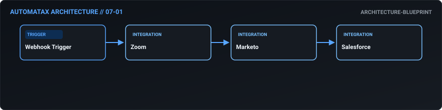
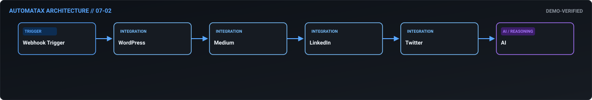
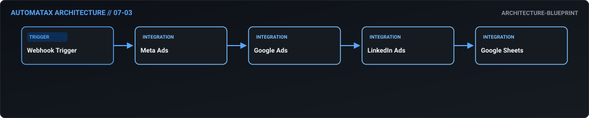
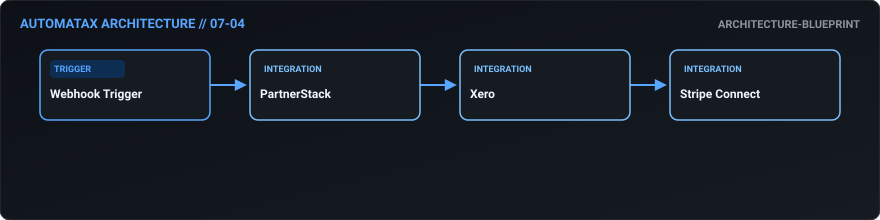
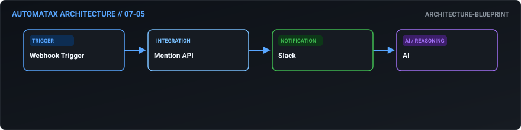
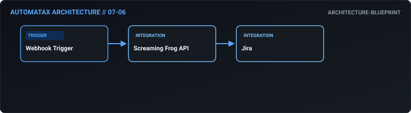
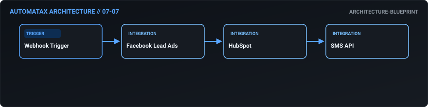
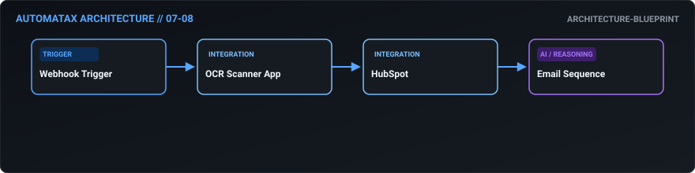
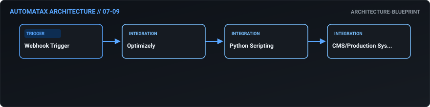
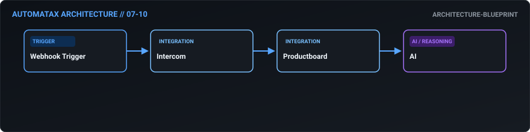

# 07. Marketing Operations — AutomataX Catalog

> **Category Focus:** End-to-end webinar ops, AI content syndication, ad spend pacing pause, technical SEO monitoring.

---

## 📋 Available Workflows

| ID | Name | Business Problem | Trigger | Integrations | Maturity | Links |
| :---: | :--- | :--- | :---: | :--- | :---: | :--- |
| **07-01** | **[End-to-End Webinar Operations](../docs/workflows/07-01-end-to-end-webinar-operations.md)** | Hosting a webinar requires manually syncing registrants between Zoom, Marketo, a... | `webhook` | `Zoom, Marketo, Salesforce` | 🔵 Blueprint | [JSON](../workflows/07-marketing/07_01_end_to_end_webinar_operations.json) · [Doc](../docs/workflows/07-01-end-to-end-webinar-operations.md) |
| **07-02** | **[AI-Powered Content Syndication](../docs/workflows/07-02-ai-powered-content-syndication.md)** | Writing a blog post is only half the battle. Distributing it across Medium, Link... | `webhook` | `WordPress, Medium, LinkedIn` | 🟢 Demo Verified | [JSON](../workflows/07-marketing/07_02_ai_powered_content_syndication.json) · [Doc](../docs/workflows/07-02-ai-powered-content-syndication.md) |
| **07-03** | **[Automated Ad Spend Pacing & Pause](../docs/workflows/07-03-automated-ad-spend-pacing-pause.md)** | Marketing agencies and internal teams frequently overspend their budgets on Meta... | `webhook` | `Meta Ads, Google Ads, LinkedIn Ads` | 🔵 Blueprint | [JSON](../workflows/07-marketing/07_03_automated_ad_spend_pacing_pause.json) · [Doc](../docs/workflows/07-03-automated-ad-spend-pacing-pause.md) |
| **07-04** | **[Frictionless Influencer & Affiliate Payouts](../docs/workflows/07-04-frictionless-influencer-affiliate-payouts.md)** | Managing an affiliate program is great until month-end, when you have to calcula... | `webhook` | `PartnerStack, Xero, Stripe Connect` | 🔵 Blueprint | [JSON](../workflows/07-marketing/07_04_frictionless_influencer_affiliate_payouts.json) · [Doc](../docs/workflows/07-04-frictionless-influencer-affiliate-payouts.md) |
| **07-05** | **[Instant VIP Brand Mention Triage](../docs/workflows/07-05-instant-vip-brand-mention-triage.md)** | By the time a PR team notices a high-profile influencer complaining about the br... | `webhook` | `Mention API, Slack, AI` | 🔵 Blueprint | [JSON](../workflows/07-marketing/07_05_instant_vip_brand_mention_triage.json) · [Doc](../docs/workflows/07-05-instant-vip-brand-mention-triage.md) |
| **07-06** | **[Automated Technical SEO Monitoring](../docs/workflows/07-06-automated-technical-seo-monitoring.md)** | Developers deploy code changes that accidentally drop meta tags or create 404 lo... | `webhook` | `Screaming Frog API, Jira` | 🔵 Blueprint | [JSON](../workflows/07-marketing/07_06_automated_technical_seo_monitoring.json) · [Doc](../docs/workflows/07-06-automated-technical-seo-monitoring.md) |
| **07-07** | **[Speed-to-Lead Ad Handoff](../docs/workflows/07-07-speed-to-lead-ad-handoff.md)** | Leads generated from Facebook or LinkedIn forms sit in a CSV file waiting to be ... | `webhook` | `Facebook Lead Ads, HubSpot, SMS API` | 🔵 Blueprint | [JSON](../workflows/07-marketing/07_07_speed_to_lead_ad_handoff.json) · [Doc](../docs/workflows/07-07-speed-to-lead-ad-handoff.md) |
| **07-08** | **[Event Badge Scanner to CRM Sync](../docs/workflows/07-08-event-badge-scanner-to-crm-sync.md)** | Sales reps collect hundreds of business cards at trade shows, but rarely enter t... | `webhook` | `OCR Scanner App, HubSpot, Email Sequence` | 🔵 Blueprint | [JSON](../workflows/07-marketing/07_08_event_badge_scanner_to_crm_sync.json) · [Doc](../docs/workflows/07-08-event-badge-scanner-to-crm-sync.md) |
| **07-09** | **[Statistical A/B Test Decision Engine](../docs/workflows/07-09-statistical-a-b-test-decision-engine.md)** | Marketers often call an A/B test a "winner" too early without calculating true s... | `webhook` | `Optimizely, Python Scripting, CMS/Production System` | 🔵 Blueprint | [JSON](../workflows/07-marketing/07_09_statistical_a_b_test_decision_engine.json) · [Doc](../docs/workflows/07-09-statistical-a-b-test-decision-engine.md) |
| **07-10** | **[Voice of Customer Feedback Loop](../docs/workflows/07-10-voice-of-customer-feedback-loop.md)** | Marketing captures great user feedback in Intercom, but it never makes its way t... | `webhook` | `Intercom, Productboard, AI` | 🔵 Blueprint | [JSON](../workflows/07-marketing/07_10_voice_of_customer_feedback_loop.json) · [Doc](../docs/workflows/07-10-voice-of-customer-feedback-loop.md) |

---

## 🛠 Workflow Details

### 07-01 — End-to-End Webinar Operations

- **Business Outcome:** Build an n8n workflow that automates webinar operations: when a user registers in Zoom, add them to a Marketo nurture track, send a reminder sequence, and upon completion, push the attendance data to Salesforce and trigger a sales task.
- **Maturity:** `architecture-blueprint` | **Complexity:** `standard` | **Trigger:** `webhook`
- **Core Integrations:** `Zoom` • `Marketo` • `Salesforce`
- **Documentation:** [Read Specs](../docs/workflows/07-01-end-to-end-webinar-operations.md)
- **Workflow File:** [Download n8n JSON](../workflows/07-marketing/07_01_end_to_end_webinar_operations.json)

---

### 07-02 — AI-Powered Content Syndication

- **Business Outcome:** Design a workflow that automates content syndication: when a new blog post is published in WordPress, automatically format and push it to Medium, LinkedIn, and Twitter, using AI to generate platform-specific hooks and hashtags.
- **Maturity:** `demo-verified` | **Complexity:** `advanced` | **Trigger:** `webhook`
- **Core Integrations:** `WordPress` • `Medium` • `LinkedIn` • `Twitter` • `AI`
- **Documentation:** [Read Specs](../docs/workflows/07-02-ai-powered-content-syndication.md)
- **Workflow File:** [Download n8n JSON](../workflows/07-marketing/07_02_ai_powered_content_syndication.json)

---

### 07-03 — Automated Ad Spend Pacing & Pause

- **Business Outcome:** Create an automated ad spend reconciliation workflow: pull daily spend from Meta Ads, Google Ads, and LinkedIn, compare it against the budget in a master sheet, and automatically pause campaigns in the ad platforms if pacing exceeds 110%.
- **Maturity:** `architecture-blueprint` | **Complexity:** `intermediate` | **Trigger:** `webhook`
- **Core Integrations:** `Meta Ads` • `Google Ads` • `LinkedIn Ads` • `Google Sheets`
- **Documentation:** [Read Specs](../docs/workflows/07-03-automated-ad-spend-pacing-pause.md)
- **Workflow File:** [Download n8n JSON](../workflows/07-marketing/07_03_automated_ad_spend_pacing_pause.json)

---

### 07-04 — Frictionless Influencer & Affiliate Payouts

- **Business Outcome:** Build a workflow that automates influencer payouts: track affiliate link clicks and conversions via PartnerStack, calculate commissions, generate invoices via Xero, and trigger payouts via Stripe Connect.
- **Maturity:** `architecture-blueprint` | **Complexity:** `standard` | **Trigger:** `webhook`
- **Core Integrations:** `PartnerStack` • `Xero` • `Stripe Connect`
- **Documentation:** [Read Specs](../docs/workflows/07-04-frictionless-influencer-affiliate-payouts.md)
- **Workflow File:** [Download n8n JSON](../workflows/07-marketing/07_04_frictionless_influencer_affiliate_payouts.json)

---

### 07-05 — Instant VIP Brand Mention Triage

- **Business Outcome:** Design a workflow that monitors brand mentions via Mention API; if a high-profile account mentions the brand, automatically alert the PR team via Slack and draft a response using AI based on brand guidelines.
- **Maturity:** `architecture-blueprint` | **Complexity:** `standard` | **Trigger:** `webhook`
- **Core Integrations:** `Mention API` • `Slack` • `AI`
- **Documentation:** [Read Specs](../docs/workflows/07-05-instant-vip-brand-mention-triage.md)
- **Workflow File:** [Download n8n JSON](../workflows/07-marketing/07_05_instant_vip_brand_mention_triage.json)

---

### 07-06 — Automated Technical SEO Monitoring

- **Business Outcome:** Create an automated SEO audit workflow: trigger a weekly crawl via Screaming Frog API, identify new 404s or dropped meta tags, and automatically create Jira tickets for the dev team to fix them.
- **Maturity:** `architecture-blueprint` | **Complexity:** `standard` | **Trigger:** `webhook`
- **Core Integrations:** `Screaming Frog API` • `Jira`
- **Documentation:** [Read Specs](../docs/workflows/07-06-automated-technical-seo-monitoring.md)
- **Workflow File:** [Download n8n JSON](../workflows/07-marketing/07_06_automated_technical_seo_monitoring.json)

---

### 07-07 — Speed-to-Lead Ad Handoff

- **Business Outcome:** Build a workflow that automates lead handoff from ads: ingest form fills from Facebook Lead Ads, enrich via HubSpot, and if the lead meets the ICP, instantly notify the on-demand sales rep via SMS with a link to call the lead.
- **Maturity:** `architecture-blueprint` | **Complexity:** `standard` | **Trigger:** `webhook`
- **Core Integrations:** `Facebook Lead Ads` • `HubSpot` • `SMS API`
- **Documentation:** [Read Specs](../docs/workflows/07-07-speed-to-lead-ad-handoff.md)
- **Workflow File:** [Download n8n JSON](../workflows/07-marketing/07_07_speed_to_lead_ad_handoff.json)

---

### 07-08 — Event Badge Scanner to CRM Sync

- **Business Outcome:** Design a workflow that automates event follow-ups: scan business cards via a mobile app (OCR), push contacts to HubSpot, tag them with the event name, and trigger a personalized "Great meeting you" email sequence.
- **Maturity:** `architecture-blueprint` | **Complexity:** `standard` | **Trigger:** `webhook`
- **Core Integrations:** `OCR Scanner App` • `HubSpot` • `Email Sequence`
- **Documentation:** [Read Specs](../docs/workflows/07-08-event-badge-scanner-to-crm-sync.md)
- **Workflow File:** [Download n8n JSON](../workflows/07-marketing/07_08_event_badge_scanner_to_crm_sync.json)

---

### 07-09 — Statistical A/B Test Decision Engine

- **Business Outcome:** Create a workflow that automates A/B test analysis: pull conversion data from Optimizely, run a statistical significance calculation via a Python node, and automatically declare a winner and push the winning variant to production.
- **Maturity:** `architecture-blueprint` | **Complexity:** `standard` | **Trigger:** `webhook`
- **Core Integrations:** `Optimizely` • `Python Scripting` • `CMS/Production System`
- **Documentation:** [Read Specs](../docs/workflows/07-09-statistical-a-b-test-decision-engine.md)
- **Workflow File:** [Download n8n JSON](../workflows/07-marketing/07_09_statistical_a_b_test_decision_engine.json)

---

### 07-10 — Voice of Customer Feedback Loop

- **Business Outcome:** Build a workflow that syncs product feedback from Intercom to Productboard: use AI to summarize the feedback, tag the relevant feature, and update the Productboard status, which then syncs back to the user in Intercom.
- **Maturity:** `architecture-blueprint` | **Complexity:** `standard` | **Trigger:** `webhook`
- **Core Integrations:** `Intercom` • `Productboard` • `AI`
- **Documentation:** [Read Specs](../docs/workflows/07-10-voice-of-customer-feedback-loop.md)
- **Workflow File:** [Download n8n JSON](../workflows/07-marketing/07_10_voice_of_customer_feedback_loop.json)

---

