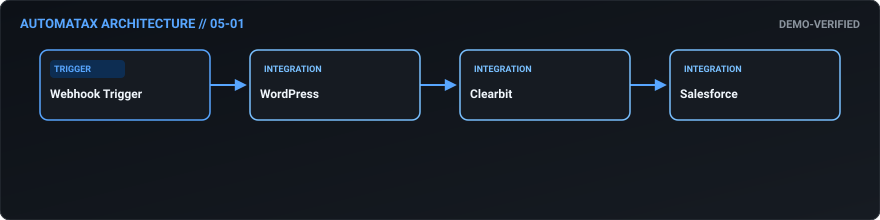
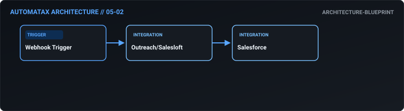
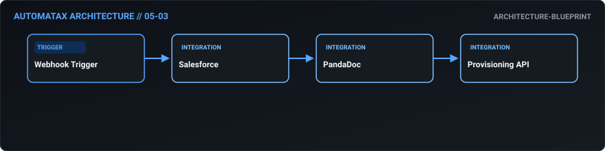
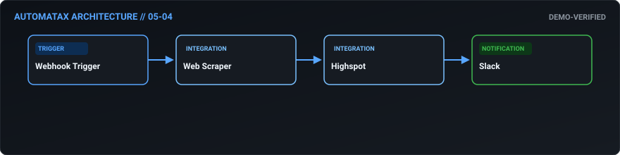
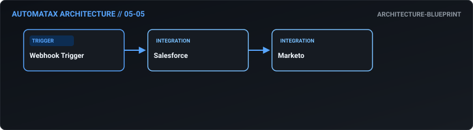
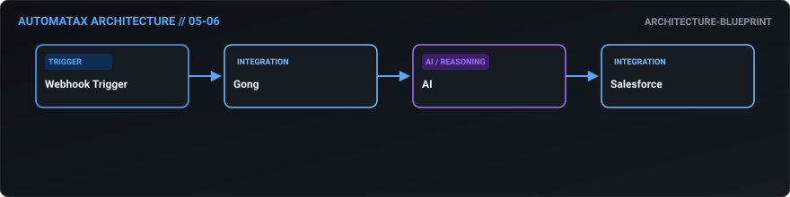
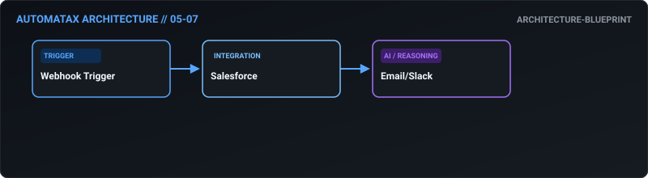
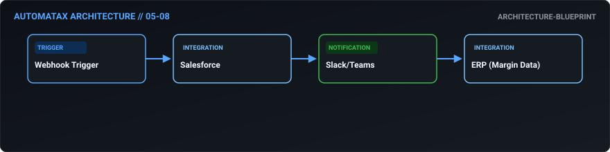
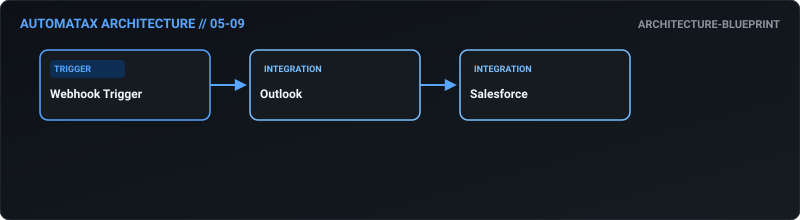
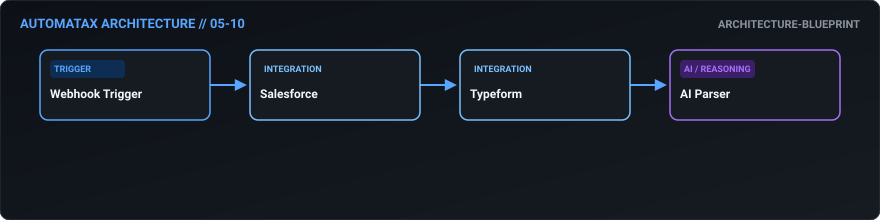

# 05. Sales & CRM — AutomataX Catalog

> **Category Focus:** Intelligent lead routing & scoring, stale deal detection, CPQ provisioning, competitor price scraping.

---

## 📋 Available Workflows

| ID | Name | Business Problem | Trigger | Integrations | Maturity | Links |
| :---: | :--- | :--- | :---: | :--- | :---: | :--- |
| **05-01** | **[Intelligent Lead Routing & Scoring](../docs/workflows/05-01-intelligent-lead-routing-scoring.md)** | High-value inbound leads get lost in round-robin queues or are assigned to the w... | `webhook` | `WordPress, Clearbit, Salesforce` | 🟢 Demo Verified | [JSON](../workflows/05-sales-crm/05_01_intelligent_lead_routing_scoring.json) · [Doc](../docs/workflows/05-01-intelligent-lead-routing-scoring.md) |
| **05-02** | **[Stale Deal Detection](../docs/workflows/05-02-stale-deal-detection.md)** | Sales reps hold onto dead opportunities to pad their pipelines, making revenue f... | `webhook` | `Outreach/Salesloft, Salesforce` | 🔵 Blueprint | [JSON](../workflows/05-sales-crm/05_02_stale_deal_detection.json) · [Doc](../docs/workflows/05-02-stale-deal-detection.md) |
| **05-03** | **[Zero-Touch CPQ & Provisioning](../docs/workflows/05-03-zero-touch-cpq-provisioning.md)** | Generating quotes manually introduces pricing errors, rogue discounting, and del... | `webhook` | `Salesforce, PandaDoc, Provisioning API` | 🔵 Blueprint | [JSON](../workflows/05-sales-crm/05_03_zero_touch_cpq_provisioning.json) · [Doc](../docs/workflows/05-03-zero-touch-cpq-provisioning.md) |
| **05-04** | **[Competitor Pricing Web Scraper](../docs/workflows/05-04-competitor-pricing-web-scraper.md)** | Competitors change pricing quietly. If sales enablement doesn't know, reps get b... | `webhook` | `Web Scraper, Highspot, Slack` | 🟢 Demo Verified | [JSON](../workflows/05-sales-crm/05_04_competitor_pricing_web_scraper.json) · [Doc](../docs/workflows/05-04-competitor-pricing-web-scraper.md) |
| **05-05** | **[Intent-Based Lead Recycling](../docs/workflows/05-05-intent-based-lead-recycling.md)** | SDRs discard "Not Right Now" leads, and marketing rarely nurtures them effective... | `webhook` | `Salesforce, Marketo` | 🔵 Blueprint | [JSON](../workflows/05-sales-crm/05_05_intent_based_lead_recycling.json) · [Doc](../docs/workflows/05-05-intent-based-lead-recycling.md) |
| **05-06** | **[Call Intelligence Sync](../docs/workflows/05-06-call-intelligence-sync.md)** | Sales reps hate writing notes in the CRM, resulting in missing context for Accou... | `webhook` | `Gong, AI, Salesforce` | 🔵 Blueprint | [JSON](../workflows/05-sales-crm/05_06_call_intelligence_sync.json) · [Doc](../docs/workflows/05-06-call-intelligence-sync.md) |
| **05-07** | **[Automated Territory Realignment](../docs/workflows/05-07-automated-territory-realignment.md)** | When a new rep is hired or territories are redrawn, Ops spends days manually exp... | `webhook` | `Salesforce, Email/Slack` | 🔵 Blueprint | [JSON](../workflows/05-sales-crm/05_07_automated_territory_realignment.json) · [Doc](../docs/workflows/05-07-automated-territory-realignment.md) |
| **05-08** | **[Contextual Deal Desk Approvals](../docs/workflows/05-08-contextual-deal-desk-approvals.md)** | Discount approvals are requested in chaotic Slack threads. Leadership lacks visi... | `webhook` | `Salesforce, Slack/Teams, ERP (Margin Data)` | 🔵 Blueprint | [JSON](../workflows/05-sales-crm/05_08_contextual_deal_desk_approvals.json) · [Doc](../docs/workflows/05-08-contextual-deal-desk-approvals.md) |
| **05-09** | **[Bulletproof Activity Logging](../docs/workflows/05-09-bulletproof-activity-logging.md)** | Sales reps forget to log meetings in the CRM, making it impossible to measure ac... | `webhook` | `Outlook, Salesforce` | 🔵 Blueprint | [JSON](../workflows/05-sales-crm/05_09_bulletproof_activity_logging.json) · [Doc](../docs/workflows/05-09-bulletproof-activity-logging.md) |
| **05-10** | **[AI-Driven Win/Loss Analysis](../docs/workflows/05-10-ai-driven-win-loss-analysis.md)** | "Price" is the default reason reps choose when they lose a deal. True win/loss a... | `webhook` | `Salesforce, Typeform, AI Parser` | 🔵 Blueprint | [JSON](../workflows/05-sales-crm/05_10_ai_driven_win_loss_analysis.json) · [Doc](../docs/workflows/05-10-ai-driven-win-loss-analysis.md) |

---

## 🛠 Workflow Details

### 05-01 — Intelligent Lead Routing & Scoring

- **Business Outcome:** Build an n8n workflow that automates lead routing: ingest form fills from WordPress, enrich via Clearbit, score using a custom algorithm, and route to the correct AE in Salesforce based on territory, industry, and company size.
- **Maturity:** `demo-verified` | **Complexity:** `advanced` | **Trigger:** `webhook`
- **Core Integrations:** `WordPress` • `Clearbit` • `Salesforce`
- **Documentation:** [Read Specs](../docs/workflows/05-01-intelligent-lead-routing-scoring.md)
- **Workflow File:** [Download n8n JSON](../workflows/05-sales-crm/05_01_intelligent_lead_routing_scoring.json)

---

### 05-02 — Stale Deal Detection

- **Business Outcome:** Design a workflow that syncs email engagement data from Outreach/Salesloft to Salesforce, updating lead/contact activity timelines and triggering a "Stale Deal" alert if no engagement occurs in 14 days.
- **Maturity:** `architecture-blueprint` | **Complexity:** `standard` | **Trigger:** `webhook`
- **Core Integrations:** `Outreach/Salesloft` • `Salesforce`
- **Documentation:** [Read Specs](../docs/workflows/05-02-stale-deal-detection.md)
- **Workflow File:** [Download n8n JSON](../workflows/05-sales-crm/05_02_stale_deal_detection.json)

---

### 05-03 — Zero-Touch CPQ & Provisioning

- **Business Outcome:** Create an automated CPQ workflow: when an Opportunity reaches "Negotiation" in Salesforce, automatically generate a quote in PandaDoc using dynamic pricing logic, and upon signature, update the Opportunity to "Closed Won" and trigger provisioning.
- **Maturity:** `architecture-blueprint` | **Complexity:** `standard` | **Trigger:** `webhook`
- **Core Integrations:** `Salesforce` • `PandaDoc` • `Provisioning API`
- **Documentation:** [Read Specs](../docs/workflows/05-03-zero-touch-cpq-provisioning.md)
- **Workflow File:** [Download n8n JSON](../workflows/05-sales-crm/05_03_zero_touch_cpq_provisioning.json)

---

### 05-04 — Competitor Pricing Web Scraper

- **Business Outcome:** Build a workflow that monitors competitor pricing via web scraping; if a competitor changes pricing, automatically update the battle card in Highspot and notify the sales enablement team via Slack.
- **Maturity:** `demo-verified` | **Complexity:** `advanced` | **Trigger:** `webhook`
- **Core Integrations:** `Web Scraper` • `Highspot` • `Slack`
- **Documentation:** [Read Specs](../docs/workflows/05-04-competitor-pricing-web-scraper.md)
- **Workflow File:** [Download n8n JSON](../workflows/05-sales-crm/05_04_competitor_pricing_web_scraper.json)

---

### 05-05 — Intent-Based Lead Recycling

- **Business Outcome:** Design a workflow that automates lead recycling: if an SDR marks a lead as "Nurture" in Salesforce, move it to a Marketo nurture track, and automatically re-assign it to an SDR if they download a high-intent asset 6 months later.
- **Maturity:** `architecture-blueprint` | **Complexity:** `standard` | **Trigger:** `webhook`
- **Core Integrations:** `Salesforce` • `Marketo`
- **Documentation:** [Read Specs](../docs/workflows/05-05-intent-based-lead-recycling.md)
- **Workflow File:** [Download n8n JSON](../workflows/05-sales-crm/05_05_intent_based_lead_recycling.json)

---

### 05-06 — Call Intelligence Sync

- **Business Outcome:** Create a workflow that integrates Gong call recordings with Salesforce: transcribe the call, extract key objections and next steps via AI, and append a summary to the Opportunity notes and the related Account record.
- **Maturity:** `architecture-blueprint` | **Complexity:** `standard` | **Trigger:** `webhook`
- **Core Integrations:** `Gong` • `AI` • `Salesforce`
- **Documentation:** [Read Specs](../docs/workflows/05-06-call-intelligence-sync.md)
- **Workflow File:** [Download n8n JSON](../workflows/05-sales-crm/05_06_call_intelligence_sync.json)

---

### 05-07 — Automated Territory Realignment

- **Business Outcome:** Build an automated territory alignment workflow: when a new AE is hired, automatically reassign existing open opportunities and accounts in Salesforce based on the new geo/industry mapping, notifying affected reps.
- **Maturity:** `architecture-blueprint` | **Complexity:** `standard` | **Trigger:** `webhook`
- **Core Integrations:** `Salesforce` • `Email/Slack`
- **Documentation:** [Read Specs](../docs/workflows/05-07-automated-territory-realignment.md)
- **Workflow File:** [Download n8n JSON](../workflows/05-sales-crm/05_07_automated_territory_realignment.json)

---

### 05-08 — Contextual Deal Desk Approvals

- **Business Outcome:** Design a workflow that automates deal desk approvals: when a discount >15% is applied in Salesforce, automatically route for approval via Slack/Teams, pulling margin data from the ERP to show impact, and updating the Opp upon approval.
- **Maturity:** `architecture-blueprint` | **Complexity:** `standard` | **Trigger:** `webhook`
- **Core Integrations:** `Salesforce` • `Slack/Teams` • `ERP (Margin Data)`
- **Documentation:** [Read Specs](../docs/workflows/05-08-contextual-deal-desk-approvals.md)
- **Workflow File:** [Download n8n JSON](../workflows/05-sales-crm/05_08_contextual_deal_desk_approvals.json)

---

### 05-09 — Bulletproof Activity Logging

- **Business Outcome:** Create a workflow that syncs calendar data from Outlook to Salesforce, automatically logging meetings as "Events" and linking them to the relevant Opportunity and Contacts, ensuring 100% activity logging compliance.
- **Maturity:** `architecture-blueprint` | **Complexity:** `standard` | **Trigger:** `webhook`
- **Core Integrations:** `Outlook` • `Salesforce`
- **Documentation:** [Read Specs](../docs/workflows/05-09-bulletproof-activity-logging.md)
- **Workflow File:** [Download n8n JSON](../workflows/05-sales-crm/05_09_bulletproof_activity_logging.json)

---

### 05-10 — AI-Driven Win/Loss Analysis

- **Business Outcome:** Build a workflow that automates win/loss analysis: when an Opp is Closed Lost, trigger a Typeform survey; upon submission, parse the feedback, categorize the loss reason, and update a custom "Loss Reason" object in Salesforce for reporting.
- **Maturity:** `architecture-blueprint` | **Complexity:** `standard` | **Trigger:** `webhook`
- **Core Integrations:** `Salesforce` • `Typeform` • `AI Parser`
- **Documentation:** [Read Specs](../docs/workflows/05-10-ai-driven-win-loss-analysis.md)
- **Workflow File:** [Download n8n JSON](../workflows/05-sales-crm/05_10_ai_driven_win_loss_analysis.json)

---

