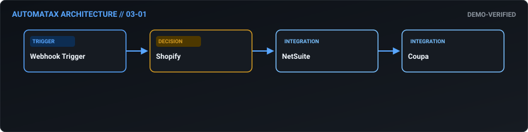
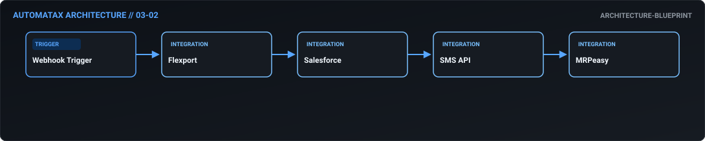
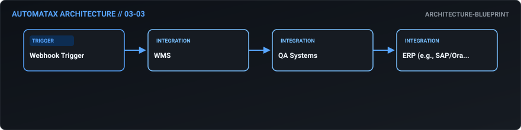
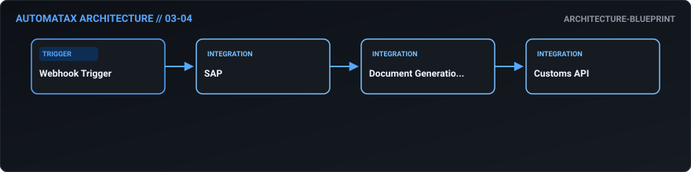
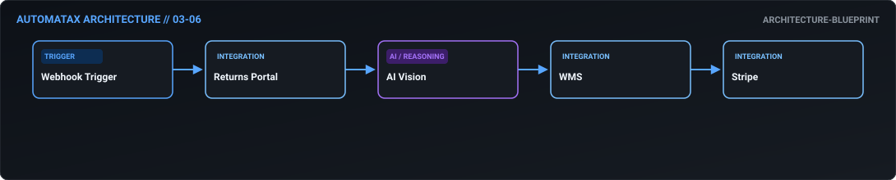
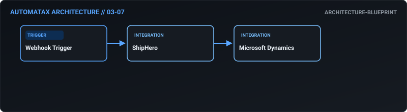
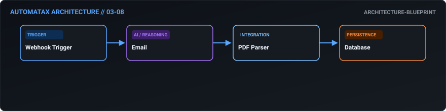
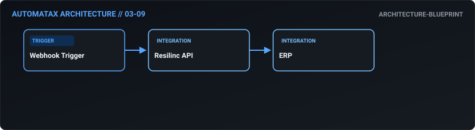
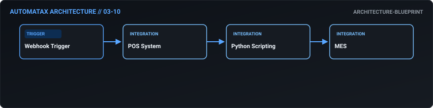

# 03. Supply Chain & Logistics — AutomataX Catalog

> **Category Focus:** Predictive inventory PO generation, freight delay rerouting, supplier scorecards, 3PL inventory reconciliation.

---

## 📋 Available Workflows

| ID | Name | Business Problem | Trigger | Integrations | Maturity | Links |
| :---: | :--- | :--- | :---: | :--- | :---: | :--- |
| **03-01** | **[Predictive Inventory PO Generation](../docs/workflows/03-01-predictive-inventory-po-generation.md)** | Manual inventory checks fail to account for seasonal sales velocity or supplier ... | `webhook` | `Shopify, NetSuite, Coupa` | 🟢 Demo Verified | [JSON](../workflows/03-supply-chain/03_01_predictive_inventory_po_generation.json) · [Doc](../docs/workflows/03-01-predictive-inventory-po-generation.md) |
| **03-02** | **[Ocean Freight Delay & Rerouting Automation](../docs/workflows/03-02-ocean-freight-delay-rerouting-automation.md)** | Supply chain delays cause downstream production halts. When shipping updates are... | `webhook` | `Flexport, Salesforce, SMS API` | 🔵 Blueprint | [JSON](../workflows/03-supply-chain/03_02_ocean_freight_delay_rerouting_automation.json) · [Doc](../docs/workflows/03-02-ocean-freight-delay-rerouting-automation.md) |
| **03-03** | **[Automated Supplier Quality Scorecarding](../docs/workflows/03-03-automated-supplier-quality-scorecarding.md)** | Evaluating supplier performance manually is time-consuming and subjective, makin... | `webhook` | `WMS, QA Systems, ERP (e.g., SAP/Oracle)` | 🔵 Blueprint | [JSON](../workflows/03-supply-chain/03_03_automated_supplier_quality_scorecarding.json) · [Doc](../docs/workflows/03-03-automated-supplier-quality-scorecarding.md) |
| **03-04** | **[Zero-Touch Customs Documentation](../docs/workflows/03-04-zero-touch-customs-documentation.md)** | Generating commercial invoices, packing lists, and AES filings by hand delays in... | `webhook` | `SAP, Document Generation API, Customs API` | 🔵 Blueprint | [JSON](../workflows/03-supply-chain/03_04_zero_touch_customs_documentation.json) · [Doc](../docs/workflows/03-04-zero-touch-customs-documentation.md) |
| **03-05** | **[Weather Risk Supply Chain Mitigation](../docs/workflows/03-05-weather-risk-supply-chain-mitigation.md)** | Severe weather events (hurricanes, snowstorms) disrupt shipping routes, but logi... | `webhook` | `Weather API, Logistics Software, MS Teams` | 🔵 Blueprint | [JSON](../workflows/03-supply-chain/03_05_weather_risk_supply_chain_mitigation.json) · [Doc](../docs/workflows/03-05-weather-risk-supply-chain-mitigation.md) |
| **03-06** | **[AI-Powered RMA & Liquidation Routing](../docs/workflows/03-06-ai-powered-rma-liquidation-routing.md)** | Processing returns manually is a massive cost center. Inspecting returned items ... | `webhook` | `Returns Portal, AI Vision, WMS` | 🔵 Blueprint | [JSON](../workflows/03-supply-chain/03_06_ai_powered_rma_liquidation_routing.json) · [Doc](../docs/workflows/03-06-ai-powered-rma-liquidation-routing.md) |
| **03-07** | **[Daily 3PL to ERP Inventory Reconciliation](../docs/workflows/03-07-daily-3pl-to-erp-inventory-reconciliation.md)** | Discrepancies between the 3PL warehouse and the central ERP cause accounting nig... | `webhook` | `ShipHero, Microsoft Dynamics` | 🔵 Blueprint | [JSON](../workflows/03-supply-chain/03_07_daily_3pl_to_erp_inventory_reconciliation.json) · [Doc](../docs/workflows/03-07-daily-3pl-to-erp-inventory-reconciliation.md) |
| **03-08** | **[Automated Freight Audit & Payment](../docs/workflows/03-08-automated-freight-audit-payment.md)** | Carriers frequently overcharge due to complex rate matrices. Auditing freight bi... | `webhook` | `Email, PDF Parser, Database` | 🔵 Blueprint | [JSON](../workflows/03-supply-chain/03_08_automated_freight_audit_payment.json) · [Doc](../docs/workflows/03-08-automated-freight-audit-payment.md) |
| **03-09** | **[Tier-1 Supplier Risk Trigger](../docs/workflows/03-09-tier-1-supplier-risk-trigger.md)** | If a critical supplier faces a natural disaster or financial trouble, the busine... | `webhook` | `Resilinc API, ERP` | 🔵 Blueprint | [JSON](../workflows/03-supply-chain/03_09_tier_1_supplier_risk_trigger.json) · [Doc](../docs/workflows/03-09-tier-1-supplier-risk-trigger.md) |
| **03-10** | **[AI-Driven Demand Planning](../docs/workflows/03-10-ai-driven-demand-planning.md)** | Simple rolling averages fail to predict complex demand shifts, resulting in poor... | `webhook` | `POS System, Python Scripting, MES` | 🔵 Blueprint | [JSON](../workflows/03-supply-chain/03_10_ai_driven_demand_planning.json) · [Doc](../docs/workflows/03-10-ai-driven-demand-planning.md) |

---

## 🛠 Workflow Details

### 03-01 — Predictive Inventory PO Generation

- **Business Outcome:** Build an n8n workflow that monitors inventory levels in Shopify, checks lead times in NetSuite, and automatically generates purchase orders in Coupa when stock hits the reorder point, factoring in seasonal velocity adjustments.
- **Maturity:** `demo-verified` | **Complexity:** `advanced` | **Trigger:** `webhook`
- **Core Integrations:** `Shopify` • `NetSuite` • `Coupa`
- **Documentation:** [Read Specs](../docs/workflows/03-01-predictive-inventory-po-generation.md)
- **Workflow File:** [Download n8n JSON](../workflows/03-supply-chain/03_01_predictive_inventory_po_generation.json)

---

### 03-02 — Ocean Freight Delay & Rerouting Automation

- **Business Outcome:** Design a workflow that integrates with Flexport API to track ocean freight shipments; if a delay is detected, automatically update the ETA in Salesforce, notify the customer via SMS, and adjust production schedules in MRPeasy.
- **Maturity:** `architecture-blueprint` | **Complexity:** `intermediate` | **Trigger:** `webhook`
- **Core Integrations:** `Flexport` • `Salesforce` • `SMS API` • `MRPeasy`
- **Documentation:** [Read Specs](../docs/workflows/03-02-ocean-freight-delay-rerouting-automation.md)
- **Workflow File:** [Download n8n JSON](../workflows/03-supply-chain/03_02_ocean_freight_delay_rerouting_automation.json)

---

### 03-03 — Automated Supplier Quality Scorecarding

- **Business Outcome:** Create an automated supplier scorecard workflow that pulls delivery on-time rates from the WMS, quality defect rates from QA logs, and calculates a monthly score, automatically downgrading suppliers in the ERP if score < 80.
- **Maturity:** `architecture-blueprint` | **Complexity:** `standard` | **Trigger:** `webhook`
- **Core Integrations:** `WMS` • `QA Systems` • `ERP (e.g., SAP/Oracle)`
- **Documentation:** [Read Specs](../docs/workflows/03-03-automated-supplier-quality-scorecarding.md)
- **Workflow File:** [Download n8n JSON](../workflows/03-supply-chain/03_03_automated_supplier_quality_scorecarding.json)

---

### 03-04 — Zero-Touch Customs Documentation

- **Business Outcome:** Build a workflow that automates customs documentation: when a commercial invoice is created in SAP, automatically generate a packing list, certificate of origin, and AES filing via API, attaching them to the shipment record.
- **Maturity:** `architecture-blueprint` | **Complexity:** `standard` | **Trigger:** `webhook`
- **Core Integrations:** `SAP` • `Document Generation API` • `Customs API`
- **Documentation:** [Read Specs](../docs/workflows/03-04-zero-touch-customs-documentation.md)
- **Workflow File:** [Download n8n JSON](../workflows/03-supply-chain/03_04_zero_touch_customs_documentation.json)

---

### 03-05 — Weather Risk Supply Chain Mitigation

- **Business Outcome:** Design a workflow that monitors weather APIs for severe conditions along key shipping routes; if a risk is detected, automatically trigger a rerouting evaluation workflow and alert the logistics control tower via Teams.
- **Maturity:** `architecture-blueprint` | **Complexity:** `standard` | **Trigger:** `webhook`
- **Core Integrations:** `Weather API` • `Logistics Software` • `MS Teams`
- **Documentation:** [Read Specs](../docs/workflows/03-05-weather-risk-supply-chain-mitigation.md)
- **Workflow File:** [Download n8n JSON](../workflows/03-supply-chain/03_05_weather_risk_supply_chain_mitigation.json)

---

### 03-06 — AI-Powered RMA & Liquidation Routing

- **Business Outcome:** Create an automated returns processing workflow that ingests RMA requests, checks item condition via uploaded photos (AI vision), routes to refurbishment or liquidation in the WMS, and triggers the refund in Stripe.
- **Maturity:** `architecture-blueprint` | **Complexity:** `intermediate` | **Trigger:** `webhook`
- **Core Integrations:** `Returns Portal` • `AI Vision` • `WMS` • `Stripe`
- **Documentation:** [Read Specs](../docs/workflows/03-06-ai-powered-rma-liquidation-routing.md)
- **Workflow File:** [Download n8n JSON](../workflows/03-supply-chain/03_06_ai_powered_rma_liquidation_routing.json)

---

### 03-07 — Daily 3PL to ERP Inventory Reconciliation

- **Business Outcome:** Build a workflow that syncs 3PL warehouse data (ShipHero) with the ERP (Microsoft Dynamics), automatically reconciling daily inventory counts and flagging discrepancies >1% for physical cycle counts.
- **Maturity:** `architecture-blueprint` | **Complexity:** `standard` | **Trigger:** `webhook`
- **Core Integrations:** `ShipHero` • `Microsoft Dynamics`
- **Documentation:** [Read Specs](../docs/workflows/03-07-daily-3pl-to-erp-inventory-reconciliation.md)
- **Workflow File:** [Download n8n JSON](../workflows/03-supply-chain/03_07_daily_3pl_to_erp_inventory_reconciliation.json)

---

### 03-08 — Automated Freight Audit & Payment

- **Business Outcome:** Design a workflow that automates freight audit and pay: ingest carrier invoices via email, parse PDFs, compare rates against the contract matrix in a database, and auto-approve or flag disputes for the logistics team.
- **Maturity:** `architecture-blueprint` | **Complexity:** `standard` | **Trigger:** `webhook`
- **Core Integrations:** `Email` • `PDF Parser` • `Database`
- **Documentation:** [Read Specs](../docs/workflows/03-08-automated-freight-audit-payment.md)
- **Workflow File:** [Download n8n JSON](../workflows/03-supply-chain/03_08_automated_freight_audit_payment.json)

---

### 03-09 — Tier-1 Supplier Risk Trigger

- **Business Outcome:** Create a workflow that monitors supplier risk via API (e.g., Resilinc); if a tier-1 supplier reports a disruption, automatically identify affected SKUs in the ERP and trigger safety stock releases.
- **Maturity:** `architecture-blueprint` | **Complexity:** `standard` | **Trigger:** `webhook`
- **Core Integrations:** `Resilinc API` • `ERP`
- **Documentation:** [Read Specs](../docs/workflows/03-09-tier-1-supplier-risk-trigger.md)
- **Workflow File:** [Download n8n JSON](../workflows/03-supply-chain/03_09_tier_1_supplier_risk_trigger.json)

---

### 03-10 — AI-Driven Demand Planning

- **Business Outcome:** Build an automated demand planning workflow that pulls historical sales from the POS, applies a time-series forecasting Python script, and outputs recommended production schedules to the manufacturing execution system (MES).
- **Maturity:** `architecture-blueprint` | **Complexity:** `standard` | **Trigger:** `webhook`
- **Core Integrations:** `POS System` • `Python Scripting` • `MES`
- **Documentation:** [Read Specs](../docs/workflows/03-10-ai-driven-demand-planning.md)
- **Workflow File:** [Download n8n JSON](../workflows/03-supply-chain/03_10_ai_driven_demand_planning.json)

---

