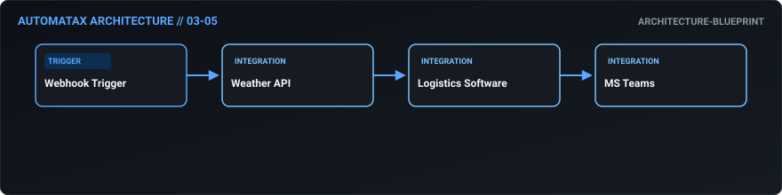

# Weather Risk Supply Chain Mitigation

> **Business Outcome:** Design a workflow that monitors weather APIs for severe conditions along key shipping routes; if a risk is detected, automatically trigger a rerouting evaluation workflow and alert the logistics control tower via Teams.

---

## Business Problem

Severe weather events (hurricanes, snowstorms) disrupt shipping routes, but logistics teams often react only after the disruption has occurred.

Without automation, teams face manual data entry errors, delayed response times, poor data consistency across platforms, and potential compliance or operational risks.

---

## Automation Strategy

This AutomataX workflow orchestrates an end-to-end automated pipeline for **Weather Risk Supply Chain Mitigation**. 
When triggered, the system receives event data, validates required parameters, enriches data via external services or AI reasoning where required, executes business decisions, and synchronizes status back to core business platforms.

---

## Architecture

*Architecture diagram generated directly from n8n workflow node structure.*

---

## Data Flow

1. **Trigger Ingestion**: Ingests incoming event payload via `webhook`.
2. **Payload Validation**: Ensures required fields and data structures exist before execution.
3. **Integration Processing**: Interacts with core services: `Weather API`, `Logistics Software`, `MS Teams`.
4. **Logic & Routing**: Evaluates thresholds, AI classifications, or conditional criteria.
5. **System Synchronization & Action**: Writes updates to destination databases/CRMs and emits alerts/notifications.

---

## Trigger

- **Type**: `WEBHOOK`
- **Source**: External Webhook event payload or Scheduled interval.
- **Payload Expectation**: JSON object containing target entity metrics, transaction attributes, or status updates.

---

## Inputs

Expected incoming fields include:
- `entity_id` / `record_id`: Primary tracking key
- `timestamp`: ISO-8601 execution timestamp
- `payload`: Contextual payload containing domain metrics and customer parameters

---

## Processing & Decision Logic

- **Schema Validation**: Validates parameter integrity and guards against missing/malformed payloads.
- **AI Reasoning Engine**: Classifies, summarizes, or extracts key attributes using LLM/NLP models.
- **Branching Rules**: Routes execution paths based on entity thresholds or operational priority.
- **Data Normalization**: Formats timestamps, currency attributes, and user attributes for target systems.

---

## Integrations

- **Weather API**: Primary operational service responsible for data retrieval, state mutation, or record persistence.
- **Logistics Software**: Primary operational service responsible for data retrieval, state mutation, or record persistence.
- **MS Teams**: Primary operational service responsible for data retrieval, state mutation, or record persistence.

---

## Outputs

- **Primary Action**: Records persisted or state updated across target platforms (Weather API, Logistics Software).
- **Notifications**: Automated summary/alert dispatched to Slack/Email.
- **Audit Log**: Execution trace preserved within n8n execution log.

---

## Failure Paths

1. **API Timeout or Rate Limit**: Downstream SaaS or ERP endpoint temporarily unavailable.
2. **Malformed Payload**: Missing required parameters in trigger body.
3. **Authentication Failure**: Expired API tokens or missing credential store configuration.

---

## Error Handling

- **Recommended Hardening**: Implement Error Trigger nodes and exponential retry policies on HTTP integration nodes.
- **Dead-Letter Handling**: Log failed executions to a queue for manual retry.

---

## Security

- **Secrets Storage**: All credential tokens must use n8n Credentials Manager (`{{$credentials...}}`). No plaintext keys allowed.
- **Least Privilege**: API keys must be scoped exclusively to required read/write permissions.
- **PII Masking**: Sensitive identity or financial payload data should be masked before logging or sending to chat channels.

---

## Required Credentials

- `Weather API API Credentials`: Scoped access token or OAuth2 credential in n8n Credential Manager.
- `Logistics Software API Credentials`: Scoped access token or OAuth2 credential in n8n Credential Manager.
- `MS Teams API Credentials`: Scoped access token or OAuth2 credential in n8n Credential Manager.

---

## Setup

1. **Import Workflow**: Download [Weather Risk Supply Chain Mitigation JSON](../../workflows/03-supply-chain/03_05_weather_risk_supply_chain_mitigation.json) and import into n8n canvas.
2. **Configure Credentials**: Assign configured n8n credentials to each integration node.
3. **Configure Environment Variables**: Set endpoint URLs and notification channel IDs.
4. **Activate**: Toggle workflow to **Active**.

---

## Test / Demo

- **Blueprint Scenario**: Supply a mock JSON payload matching the trigger schema to test workflow node routing in test mode.

---

## Workflow JSON

📥 **[Download n8n Workflow JSON](../../workflows/03-supply-chain/03_05_weather_risk_supply_chain_mitigation.json)**

---

## Maturity

Current Level: **Architecture Blueprint**

This architecture defines complete integration node sequencing. Implementation requires configuring destination API endpoints and credential bindings.

---

## Production Hardening

Before deploying to production:
1. Bind real n8n credential objects for all integration nodes.
2. Configure error handling workflows and Slack/PagerDuty dead-letter alerts.
3. Validate rate limits and retry parameters for external APIs.
4. Verify PII masking and data retention settings.
