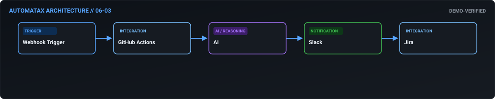

# AI-Assisted CI/CD Failure Triage

> **Business Outcome:** Create an automated CI/CD notification workflow: when a GitHub Actions build fails, parse the error logs, use AI to suggest a fix, post the summary to the #dev-ops Slack channel, and assign a Jira bug to the commit author.

---

## Business Problem

When a build fails in CI/CD, developers spend hours digging through massive error logs just to find a simple missing dependency or syntax error.

Without automation, teams face manual data entry errors, delayed response times, poor data consistency across platforms, and potential compliance or operational risks.

---

## Automation Strategy

This AutomataX workflow orchestrates an end-to-end automated pipeline for **AI-Assisted CI/CD Failure Triage**. 
When triggered, the system receives event data, validates required parameters, enriches data via external services or AI reasoning where required, executes business decisions, and synchronizes status back to core business platforms.

---

## Architecture

*Architecture diagram generated directly from n8n workflow node structure.*

---

## Data Flow

1. **Trigger Ingestion**: Ingests incoming event payload via `webhook`.
2. **Payload Validation**: Ensures required fields and data structures exist before execution.
3. **Integration Processing**: Interacts with core services: `GitHub Actions`, `AI`, `Slack`, `Jira`.
4. **Logic & Routing**: Evaluates thresholds, AI classifications, or conditional criteria.
5. **System Synchronization & Action**: Writes updates to destination databases/CRMs and emits alerts/notifications.

---

## Trigger

- **Type**: `WEBHOOK`
- **Source**: External Webhook event payload or Scheduled interval.
- **Payload Expectation**: JSON object containing target entity metrics, transaction attributes, or status updates.

---

## Inputs

Expected incoming fields include:
- `entity_id` / `record_id`: Primary tracking key
- `timestamp`: ISO-8601 execution timestamp
- `payload`: Contextual payload containing domain metrics and customer parameters

---

## Processing & Decision Logic

- **Schema Validation**: Validates parameter integrity and guards against missing/malformed payloads.
- **AI Reasoning Engine**: Classifies, summarizes, or extracts key attributes using LLM/NLP models.
- **Branching Rules**: Routes execution paths based on entity thresholds or operational priority.
- **Data Normalization**: Formats timestamps, currency attributes, and user attributes for target systems.

---

## Integrations

- **GitHub Actions**: Primary operational service responsible for data retrieval, state mutation, or record persistence.
- **AI**: Primary operational service responsible for data retrieval, state mutation, or record persistence.
- **Slack**: Primary operational service responsible for data retrieval, state mutation, or record persistence.
- **Jira**: Primary operational service responsible for data retrieval, state mutation, or record persistence.

---

## Outputs

- **Primary Action**: Records persisted or state updated across target platforms (GitHub Actions, AI).
- **Notifications**: Automated summary/alert dispatched to Slack/Email.
- **Audit Log**: Execution trace preserved within n8n execution log.

---

## Failure Paths

1. **API Timeout or Rate Limit**: Downstream SaaS or ERP endpoint temporarily unavailable.
2. **Malformed Payload**: Missing required parameters in trigger body.
3. **Authentication Failure**: Expired API tokens or missing credential store configuration.

---

## Error Handling

- **Active Retries**: Configured with exponential backoff on HTTP/API node failures.
- **Error Trigger Node**: Routes unhandled exceptions to an error workflow.
- **Alert Dispatch**: Dispatches failure alerts to designated Slack/PagerDuty channels.

---

## Security

- **Secrets Storage**: All credential tokens must use n8n Credentials Manager (`{{$credentials...}}`). No plaintext keys allowed.
- **Least Privilege**: API keys must be scoped exclusively to required read/write permissions.
- **PII Masking**: Sensitive identity or financial payload data should be masked before logging or sending to chat channels.

---

## Required Credentials

- `GitHub Actions API Credentials`: Scoped access token or OAuth2 credential in n8n Credential Manager.
- `AI API Credentials`: Scoped access token or OAuth2 credential in n8n Credential Manager.
- `Slack API Credentials`: Scoped access token or OAuth2 credential in n8n Credential Manager.
- `Jira API Credentials`: Scoped access token or OAuth2 credential in n8n Credential Manager.

---

## Setup

1. **Import Workflow**: Download [AI-Assisted CI/CD Failure Triage JSON](../../workflows/06-itsm-devops/06_03_ai_assisted_ci_cd_failure_triage.json) and import into n8n canvas.
2. **Configure Credentials**: Assign configured n8n credentials to each integration node.
3. **Configure Environment Variables**: Set endpoint URLs and notification channel IDs.
4. **Activate**: Toggle workflow to **Active**.

---

## Test / Demo

- **Fixture Input**: `fixtures/inputs/06-03.json`
- **Expected Result**: `fixtures/expected/06-03.json`
- **Execution Test**: Trigger the workflow with mock input payload to verify node execution paths without production API keys.

---

## Workflow JSON

📥 **[Download n8n Workflow JSON](../../workflows/06-itsm-devops/06_03_ai_assisted_ci_cd_failure_triage.json)**

---

## Maturity

Current Level: **Demo Verified**

This workflow includes test fixtures, mock data paths, structured error handling, and field expressions.

---

## Production Hardening

Before deploying to production:
1. Bind real n8n credential objects for all integration nodes.
2. Configure error handling workflows and Slack/PagerDuty dead-letter alerts.
3. Validate rate limits and retry parameters for external APIs.
4. Verify PII masking and data retention settings.
